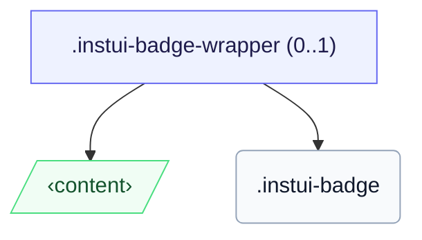

# CSS: badge

`.instui-badge` — Փոքր հաշվարար կամ վիճակի կետ տեղադրված թիրախի անկյունի վրա:

Մեծանիշ դնելու համար թիրախի վրա, փակցել երկուսն էլ `.instui-badge-wrapper` (դիրքային խարիսխ) և կցել մեծանիշը `-placement-*` փոփոխիչով:

**Աղբյուր:** [badge.css](https://github.com/thedannywahl/pantoken/blob/main/formats/components/src/components/badge/badge.css)

## Օգտագործում

```css
@import "@pantoken/components/components.css";
@import "@pantoken/components/badge.css";
```

## Դեմո

```demo
self:badge
```

## Օրինակներ

```html
<span class="instui-badge-wrapper">
  <button class="instui-button">Inbox</button>
  <span class="instui-badge -placement-top-end">4</span>
</span>
```

## Կառուցվածք

Մեծանիշը գծվում է ինտերնետային ստորագծում իր վրա, կամ ընտրովի `instui-badge-wrapper` ներսում, որը այն խարիսխում է թիրախի վրա:

```text
.instui-badge-wrapper (0..1)
  ‹content›
  .instui-badge
```



## Մոդիֆիկատորներ

| Մոդիֆիկատոր | Նկարագիր |
| --- | --- |
| `.-color-danger` | Ուշադրության / սխալի հաշվարար: |
| `.-color-inverse` | Մութ վրա. թեթև չիպ մութ տեքստով: |
| `.-color-success` | Դրական / ամբողջական հաշվարար: |
| `.-placement-bottom-end` | Դիրք ներքևի վերջի անկյունում: |
| `.-placement-bottom-start` | Դիրք ներքևի մեկնարկային անկյունում: |
| `.-placement-end-center` | Դիրք կենտրոնացված վերջի եզրին: |
| `.-placement-start-center` | Դիրք կենտրոնացված մեկնարկային եզրին: |
| `.-placement-top-end` | Դիրք վերևի վերջի անկյունում: |
| `.-placement-top-start` | Դիրք վերևի մեկնարկային անկյունում: |
| `.-pulse` | Զարկանացող ուշադրության օղակ: |
| `.-standalone` | Գծել ինտերնետային ստորագծում, ոչ թե դիրքորոշված թիրախի անկյունի վրա: |
| `.-type-notification` | Միայն կետ, ոչ հաշվարար: |

## Պսևդո-էլեմենտներ

| Պսևդո-էլեմենտ | Նկարագիր |
| --- | --- |
| `::before` | Զարկանացող ուշադրության օղակը գծված մեծանիշի շեշտի գույնով (`-pulse` տարբերակ): |

## Անհատական հատկություններ

| Առանձնահատկություն | Տիպ | Ընթացիկ | Նկարագիր |
| --- | --- | --- | --- |
| `--pantoken-badge-accent` | `<color>` | — | Չիպի լցվածք. յուրաքանչյուր `-color-*` տարբերակ և զարկանացողի օղակը կարդացվածից: |
| `--pantoken-badge-text` | `<color>` | — | Տեքստի գույն, զուգակցված շեշտին, որպեսզի այն մնա ընթեռնելի: |

## Անիմացիաներ

| Անիմացիա | Նկարագիր |
| --- | --- |
| `pantoken-badge-pulse` | Զարկանացողի օղակի անիմացիա: |

## Ցուցիչներ սպառված

| Տոկեն | Տիպ | Արժեք |
| --- | --- | --- |
| `--instui-border-width-md` | `<length>` | `0.125rem` |
| `--instui-component-badge-border-radius` | `<length>` | `999rem` |
| `--instui-component-badge-color` | `<color>` | `#ffffff` |
| `--instui-component-badge-color-danger` | `<color>` | `#E62429` |
| `--instui-component-badge-color-inverse` | `<color>` | `#273540` |
| `--instui-component-badge-color-primary` | `<color>` | `light-dark(#1D354F, #EEF4FD)` |
| `--instui-component-badge-color-success` | `<color>` | `#03893D` |
| `--instui-component-badge-font-family` | `[ <font-family-name> \| <generic-font-family> ]#` | `Atkinson Hyperlegible Next, "Helvetica Neue", Helvetica, Arial, sans-serif` |
| `--instui-component-badge-font-size` | `<length>` | `0.75rem` |
| `--instui-component-badge-font-weight` | `<integer>` | `600` |
| `--instui-component-badge-padding` | `<length>` | `0.25rem` |
| `--instui-component-badge-size` | `<length>` | `1rem` |
| `--instui-spacing-space-sm` | `<length>` | `0.5rem` |

## Ավելին կապված

- [pill](/hy/api/css/pill.md) — Ինտերնետային պիտակ-չիպ հավանցք:

