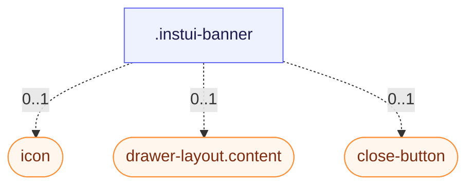

# CSS: banner

`.instui-banner` — Մերժելի, պատկերային հաղորդագրման մակերես էջի մակարդակի կամ համատեքստային հայտարարությունների համար:

**Չափ** վերահսկում է լրցուցածք և բաց. `relaxed` (լռակյալ) ավելի լայն է. `compact` ամբողջացնում է երկուսը:
**Գույն** դնում է լրցուցածքը. մերկ (ոչ փոփոխիչ) լրցված չի — սահման և պատկեր միայն. `-color-violet`
և `-color-sea` ավելացնել մի քիչ կապույտ ֆոն ու համապատասխան պատկերային նմուշ: `-variant-ai` փոխարինում է
լրցուցածքը վերից ներքև գրադիենտով, AI-ի հատկացված հաղորդագրությունների համար:

## Accessibility

Ավելացնել `role="status"` (կամ `role="alert"` շտապ հաղորդագրությունների համար), որպեսզի օգնական տեխ հայտարարի
ցուցակ. նշել դեկորատիվ պատկեր `aria-hidden="true"` և տալ փակ կոճակին `aria-label`:

## Usage

@import "@pantoken/plugin-custom-components/custom-components.css";

```css
@import "@pantoken/plugin-custom-components/custom-components.css";
```

## Examples

-nocard

```html
<div class="instui-banner -color-violet" role="status">
  <span class="icon" aria-hidden="true"></span>
  <div class="content">This is a violet banner with an icon.</div>
  <button class="instui-close-button -size-xs" aria-label="Close"></button>
</div>
```

## Structure

```text
.instui-banner
  icon (component, 0..1)
  drawer-layout.content (component, 0..1)
  close-button (component, 0..1)
```



## Modifiers

| Modifier         | Description                                          |
| ---------------- | ---------------------------------------------------- |
| `.-color-sea`    | Ծովային կապույտ ֆոն և պատկերային նմուշ:              |
| `.-color-violet` | Մանուշակագույն կապույտ ֆոն և պատկերային նմուշ:       |
| `.-size-compact` | Ավելի տեղավար լրցուցածք և բաց:                       |
| `.-size-relaxed` | Ավելի լայն լրցուցածք և բաց (լռակյալ):                |
| `.-variant-ai`   | AI-ի հատկացված գրադիենտ ֆոն հարթ լրցուցածքի փոխարեն: |

## Parts

| Part       | Description                                                                             |
| ---------- | --------------------------------------------------------------------------------------- |
| `.content` | Հաղորդագրության բովանդակություն, կուտակված սյունակում:                                  |
| `.icon`    | Ընտրովի պատկերային նմուշ. դրա ֆոն և անկյունային շառավիղ գալիս են ակտիվ չափից / գույնից: |

## Tokens consumed

| Token                                                           | Type       | Value                          |
| --------------------------------------------------------------- | ---------- | ------------------------------ |
| `--instui-component-banner-ai-background-bottom-gradient-color` | `<color>`  | `light-dark(#CFF0F6, #00424A)` |
| `--instui-component-banner-ai-background-top-gradient-color`    | `<color>`  | `light-dark(#F3E5F7, #522965)` |
| `--instui-component-banner-border-color`                        | `<color>`  | `light-dark(#5F6E7A, #9EA6AD)` |
| `--instui-component-banner-border-radius`                       | `<length>` | `1rem`                         |
| `--instui-component-banner-border-style`                        | —          | `solid`                        |
| `--instui-component-banner-border-width`                        | `<length>` | `0.0625rem`                    |
| `--instui-component-banner-close-button-margin-right`           | `<length>` | `0.5rem`                       |
| `--instui-component-banner-close-button-margin-top`             | `<length>` | `0.5rem`                       |
| `--instui-component-banner-color`                               | `<color>`  | `light-dark(#273540, #ffffff)` |
| `--instui-component-banner-compact-content-gap-horizontal`      | `<length>` | `0.5rem`                       |
| `--instui-component-banner-compact-icon-border-radius`          | `<length>` | `0.5rem`                       |
| `--instui-component-banner-compact-padding-horizontal`          | `<length>` | `0.75rem`                      |
| `--instui-component-banner-compact-padding-vertical`            | `<length>` | `0.75rem`                      |
| `--instui-component-banner-content-gap-vertical`                | `<length>` | `0.75rem`                      |
| `--instui-component-banner-icon-color`                          | `<color>`  | `#ffffff`                      |
| `--instui-component-banner-relaxed-content-gap-horizontal`      | `<length>` | `1rem`                         |
| `--instui-component-banner-relaxed-icon-border-radius`          | `<length>` | `0.75rem`                      |
| `--instui-component-banner-relaxed-padding-horizontal`          | `<length>` | `1.5rem`                       |
| `--instui-component-banner-relaxed-padding-vertical`            | `<length>` | `1.5rem`                       |
| `--instui-component-banner-sea-background`                      | `<color>`  | `light-dark(#CFF0F6, #00424A)` |
| `--instui-component-banner-sea-icon-background`                 | `<color>`  | `#00828E`                      |
| `--instui-component-banner-violet-background`                   | `<color>`  | `light-dark(#F3E5F7, #522965)` |
| `--instui-component-banner-violet-icon-background`              | `<color>`  | `#9E58BD`                      |

## Subcomponents

- [close-button](/hy/api/css/close-button.md)
- [drawer-layout.content](/hy/api/css/drawer-layout.content.md)
- [icon](/hy/api/css/icon.md)

## Related

- [alert](/hy/api/css/alert.md) — Մերժել անյուրի, վիճակային գույնի հավանցք ինտերնետային հաղորդագրությունների համար:
- [close-button](/hy/api/css/close-button.md) — Մերժել վերահսկումը, որ ցուցակ կարող է ներառել:
