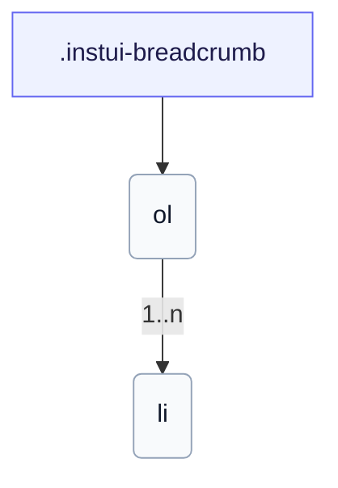

# CSS: breadcrumb

`.instui-breadcrumb` · <span class="instui-pill -color-success pantoken-doc-tag">stable</span> — Հաբերի շղթա բաժանարարներով; վերջինը ընթացիկ էջն է:

Ինքնաբերաբար փլուզում է մի սլաք ետ փոքր էկրաններում: Օգտագործեք `breadcrumb.link` յուրաքանչյուր հաբի համար:

**Աղբյուր:** [breadcrumb.css](https://github.com/thedannywahl/pantoken/blob/main/formats/components/src/components/breadcrumb/breadcrumb.css)

## Մուտքականություն

Փաթեթեք `&lt;ol&gt;`-ը `<nav aria-label>` վերլանդմարկի մեջ; նշեք ընթացիկ էջի հաբը `aria-current="page"`-ով:

## Օգտագործում

```css
@import "@pantoken/components/components.css";
@import "@pantoken/components/breadcrumb.css";
```

## Օրինակներ

```html
<nav class="instui-breadcrumb" aria-label="Breadcrumb">
  <ol>
    <li>
      <a class="-icon-house" href="#">Home</a>
    </li>
    <li><a href="#">Guides</a></li>
    <li><a href="#">Components</a></li>
    <li aria-current="page">Breadcrumb</li>
  </ol>
</nav>
```

## Կառուցվածք

```text
.instui-breadcrumb
  ol
    li (1..n)
```



## Մոդիֆիկատորներ

| Մոդիֆիկատոր | Նկարագիր |
| --- | --- |
| `.-size-large` | Մեծ: @affects breadcrumb.link — Սանդղակում է հաբի բաժանարար հեռավորությունը համապատասխանելու համար: `-size-lg`-ի երկար ձևի անվանում: |
| `.-size-lg` | Մեծ: @affects breadcrumb.link — Սանդղակում է հաբի բաժանարար հեռավորությունը համապատասխանելու համար: |
| `.-size-md` | Միջին (լռելի ևս): @affects breadcrumb.link — Սանդղակում է հաբի բաժանարար հեռավորությունը համապատասխանելու համար: |
| `.-size-medium` | Միջին (լռելի ևս): @affects breadcrumb.link — Սանդղակում է հաբի բաժանարար հեռավորությունը համապատասխանելու համար: `-size-md`-ի երկար ձևի անվանում: |
| `.-size-sm` | Փոքր: @affects breadcrumb.link — Սանդղակում է հաբի բաժանարար հեռավորությունը համապատասխանելու համար: |
| `.-size-small` | Փոքր: @affects breadcrumb.link — Սանդղակում է հաբի բաժանարար հեռավորությունը համապատասխանելու համար: `-size-sm`-ի երկար ձևի անվանում: |

## Ցուցիչներ սպառված

| Տոկեն | Տիպ | Արժեք |
| --- | --- | --- |
| `--instui-component-breadcrumb-gap-lg` | `<length>` | `0.5rem` |
| `--instui-component-breadcrumb-gap-md` | `<length>` | `0.25rem` |
| `--instui-component-breadcrumb-gap-sm` | `<length>` | `0.125rem` |
| `--instui-component-link-font-family` | `[ <font-family-name> \| <generic-font-family> ]#` | `Atkinson Hyperlegible Next, "Helvetica Neue", Helvetica, Arial, sans-serif` |
| `--instui-component-link-font-size-lg` | `<length>` | `1.75rem` |
| `--instui-component-link-font-size-md` | `<length>` | `1rem` |
| `--instui-component-link-font-size-sm` | `<length>` | `0.875rem` |

## Ենթակարողություններ

- [breadcrumb.link](/hy/api/css/breadcrumb.link.md)

