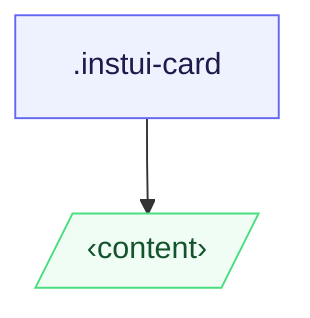

# CSS: card

`.instui-card` — Մակերեսային հարթակ, որը ընդունում է կամայական բովանդակություն:

**Տարբերակ** վերահսկում է, թե ինչպես են ուղղակի երեխաները ստեղծել. `content` (լռելյայն) թողնում է նրանց
անձևավորված; `container` դրանք դառնում են սահմանով, բացատային բաժինների պես: Բացատը մասշտաբ է
տեսանկյուն լայնության հետ և նույնն է երկու տարբերակներում:
**Չափ** ամբողջությամբ արձագանքատեղ է — բացատ և սահմանի շառավիղ ինքնաբերաբար բարձրանում են 320px-ում
(20rem) և 640px (40rem) ստանդարտ `min-width` մեդիա հարցումների միջոցով; չափի դասի անհրաժեշտ չէ:
Զուգակցել `@pantoken/components` հետ վերնագրի, կոճակի և այլ ներքևում բաղադրիչների համար:

## Accessibility

Օգտագործել `&lt;article&gt;` որպես քարտի տարր, երբ քարտը ինքնավարար բովանդակության միավոր է;
օգտագործել `&lt;section&gt;`, երբ խմբավորված է ավելի մեծ ցանցաշար: `-variant-container` մեջ, գերադասել
`&lt;section&gt;` տարրերը որպես ուղղակի երեխաներ, որպեսզի յուրաքանչյուր սահմանայը կրի թվային իմաստ:

## Usage

@import "@pantoken/plugin-custom-components/custom-components.css";

```css
@import "@pantoken/plugin-custom-components/custom-components.css";
```

## Examples

Բովանդակության քարտ -nocard

```html
<article class="instui-card">
  <h2 class="instui-heading -h3">Card title</h2>
  <p>Content here.</p>
  <button class="instui-button">Action</button>
</article>
```

Հարթակային քարտ -nocard

```html
<article class="instui-card -variant-container">
  <section>First section</section>
  <section>Second section</section>
</article>
```

## Structure

```text
.instui-card
  ‹content›
```



## Modifiers

| Modifier              | Description                                                                                        |
| --------------------- | -------------------------------------------------------------------------------------------------- |
| `.-variant-container` | Հարթակային քարտ; ուղղակի երեխաներ դառնում են սահմանք, բացատային բաժինների:                         |
| `.-variant-content`   | Ստանդարտ բովանդակության քարտ; երեխաներ անձևավորված չեն: Լռելյայն, երբ ոչ մի տարբերակ չի սահմանված: |

## Conditions

| Type  | Query                | Description |
| ----- | -------------------- | ----------- |
| media | `(min-width: 20rem)` | —           |
| media | `(min-width: 40rem)` | —           |

## Tokens consumed

| Token                                                                     | Type                | Value                          |
| ------------------------------------------------------------------------- | ------------------- | ------------------------------ |
| `--instui-component-card-background-color`                                | `<color>`           | `light-dark(#ffffff, #1C222B)` |
| `--instui-component-card-border-radius-base-lg`                           | `<length>`          | `1rem`                         |
| `--instui-component-card-border-radius-base-md`                           | `<length>`          | `1rem`                         |
| `--instui-component-card-border-radius-base-sm`                           | `<length>`          | `0.75rem`                      |
| `--instui-component-card-border-radius-nested-lg`                         | `<length>`          | `0.75rem`                      |
| `--instui-component-card-border-radius-nested-md`                         | `<length>`          | `0.5rem`                       |
| `--instui-component-card-border-radius-nested-sm`                         | `<length>`          | `0.5rem`                       |
| `--instui-component-card-nested-border-color`                             | `<color>`           | `light-dark(#E8EAEC, #2D3D49)` |
| `--instui-component-card-padding-base-lg`                                 | `<length>`          | `1.5rem`                       |
| `--instui-component-card-padding-base-md`                                 | `<length>`          | `1rem`                         |
| `--instui-component-card-padding-base-sm`                                 | `<length>`          | `0.75rem`                      |
| `--instui-component-card-padding-nested-lg`                               | `<length>`          | `1rem`                         |
| `--instui-component-card-padding-nested-md`                               | `<length>`          | `0.75rem`                      |
| `--instui-component-card-padding-nested-sm`                               | `<length>`          | `0.5rem`                       |
| `--instui-component-shared-tokens-spacing-gap-cards-nested-containers-lg` | `<length>`          | `1rem`                         |
| `--instui-component-shared-tokens-spacing-gap-cards-nested-containers-md` | `<length>`          | `0.75rem`                      |
| `--instui-component-shared-tokens-spacing-gap-cards-nested-containers-sm` | `<length>`          | `0.5rem`                       |
| `--instui-component-shared-tokens-stroke-width-sm`                        | `<length>`          | `0.0625rem`                    |
| `--instui-elevation-card`                                                 | `none \| <shadow>#` | —                              |

## Browser support

- `@scope` Baseline 2023 Նոր հասանելի; քարտը վատանում է չաշխատող հարթ stylesheet ի
  հին բրաուզերներում առանց տեսանելի ձևային կորստի:

## Related

- [heading](/hy/api/css/heading.md) — Տեղադրել անմիջապես քարտում կամ հարթակային բաժինում:
- [button](/hy/api/css/button.md) — Տեղադրել անմիջապես քարտում կամ հարթակային բաժինում:
- [img](/hy/api/css/img.md) — Տեղադրել անմիջապես քարտում որպես մեդիա տարածք:
- [badge](/hy/api/css/badge.md) — Տեղադրել անմիջապես քարտում որպես վիճակի ցուցիչ:

## See also

- https://drafts.csswg.org/css-cascade-6/#scoping
