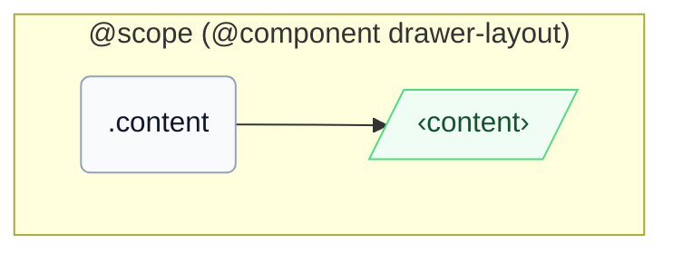

# CSS: drawer-layout.content

`.content` — հիմնական բովանդակության վահանակ, որը լրացնում է մնացած տարածությունը դարակի կողքին:

Երբ ծնողի inline-size-ը ընկնի `46em`-ից (`16em` դարակի լայնություն + `30em` breakpoint), `@container` հարցումը ծնողի `pantoken-drawer-layout` կոնտեյներում հեռացնում է այս անդամի `min-inline-size`-ը `0`-ի վրա ինքնաբերաբար՝ համընկնելով ձեռքով `[should-overlay-tray]` վերակայմանը:

## Մուտքականություն

Կրեք `role="region"` (InstUI-ի DrawerLayout պայմանավորվածություն) և անվանեք այն `aria-label`/`aria-labelledby`-ով, երբ համատեքստը միայնակ չի նույնականացնում այն:

## Օգտագործում

```css
@import "@pantoken/components/components.css";
@import "@pantoken/components/drawer-layout.content.css";
```

## Օրինակներ

```html
<div class="instui-drawer-layout">
  <div class="content" role="region">
    <p class="instui-text">Tray content</p>
  </div>
</div>
```

## Կառուցվածք

```text
@scope (@component drawer-layout)
  .content
    ‹content›
```



## Պայմաններ

| Տիպ | Հարցում | Նկարագիր |
| --- | --- | --- |
| container | `pantoken-drawer-layout (max-width: 46em)` | — |

## Ցուցիչներ սպառված

| Տոկեն | Տիպ | Արժեք |
| --- | --- | --- |
| `--drawer-layout-content-min-inline-size` | `<length>` | — |
| `--pantoken-bp-md` | `<length>` | `30em` |

## Ավելին կապված

- [drawer-layout.tray](/hy/api/css/drawer-layout.tray.md) — հարակից վահանակ նույն flex տողում:

