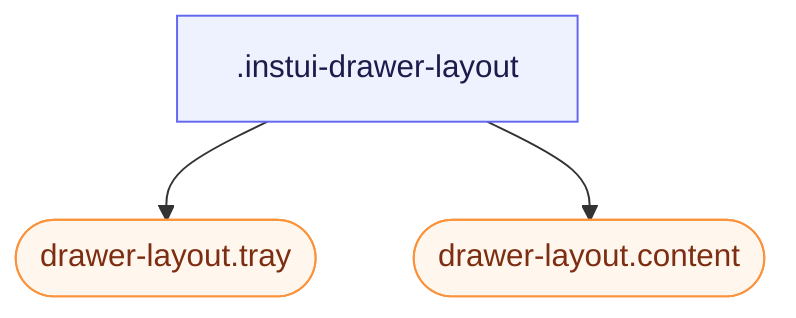

# CSS: drawer-layout

`.instui-drawer-layout` — բաժանված դասավորվածություն՝ կոտրվող կողային դարակով և հիմնական մեկնաբանվող բովանդակության վահանակով:

`-placement-end`-ն և լռելի (start) երկուսն էլ օգտագործում են `flex-direction`/`inset-inline-*` տրամաբանական հատկություններ, ոչ թե `left`/`right`, ուստի դարակի կողմը հետևում է `direction`/`dir="rtl"`-ին ինքնաբերաբար — առանձին RTL կանոն չի պահանջվում:

**Աղբյուր:** [drawer-layout.css](https://github.com/thedannywahl/pantoken/blob/main/formats/components/src/components/drawer-layout/drawer-layout.css)

## Accessibility

Երբ դարակն գործում է որպես նավիգացիա, պիտակավորեք այն հասանելի վերնագրով կամ `aria-label`: Տվեք `.content`-ին `role="region"` (InstUI-ի DrawerLayout պայմանավորվածություն) և անվանեք այն `aria-label`/`aria-labelledby`-ով, երբ համատեքստը միայնակ չի նույնականացնում այն:

## Usage

```css
@import "@pantoken/components/components.css";
@import "@pantoken/components/drawer-layout.css";
```

## Examples

```html
<div class="instui-drawer-layout" id="drawer" open>
  <aside class="tray">Navigation</aside>
  <main class="content" role="region">Main content</main>
</div>
```

## Structure

```text
.instui-drawer-layout
  drawer-layout.tray (component)
  drawer-layout.content (component)
```



## Modifiers

| Modifier                | Description                                                                                                                                                     |
| ----------------------- | --------------------------------------------------------------------------------------------------------------------------------------------------------------- |
| `.-open`                | Ցույց տվեք դարակը նույնիսկ այն դեպքում, երբ `open` ատրիբուտը բացակայում է:                                                                                      |
| `.-placement-end`       | Կցեք դարակը inline-end կողմում:                                                                                                                                 |
| `.-placement-start`     | Կցեք դարակը inline-start կողմում (լռելի; դրեք այն հստակ):                                                                                                       |
| `.-should-overlay-tray` | <span class="instui-pill pantoken-doc-tag pantoken-doc-tag-interaction">Interaction</span> — Render the tray as an overlay instead of shrinking content inline. |

## Parts

| Part       | Description       |
| ---------- | ----------------- |
| `.content` | Հիմնական վահանակ: |
| `.tray`    | Կողային վահանակ:  |

## Custom properties

| Property           | Type | Default | Description                                                                                       |
| ------------------ | ---- | ------- | ------------------------------------------------------------------------------------------------- |
| `--pantoken-bp-md` | —    | —       | Լայնության շեմ overlay ռեժիմի համար (`30em`, թեմատիզացված պատասխանական ծառայությունների միջոցով): |

## Browser support

- `drawer-layout.tray`/`drawer-layout.content` անդամները ինքնաբերաբար անցում են overlay ռեժիմի `@container` հարցման միջոցով, երբ այս տարրի inline-size-ը ընկնի tray-width + `--pantoken-bp-md`-ից: `@pantoken/interactions` վարքը լրացուցիչ փոխարկում է `[should-overlay-tray]`/`.-should-overlay-tray`-ը (ձեռքով վերակայում) և արձակում `overlaytraychange`-ը հավելվածների համար, որոնք անհրաժեշտ են փոփոխությունը որպես իրադարձություն:

## Subcomponents

- [drawer-layout.content](/hy/api/css/drawer-layout.content.md)
- [drawer-layout.tray](/hy/api/css/drawer-layout.tray.md)
- [tray](/hy/api/css/tray.md)

## Related

- [tray](/hy/api/css/tray.md) — անկախ եզրային overlay; այս դասավորվածությունը պահում է դարակ և բովանդակություն նույն հոսքում:
- [context-view](/hy/api/css/context-view.md) — ավելի փոքր շեղված մակերես համատեքստային գործողությունների և մանրամասների համար:
