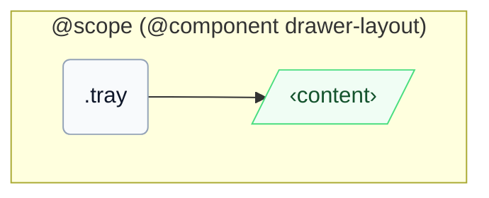

# CSS: drawer-layout.tray

`.tray` — կողային վահանակ հիմնական բովանդակության կողքին, ընտրական overlay-ով և դարակ-նման մակերեսային ձևափոխիչներով:

Դիրքավորումը օգտագործում է `inset-inline-start`/`inset-inline` (երբեք ոչ `left`/`right`), ուստի `-placement-end` կցվում է իրական հետածանցյալ եզրին LTR-ում և RTL-ում:

## Մուտքականություն

Եթե օգտագործվում է որպես նավիգացիա, պակետավորեք հղումները իմաստային `&lt;nav&gt;`-ում և տրամադրեք հասանելի անվ:

## Օգտագործում

```css
@import "@pantoken/components/components.css";
@import "@pantoken/components/drawer-layout.tray.css";
```

## Օրինակներ

```html
<div class="instui-drawer-layout" open>
  <aside class="tray" aria-label="Course navigation">
    <a class="instui-link" href="#">Modules</a>
  </aside>
  <main class="content" role="region">Main content</main>
</div>
```

## Կառուցվածք

```text
@scope (@component drawer-layout)
  .tray
    ‹content›
```



## Մոդիֆիկատորներ

| Մոդիֆիկատոր | Նկարագիր |
| --- | --- |
| `.-placement-end` | Կցեք այս դարակը inline-end-ին, երբ overlay ռեժիմը ակտիվ է: |
| `.-without-border` | Հեռացրեք վահանակի եզրային սահմանը: |
| `.-without-shadow` | Հեռացրեք բարձրությունը, երբ overlay ռեժիմը ակտիվ է: |

## Պայմաններ

| Տիպ | Հարցում | Նկարագիր |
| --- | --- | --- |
| container | `pantoken-drawer-layout (max-width: 46em)` | — |

## Ցուցիչներ սպառված

| Տոկեն | Տիպ | Արժեք |
| --- | --- | --- |
| `--drawer-layout-tray-width` | — | — |
| `--instui-border-width-sm` | `<length>` | `0.0625rem` |
| `--instui-color-background-elevated-surface-base` | `<color>` | `light-dark(#ffffff, #171B21)` |
| `--instui-color-stroke-base` | `<color>` | `light-dark(#8D959F, #6A7883)` |
| `--instui-component-tray-width-xs` | `<length>` | `16em` |
| `--instui-component-tray-z-index` | `<integer>` | `9999` |
| `--instui-elevation-topmost` | `none \| <shadow>#` | — |

## Ավելին կապված

- [drawer-layout.content](/hy/api/css/drawer-layout.content.md) — հիմնական վահանակ, որը ճկվում է այս անդամի կողքին:

