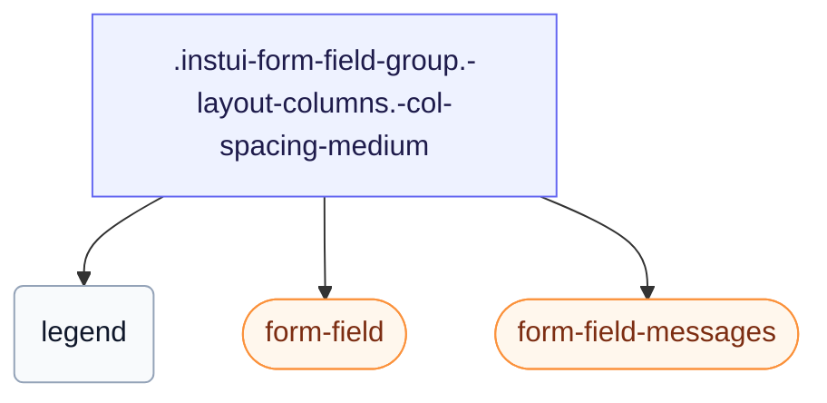

# CSS: form-field-group

`.instui-form-field-group` — `&lt;fieldset&gt;` խումբ՝ լեգենդով, սյունակային կամ inline դասավորվածությամբ և կազմվող միջեջներով:

Սահմանում է իր սեփական `gap` դաշտերի միջև, կարգավորելի `-col-spacing-*`/`-row-spacing-*` մոդիֆիկատորներով ստորև — նախընտրում են դրանք ընդհանուր `-gap-*` տարածության կոմունալ մոդիֆիկատորի շղթայակցման փոխարեն, որը ամբողջությամբ անտեսում է ներկառուցված արժեքը:

**Աղբյուր:** [form-field-group.css](https://github.com/thedannywahl/pantoken/blob/main/formats/components/src/components/form-field-group/form-field-group.css)

## Մուտքականություն

Տեղադրում է ծնունդական `&lt;fieldset&gt;` `&lt;legend&gt;` հետ, որպեսզի հեռապատկերի տեքստը անվանի ամբողջ խումբը օգնական տեխնոլոգիայի համար:

## Օգտագործում

```css
@import "@pantoken/components/components.css";
@import "@pantoken/components/form-field-group.css";
```

## Օրինակներ

```html
<fieldset class="instui-form-field-group -layout-columns -col-spacing-medium">
  <legend>Shipping address</legend>
  <label class="instui-form-field">
    <span class="label">First name</span>
    <span class="controls"><input class="instui-text-input"></span>
  </label>
  <label class="instui-form-field">
    <span class="label">Last name</span>
    <span class="controls"><input class="instui-text-input"></span>
  </label>
  <label class="instui-form-field">
    <span class="label">City</span>
    <span class="controls"><input class="instui-text-input"></span>
  </label>
  <label class="instui-form-field">
    <span class="label">State</span>
    <span class="controls">
      <select class="instui-simple-select">
        <option>CA</option>
        <option>NY</option>
        <option>TX</option>
      </select>
    </span>
  </label>
  <div class="instui-form-field-messages">
    <span class="instui-form-field-message -type-hint">All fields are used for delivery only.</span>
  </div>
</fieldset>
```

## Կառուցվածք

```text
.instui-form-field-group.-layout-columns.-col-spacing-medium
  legend
  form-field (component)
  form-field-messages (component)
```



## Մոդիֆիկատորներ

| Մոդիֆիկատոր | Նկարագիր |
| --- | --- |
| `.-col-spacing-large` | Խոշոր սյունակի բացատ: |
| `.-col-spacing-medium` | Միջին սյունակի բացատ: |
| `.-col-spacing-none` | Սյունակի բացատ չկա: |
| `.-col-spacing-small` | Փոքր սյունակի բացատ: |
| `.-layout-aligned` | Վերեր դաշտերը հավասարեցնել ընդհանուր ցանցին: |
| `.-layout-columns` | Տեղադրել երեխա դաշտերը սյունակներով: |
| `.-layout-inline` | Տեղադրել երեխա դաշտերը շարքում, դրամական: |
| `.-required` | Հերթագրել խումբը որպես պարտադիր: |
| `.-row-spacing-large` | Խոշոր տողի բացատ: |
| `.-row-spacing-medium` | Միջին տողի բացատ: |
| `.-row-spacing-none` | Տողի բացատ չկա: |
| `.-row-spacing-small` | Փոքր տողի բացատ: |
| `.-v-align-bottom` | Հավասարեցնել դաշտերը ներքևում: |
| `.-v-align-middle` | Հավասարեցնել դաշտերը մեջտեղում: |
| `.-v-align-top` | Հավասարեցնել դաշտերը վերևում: |

## Պսևդո-էլեմենտներ

| Պսևդո-էլեմենտ | Նկարագիր |
| --- | --- |
| `::after` | Տեղադրում է ձևավորական պարտադիր-դաշտի աստղանիշ հեռապատկերի տեքստից հետո, երբ խումբը պարտադիր է: |

## Պայմաններ

| Տիպ | Հարցում | Նկարագիր |
| --- | --- | --- |
| supports | `(grid-template-columns: subgrid)` | — |

## Ցուցիչներ սպառված

| Տոկեն | Տիպ | Արժեք |
| --- | --- | --- |
| `--instui-component-form-field-layout-asterisk-color` | `<color>` | `light-dark(#CF1F24, #FA917F)` |
| `--instui-component-form-field-layout-font-family` | `[ <font-family-name> \| <generic-font-family> ]#` | `Atkinson Hyperlegible Next, "Helvetica Neue", Helvetica, Arial, sans-serif` |
| `--instui-component-form-field-layout-font-size` | `<length>` | `1rem` |
| `--instui-component-form-field-layout-font-weight` | `<integer>` | `400` |
| `--instui-component-form-field-layout-gap-inputs` | `<length>` | `0.75rem` |
| `--instui-component-form-field-layout-gap-primitives` | `<length>` | `0.5rem` |
| `--instui-component-form-field-layout-line-height` | `<length>` | `1.125rem` |
| `--instui-component-form-field-layout-text-color` | `<color>` | `light-dark(#273540, #ffffff)` |
| `--instui-spacing-space-lg` | `<length>` | `1rem` |
| `--instui-spacing-space-md` | `<length>` | `0.75rem` |
| `--instui-spacing-space-sm` | `<length>` | `0.5rem` |

## Բրաուզերի աջակցություն

- `-layout-aligned` ռեժիմը օգտագործում է CSS ենթացանց `@supports` պաշտպանության ետևում; որտեղ ենթացանցը չի աջակցվում, դաշտերը վերադառնում են իրենց սեփական կուտակային դասավորվածքին:

## Ենթակարողություններ

- [form-field](/hy/api/css/form-field.md)
- [form-field-messages](/hy/api/css/form-field-messages.md)

## Ավելին կապված

- [form-field](/hy/api/css/form-field.md) — Այն մեկ դաշտը, որը կրկնում է այս խումբը:
- [radio-input-group](/hy/api/css/radio-input-group.md) — Խմբավորում է ռադիո մուտքերը հեռապատկերի տակ:

