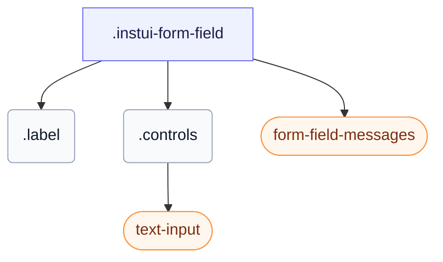

# CSS: form-field

`.instui-form-field` — Ձևի դաշտի շրջապատ՝ պիտակ, դրա վերահսկողություն և դրամական, պարտադիր կամ միայն կարդալի դասավորվածքներ:

Սխալի հաղորդագրությունը մնում է թաքնված, մինչև դաշտի վերահսկողությունը լինի `:user-invalid` (օգտվողի փոխազդեցից հետո) կամ դուք ավելացնում եք `-invalid` դասը: Օգտագործել `-layout-inline` պիտակը վերահսկողության կողքին դնելու համար և `-layout-stacked` այն վերևում դնելու համար: Նաև սահմանում է իր սեփական `gap` պիտակ, վերահսկողություն և հաղորդագրությունների միջև; շղթայակցել `-gap-*` տարածության կոմունալ մոդիֆիկատորը անտեսում է այն ներկառուցված արժեքը:

**Աղբյուր:** [form-field.css](https://github.com/thedannywahl/pantoken/blob/main/formats/components/src/components/form-field/form-field.css)

## Accessibility

`&lt;label&gt;` տարրը շրջապատում է վերահսկողությունը, ուստի պիտակի տեքստը անվանում է այն բնածին; պարտադիր աստղանիշը ձևավորական է և պետք է թաքնված լինի օգնական տեխնոլոգիայից (aria-hidden), և սխալի հաղորդագրությունը բարձրանում է, երբ վերահսկողությունը լինի `:user-invalid` կամ դուք ավելացնում եք `-invalid` դասը:

## Usage

```css
@import "@pantoken/components/components.css";
@import "@pantoken/components/form-field.css";
```

## Examples

```html
<label class="instui-form-field">
  <span class="label">Email address</span>
  <span class="controls"
    ><input class="instui-text-input" type="email" placeholder="you@example.com"
  /></span>
  <div class="instui-form-field-messages">
    <span class="instui-form-field-message -type-hint">We'll never share it.</span>
    <span class="instui-form-field-message -type-error">Enter a valid email address.</span>
  </div>
</label>
```

## Structure

```text
.instui-form-field
  .label
  .controls
    text-input (component)
  form-field-messages (component)
```



## Modifiers

| Modifier              | Description                                             |
| --------------------- | ------------------------------------------------------- |
| `.-inline`            | Դրամական դասավորվածք (`-layout-inline` համար կարճ ձևը): |
| `.-invalid`           | Անվավեր (սխալ) վիճակ:                                   |
| `.-label-align-end`   | Վերջում հավասարեցնել պիտակի տեքստը:                     |
| `.-label-align-start` | Սկզբում հավասարեցնել պիտակի տեքստը:                     |
| `.-layout-inline`     | Դրամական դասավորվածք՝ պիտակ վերահսկողության կողքին:     |
| `.-layout-stacked`    | Կուտակային դասավորվածք՝ պիտակ վերահսկողության վերևում:  |
| `.-readonly`          | Միայն կարդալու համար վիճակ:                             |
| `.-v-align-bottom`    | Հավասարեցնել պիտակը վերահսկողության հետ ներքևում:       |
| `.-v-align-top`       | Հավասարեցնել պիտակը վերահսկողության հետ վերևում:        |

## Parts

| Part        | Description                                         |
| ----------- | --------------------------------------------------- |
| `.controls` | Վերահսկողության տարածքը պիտակի կողքին կամ ներքևում: |
| `.label`    | Դաշտի պիտակ:                                        |

## Pseudo-elements

| Pseudo-element | Description                                                                               |
| -------------- | ----------------------------------------------------------------------------------------- |
| `::after`      | Տեղադրում է ձևավորական պարտադիր-դաշտի աստղանիշ պիտակի տեքստից հետո, երբ դաշտը պարտադիր է: |

## States

| State       | Description |
| ----------- | ----------- |
| `:required` | —           |

## Tokens consumed

| Token                                                      | Type                                               | Value                                                                        |
| ---------------------------------------------------------- | -------------------------------------------------- | ---------------------------------------------------------------------------- |
| `--instui-component-form-field-layout-asterisk-color`      | `<color>`                                          | `light-dark(#CF1F24, #FA917F)`                                               |
| `--instui-component-form-field-layout-font-family`         | `[ <font-family-name> \| <generic-font-family> ]#` | `Atkinson Hyperlegible Next, "Helvetica Neue", Helvetica, Arial, sans-serif` |
| `--instui-component-form-field-layout-font-size`           | `<length>`                                         | `1rem`                                                                       |
| `--instui-component-form-field-layout-font-weight`         | `<integer>`                                        | `400`                                                                        |
| `--instui-component-form-field-layout-gap-inputs`          | `<length>`                                         | `0.75rem`                                                                    |
| `--instui-component-form-field-layout-gap-primitives`      | `<length>`                                         | `0.5rem`                                                                     |
| `--instui-component-form-field-layout-line-height`         | `<length>`                                         | `1.125rem`                                                                   |
| `--instui-component-form-field-layout-readonly-text-color` | `<color>`                                          | `light-dark(#576773, #AAB0B5)`                                               |
| `--instui-component-form-field-layout-text-color`          | `<color>`                                          | `light-dark(#273540, #ffffff)`                                               |

## Browser support

- Պարունակում է իր տարրի ոճերը CSS `@scope` at-rule-ի հետ; անհրաժեշտ է վերջին Chromium, Firefox կամ Safari:

## Subcomponents

- [form-field-messages](/hy/api/css/form-field-messages.md)
- [text-input](/hy/api/css/text-input.md)

## Related

- [form-field-messages](/hy/api/css/form-field-messages.md) — Տեղադրում է դաշտի ակնարկ, սխալ և հաջողության հաղորդագրությունները:
- [form-field-group](/hy/api/css/form-field-group.md) — Խմբավորում է առնչվող դաշտերը ընդհանուր հեռապատկերի տակ:
