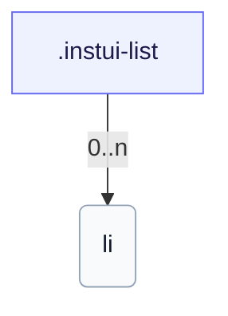

# CSS: list

`.instui-list` — Ցանկ՝ տոկեն-վարորդ տարրերի տարածությամբ:

Սահմանում է իր սեփական `padding-inline-start` ցանկի ընդվզման համար; շղթայավորելով `-p*`/`-padding*` տարածության կոմունալ փոփոխիչ՝ վերակայում է այդ ներկառուցված արժեքը: Տե՛ս `list.item` անդամը առանձին տարրերի համար:

**Աղբյուր:** [list.css](https://github.com/thedannywahl/pantoken/blob/main/formats/components/src/components/list/list.css)

## Օգտագործում

```css
@import "@pantoken/components/components.css";
@import "@pantoken/components/list.css";
```

## Օրինակներ

```html
<ul class="instui-list">
  <li>First item</li>
  <li>Second item</li>
  <li>Third item</li>
</ul>
```

## Կառուցվածք

```text
.instui-list
  li (0..n)
```



## Մոդիֆիկատորներ

| Մոդիֆիկատոր | Նկարագիր |
| --- | --- |
| `.-inline` | Դասավորել տարրերը ներքին (հորիզոնական): |
| `.-size-large` | Մեծ: @affects list.item — Կշեռքավորում է տարրի տարածությունը համընկույսի համար: `-size-lg`-ի երկար ձեւ կեղծանուն: |
| `.-size-lg` | Մեծ: @affects list.item — Կշեռքավորում է տարրի տարածությունը համընկույսի համար: |
| `.-size-md` | Միջին (կանխադրված): @affects list.item — Կշեռքավորում է տարրի տարածությունը համընկույսի համար: |
| `.-size-medium` | Միջին (կանխադրված): @affects list.item — Կշեռքավորում է տարրի տարածությունը համընկույսի համար: `-size-md`-ի երկար ձեւ կեղծանուն: |
| `.-size-sm` | Փոքր: @affects list.item — Կշեռքավորում է տարրի տարածությունը համընկույսի համար: |
| `.-size-small` | Փոքր: @affects list.item — Կշեռքավորում է տարրի տարածությունը համընկույսի համար: `-size-sm`-ի երկար ձեւ կեղծանուն: |
| `.-unstyled` | Հեռացնել նշիչներ և հավելումներ: |

## Ցուցիչներ սպառված

| Տոկեն | Տիպ | Արժեք |
| --- | --- | --- |
| `--instui-component-list-item-color` | `<color>` | `light-dark(#273540, #ffffff)` |
| `--instui-component-list-item-font-family` | `[ <font-family-name> \| <generic-font-family> ]#` | `Atkinson Hyperlegible Next, "Helvetica Neue", Helvetica, Arial, sans-serif` |
| `--instui-component-list-item-font-size-large` | `<length>` | `1.25rem` |
| `--instui-component-list-item-font-size-medium` | `<length>` | `1rem` |
| `--instui-component-list-item-font-size-small` | `<length>` | `0.875rem` |
| `--instui-component-list-item-font-weight` | `<integer>` | `400` |
| `--instui-component-list-item-line-height` | `<percentage>` | `150%` |
| `--instui-component-list-item-spacing-medium` | `<length>` | `1.5rem` |
| `--instui-component-list-list-padding` | `<length>` | `2.25rem` |

## Ենթակարողություններ

- [list.item](/hy/api/css/list.item.md)

