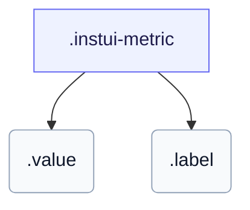

# CSS: metric

`.instui-metric` — Պիտակավորված վիճակագրություն — մեծ արժեք վերնագրի վրա:

Սահմանում է իր սեփական `gap` արժեքի և պիտակի միջև, և իր սեփական հորիզոնական `padding`; շղթայական `-gap-*`/`-p-*`/`-padding-*` հեռավորության կոմունալ փոփոխիչ վերակացնում է այդ ներկառուցված արժեքները:

**Աղբյուր:** [metric.css](https://github.com/thedannywahl/pantoken/blob/main/formats/components/src/components/metric/metric.css)

## Օգտագործում

```css
@import "@pantoken/components/components.css";
@import "@pantoken/components/metric.css";
```

## Օրինակներ

```html
<div class="instui-metric">
  <span class="value">1,284</span>
  <span class="label">Active users</span>
</div>
```

## Կառուցվածք

```text
.instui-metric
  .value
  .label
```



## Մոդիֆիկատորներ

| Մոդիֆիկատոր | Նկարագիր |
| --- | --- |
| `.-text-align-center` | Կենտրոնացնել արժեքը և պիտակը: |
| `.-text-align-end` | Վերջ-հավասարեցնել արժեքը և պիտակը: |
| `.-text-align-start` | Սկիզբ-հավասարեցնել արժեքը և պիտակը: |

## Մասեր

| Մաս | Նկարագիր |
| --- | --- |
| `.label` | Արժեքի տակ գտնվող վերնագիր: |
| `.value` | Մեծ մետրային թիվ: |

## Ցուցիչներ սպառված

| Տոկեն | Տիպ | Արժեք |
| --- | --- | --- |
| `--instui-component-metric-gap-texts` | `<length>` | `0.5rem` |
| `--instui-component-metric-label-color` | `<color>` | `light-dark(#273540, #ffffff)` |
| `--instui-component-metric-label-font-family` | `[ <font-family-name> \| <generic-font-family> ]#` | `Atkinson Hyperlegible Next, "Helvetica Neue", Helvetica, Arial, sans-serif` |
| `--instui-component-metric-label-font-size` | `<length>` | `0.75rem` |
| `--instui-component-metric-label-font-weight` | `<integer>` | `400` |
| `--instui-component-metric-label-line-height` | `<length>` | `0.75rem` |
| `--instui-component-metric-padding-horizontal` | `<length>` | `0.5rem` |
| `--instui-component-metric-value-color` | `<color>` | `light-dark(#273540, #ffffff)` |
| `--instui-component-metric-value-font-family` | `[ <font-family-name> \| <generic-font-family> ]#` | `Inclusive Sans, "Helvetica Neue", Helvetica, Arial, sans-serif` |
| `--instui-component-metric-value-font-size` | `<length>` | `1.75rem` |
| `--instui-component-metric-value-font-weight` | `<integer>` | `600` |
| `--instui-component-metric-value-line-height` | `<length>` | `1.75rem` |

