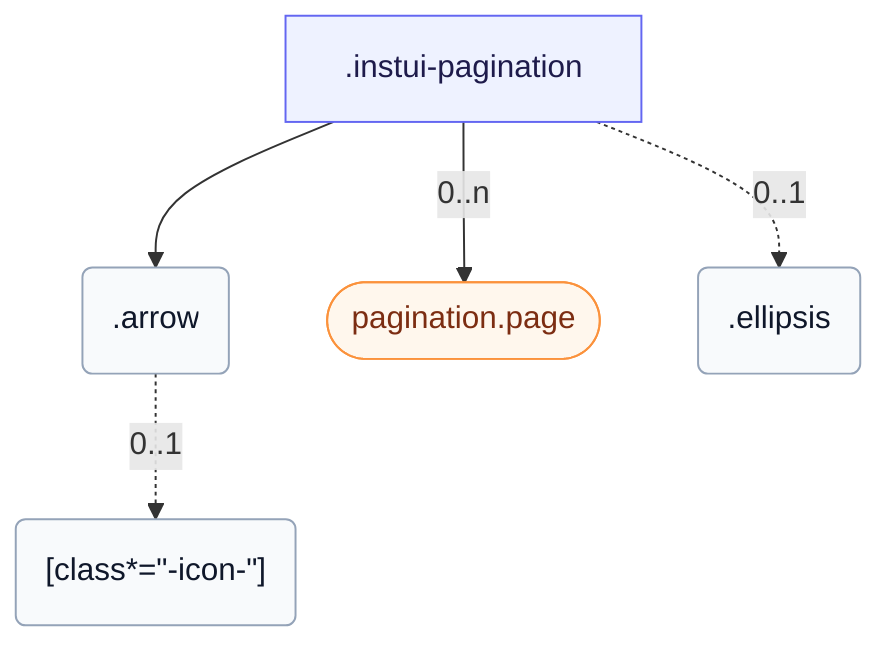

# CSS: pagination

`.instui-pagination` — Էջի նավիգացիա` համարակալված էջերը, առաջինը, նախորդը, հետևածը և վերջինը սլաքներ, և էլիպսիս բացակայության համար:

Տես `pagination.page` անդամ առանձին էջի վերահսկման համար:

**Աղբյուր:** [page.css](https://github.com/thedannywahl/pantoken/blob/main/formats/components/src/components/pagination/members/page/page.css)

## Մուտքականություն

Պիտակել `&lt;nav&gt;` aria-label հետ, նշել ընթացիկ էջը aria-current="page" հետ, տալ յուրաքանչյուր սլաք aria-label, և անջատել վերջի սլաքները disabled կամ aria-disabled="true" հետ:

## Օգտագործում

```css
@import "@pantoken/components/components.css";
@import "@pantoken/components/pagination.css";
```

## Օրինակներ

```html
<nav class="instui-pagination" aria-label="Pagination">
  <button class="arrow" type="button" aria-label="First page" disabled><span class="instui-icon -icon-chevrons-left"></span></button>
  <button class="arrow" type="button" aria-label="Previous page" disabled><span class="instui-icon -icon-chevron-left"></span></button>
  <a class="page" href="#" aria-current="page">1</a>
  <a class="page" href="#">2</a>
  <a class="page" href="#">3</a>
  <span class="ellipsis">…</span>
  <a class="page" href="#">12</a>
  <a class="arrow" href="#" aria-label="Next page"><span class="instui-icon -icon-chevron-right"></span></a>
  <a class="arrow" href="#" aria-label="Last page"><span class="instui-icon -icon-chevrons-right"></span></a>
</nav>
```

## Կառուցվածք

```text
.instui-pagination
  .arrow
    [class*="-icon-"] (0..1)
  pagination.page (component, 0..n)
  .ellipsis (0..1)
```



## Մոդիֆիկատորներ

| Մոդիֆիկատոր | Նկարագիր |
| --- | --- |
| `.-icon-*` | Ցուցադրեք սլաք գլիֆիկ պատկերակները առաջին/նախորդ/հաջորդ/վերջին կառավարման տարրերի մեջ: |
| `.-variant-input` | Կոմպակտ տարբերակ էջի համարի մուտքագրմամբ: |

## Մասեր

| Մաս | Նկարագիր |
| --- | --- |
| `.arrow` | Առաջին, նախորդ, հաջորդ կամ վերջին կառավարման տարր: |
| `.ellipsis` | Բացատի նշանակիչ էջի տիրույթների միջև: |
| `.page-input-label` | Պիտակ էջի համարի մուտքագրման համար (մուտքագրման տարբերակ): |

## Փոփոխական վիճակներ

| Վիճակ | Նկարագիր |
| --- | --- |
| `[aria-disabled="true"]` | — |
| `:disabled` | — |

## Ցուցիչներ սպառված

| Տոկեն | Տիպ | Արժեք |
| --- | --- | --- |
| `--instui-border-width-md` | `<length>` | `0.125rem` |
| `--instui-color-background-muted` | `<color>` | `light-dark(#F2F4F5, #273540)` |
| `--instui-color-text-interactive-navigation-primary-base` | `<color>` | `light-dark(#2369A4, #7FB4F1)` |
| `--instui-color-text-interactive-navigation-primary-hover` | `<color>` | `light-dark(#1A5281, #ACCDF7)` |
| `--instui-color-text-muted` | `<color>` | `light-dark(#576773, #AAB0B5)` |
| `--instui-component-base-button-border-radius` | `<length>` | `0.75rem` |
| `--instui-component-pagination-page-indicator-gap` | `<length>` | `0.5rem` |
| `--instui-component-pagination-page-input-input-spacing` | `<length>` | `0.5rem` |
| `--instui-component-pagination-page-input-input-width` | `<length>` | `4.5rem` |
| `--instui-component-pagination-page-input-label-color` | `<color>` | `light-dark(#273540, #F2F4F5)` |
| `--instui-font-family-base` | `[ <font-family-name> \| <generic-font-family> ]#` | `Atkinson Hyperlegible Next, "Helvetica Neue", Helvetica, Arial, sans-serif` |
| `--instui-font-weight-interactive` | `<integer>` | `500` |
| `--instui-opacity-disabled` | `<number>` | `0.5` |
| `--instui-spacing-space-xs` | `<length>` | `0.25rem` |
| `--instui-spacing-space2xs` | `<length>` | `0.125rem` |

## Ենթակարողություններ

- [pagination.page](/hy/api/css/pagination.page.md)

