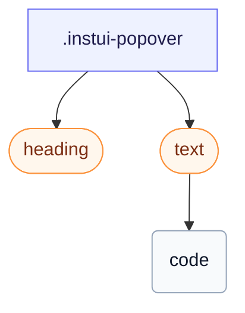

# CSS: popover

`.instui-popover` — բարձրացված մակերես ծրագրային `[popover]`-ի համար, տեղադրված CSS թաբի դիրքավորմամբ:

Թաբի դիրքավորումը միայն Chromium-ի համար է; `@supports` պահպանը նշանակում է, որ `-placement-*` անուղղակիորեն իներտ է այլուր, և UA-ն popover-ը կենտրոնացնում է վերին շերտում անհաջոկության փոխարեն:

**Աղբյուր:** [popover.css](https://github.com/thedannywahl/pantoken/blob/main/formats/components/src/components/popover/popover.css)

## Օգտագործում

```css
@import "@pantoken/components/components.css";
@import "@pantoken/components/popover.css";
```

## Օրինակներ

```html
<div class="instui-popover -placement-bottom" id="pop-1">
  <div class="instui-heading -level-h4">Share this page</div>
  <p class="instui-text -size-sm">A popover is a lightweight surface anchored to a trigger. This one uses the native <code>popover</code> attribute.</p>
</div>
```

## Կառուցվածք

```text
.instui-popover
  heading (component)
  text (component)
    code
```



## Մոդիֆիկատորներ

| Մոդիֆիկատոր | Նկարագիր |
| --- | --- |
| `.-placement-bottom` | Նստեք խարիսխից ներքեւ: |
| `.-placement-end` | Նստեք խարիսխից վերջում (inline-end): |
| `.-placement-start` | Նստեք խարիսխից սկզբում (inline-start): |
| `.-placement-top` | Նստեք խարիսխից վերեւ: |

## Պայմաններ

| Տիպ | Հարցում | Նկարագիր |
| --- | --- | --- |
| supports | `(position-area: block-end)` | — |
| supports | `(transition-behavior: allow-discrete)` | — |

## Ցուցիչներ սպառված

| Տոկեն | Տիպ | Արժեք |
| --- | --- | --- |
| `--instui-border-width-sm` | `<length>` | `0.0625rem` |
| `--instui-color-background-elevated-surface-base` | `<color>` | `light-dark(#ffffff, #171B21)` |
| `--instui-color-text-base` | `<color>` | `light-dark(#273540, #F2F4F5)` |
| `--instui-component-popover-border-color` | `<color>` | `light-dark(#8D959F, #6A7883)` |
| `--instui-component-popover-border-radius` | `<length>` | `0.75rem` |
| `--instui-elevation-above` | `none \| <shadow>#` | — |
| `--instui-spacing-space-sm` | `<length>` | `0.5rem` |

## Բրաուզերի աջակցություն

- Օգտագործում է CSS թաբի դիրքավորում (`position-anchor`/`position-area`) և ծրագրային `[popover]` API, երկուսն էլ միայն Chromium-ի համար այսօր; `@supports` պահպանը հեռացնում է դիրքը այլուր, որտեղ UA-ն կենտրոնացնում է popover-ը վերին շերտում:

## Ենթակարողություններ

- [heading](/hy/api/css/heading.md)
- [text](/hy/api/css/text.md)

## Ավելին կապված

- [tooltip](/hy/api/css/tooltip.md) — Հուշումը ավելի փոքր, շարժել կամ ուշադրություն ակտիվացված թաբի մակերես է:
- [context-view](/hy/api/css/context-view.md) — Համատեքստի դիտումը կապված թաբի մակերես է ցուցակիչով:

