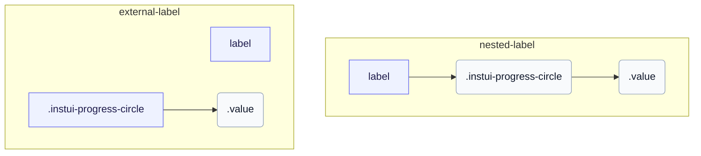

# CSS: progress-circle

`.instui-progress-circle` · <span class="instui-pill -color-success pantoken-doc-tag">կայուն</span> — Շրջանաձև առաջընթացի օղակ, որը վարվում է `--value` և `--value-max` հատուկ հատկություններով:

Օղակը `conic-gradient` դոնատ է, որը նկարված է `::before`-ի վրա և կտրված ռադիալ գրադիենտ դիմակով; `--value` բաժանված `--value-max`-ով վարում է աղեղը: Ավելացրեք `-should-animate` և բեռնեք փոխազդեցությունների մուտքի կետը այն անիմացիայի համար զրոյից մեղմ վրա: InstUI-ն չունի անորոշ վիճակ; `:indeterminate`-ը պանտոկեն-միայն լավագույն կռահ է (ծրագրային `&lt;progress&gt;` առանց `value` հատկության), պտտեք օղակը ֆիքսված աղեղով և թաքցրեք `.value`, քանի որ ցույց տալու համար իմաստալից թիվ չկա: `&lt;meter&gt;`-ն չունի անորոշ վիճակ, ուստի այն ազդեցության չի ենթարկվում:

**Աղբյուր:** [progress-circle.css](https://github.com/thedannywahl/pantoken/blob/main/formats/components/src/components/progress-circle/progress-circle.css)

<!-- js-requirement -->

> [!TIP]
> **JS Enhancement** — Այս բաղադրիչի CSS-ը ցուցադրվում և աշխատում է ինքնուրույն; զուգակցեք այն `@pantoken/interactions`-ի հետ ինտերակտիվ վարքագիծ ավելացնելու համար: Դրա `-should-animate` փոփոխիչը վարվում է այդ վարքագծով: Տե՛ս ստորև գտնվող [փոփոխիչ աղյուսակ](#modifiers):

## Accessibility

Օգտագործեք ծնիկ `&lt;progress&gt;` զրոյական հիմնական առաջադրանքի ավարտման շրջանակի համար և `&lt;meter&gt;` երբ նվազագույնը ոչ զրոյական է: Տալ յուրաքանչյուր տարրին մատչելի անուն`այն տեղադրելով`&lt;label&gt;`-ում կամ կցելով առանձին `&lt;label&gt;`-ը համապատասխան `for`և`id` արժեքների միջոցով:

## Usage

```css
@import "@pantoken/components/components.css";
@import "@pantoken/components/progress-circle.css";
```

## Examples

### Nested label

```html
<label>
  Uploading Document: <progress class="instui-progress-circle -size-sm" value="70">70%</progress>
</label>
```

### External label

```html
<label for="score">Score</label>
<meter id="score" class="instui-progress-circle -color-success" min="20" value="40" max="60">
  50%
</meter>
```

## Structure

`// Variant: nested-label`

```text
label
  .instui-progress-circle
    .value
```

`// Variant: external-label`

```text
label
.instui-progress-circle
  .value
```



## Modifiers

| Modifier                    | Description                                                                                                                                                   |
| --------------------------- | ------------------------------------------------------------------------------------------------------------------------------------------------------------- |
| `.-color-brand`             | Ապրանքային նշանի մետրի գույն:                                                                                                                                 |
| `.-color-danger`            | Վտանգի մետրի գույն:                                                                                                                                           |
| `.-color-info`              | Տեղեկատվական մետրի գույն:                                                                                                                                     |
| `.-color-primary-inverse`   | Մութ ֆոնի վրա (առաջնային հակադարձ) մետրի գույն:                                                                                                               |
| `.-color-success`           | Հաջողության մետրի գույն:                                                                                                                                      |
| `.-color-warning`           | Զգուշացման մետրի գույն:                                                                                                                                       |
| `.-meter-color-alert`       | <span class="instui-pill -color-danger pantoken-doc-tag">Deprecated</span> — use `.-color-warning`.                                                           |
| `.-meter-color-brand`       | <span class="instui-pill -color-danger pantoken-doc-tag">Deprecated</span> — use `.-color-brand`.                                                             |
| `.-meter-color-danger`      | <span class="instui-pill -color-danger pantoken-doc-tag">Deprecated</span> — use `.-color-danger`.                                                            |
| `.-meter-color-info`        | <span class="instui-pill -color-danger pantoken-doc-tag">Deprecated</span> — use `.-color-info`.                                                              |
| `.-meter-color-success`     | <span class="instui-pill -color-danger pantoken-doc-tag">Deprecated</span> — use `.-color-success`.                                                           |
| `.-meter-color-warning`     | <span class="instui-pill -color-danger pantoken-doc-tag">Deprecated</span> — use `.-color-warning`.                                                           |
| `.-shold-animate-on-mount`  | <span class="instui-pill -color-info pantoken-doc-tag">Alias</span> — maps to `.-should-animate`.                                                             |
| `.-should-animate`          | <span class="instui-pill pantoken-doc-tag pantoken-doc-tag-interaction">Interaction</span> — Animate the meter, ring, and centered value into place on mount. |
| `.-should-animate-on-mount` | <span class="instui-pill -color-info pantoken-doc-tag">Alias</span> — maps to `.-should-animate`.                                                             |
| `.-size-large`              | Մեծ. Երկար-ձեւ այլանունը `-size-lg`:                                                                                                                          |
| `.-size-lg`                 | Մեծ:                                                                                                                                                          |
| `.-size-md`                 | Միջին (լռելյալ):                                                                                                                                              |
| `.-size-medium`             | Միջին (լռելյալ): `-size-md`-ի երկար ձևի միջուկ:                                                                                                               |
| `.-size-sm`                 | Փոքր:                                                                                                                                                         |
| `.-size-small`              | Փոքր. Երկար-ձեւ այլանունը `-size-sm`:                                                                                                                         |
| `.-size-x-small`            | Չափազանց փոքր. Երկար-ձեւ այլանունը `-size-xs`:                                                                                                                |
| `.-size-xs`                 | Չափազանց փոքր:                                                                                                                                                |

## Parts

| Part     | Description                           |
| -------- | ------------------------------------- |
| `.value` | Արժեքի տեքստը ճեղքի անցքի կենտրոնում: |

## Pseudo-elements

| Pseudo-element     | Description                                                                                                                                                          |
| ------------------ | -------------------------------------------------------------------------------------------------------------------------------------------------------------------- |
| `:::indeterminate` | Հատուկ, InstUI-ի մաս չէ: Կիրառվում է միայն ծնիկ `&lt;progress&gt;`-ի համար, որը չունի `value` հատկանիշ; պտտում է `::before`-ը ֆիքսված աղեղում և թաքցնում `.value`-ը: |
| `::before`         | Նկարում է ինքը ճեղքը`կոնիկ-գրադիենտ պուչ, որը կտրված է շառավղային դիմակով, որի աղեղը հետևում է`--value` հատուկ հատկությանը:                                          |

## States

| State            | Description |
| ---------------- | ----------- |
| `:indeterminate` | —           |

## Custom properties

| Property               | Type       | Default | Description                                                                              |
| ---------------------- | ---------- | ------- | ---------------------------------------------------------------------------------------- |
| `--animation-delay`    | `<number>` | —       | Միլիվայրկյաններ, որոնք պետք է սպասել մոնտաժային անիմացիայի մեկնարկից առաջ (լռելյալ `0`): |
| `--max`                | `<number>` | —       | Առաջընթացի առավելագույն արժեքը (լռելյալ `100`):                                          |
| `--min`                | `<number>` | —       | Մետրի նվազագույն արժեքը (լռելյալ `0`):                                                   |
| `--pantoken-pc-fill`   | `<color>`  | —       | Լցված աղեղի (մետրի) գույն; -color-* փոփոխականներն այն սահմանում են:                      |
| `--pantoken-pc-stroke` | `<length>` | —       | Ճեղքի հարվածի լայնությունը; -size-* փոփոխականներն այն սահմանում են:                      |
| `--pantoken-pc-track`  | `<color>`  | —       | Չլցված ճանապարհի գույն:                                                                  |
| `--value`              | `<number>` | —       | Ընթացիկ առաջընթացի արժեքը; գրանցված @property-ով այնպես որ այն կարող է անցում կատարել:   |
| `--value-max`          | `<number>` | —       | @alias {@link --max} Առաջընթացի առավելագույն արժեքը (լռելյալ `100`):                     |
| `--value-now`          | `<number>` | —       | @alias `--value`-ի միջուկ:                                                               |

## Animations

| Animation                                | Description |
| ---------------------------------------- | ----------- |
| `pantoken-progress-circle-indeterminate` | —           |

## Tokens consumed

| Token                                                            | Type                                               | Value                                                                        |
| ---------------------------------------------------------------- | -------------------------------------------------- | ---------------------------------------------------------------------------- |
| `--instui-component-progress-circle-color`                       | `<color>`                                          | `light-dark(#273540, #ffffff)`                                               |
| `--instui-component-progress-circle-color-inverse`               | `<color>`                                          | `light-dark(#ffffff, #1C222B)`                                               |
| `--instui-component-progress-circle-font-family`                 | `[ <font-family-name> \| <generic-font-family> ]#` | `Atkinson Hyperlegible Next, "Helvetica Neue", Helvetica, Arial, sans-serif` |
| `--instui-component-progress-circle-font-weight`                 | `<integer>`                                        | `600`                                                                        |
| `--instui-component-progress-circle-large-size`                  | `<length>`                                         | `9em`                                                                        |
| `--instui-component-progress-circle-large-stroke-width`          | `<length>`                                         | `0.875em`                                                                    |
| `--instui-component-progress-circle-line-height`                 | `<percentage>`                                     | `125%`                                                                       |
| `--instui-component-progress-circle-medium-size`                 | `<length>`                                         | `7em`                                                                        |
| `--instui-component-progress-circle-medium-stroke-width`         | `<length>`                                         | `0.625em`                                                                    |
| `--instui-component-progress-circle-meter-color-brand`           | `<color>`                                          | `light-dark(#1D354F, #EEF4FD)`                                               |
| `--instui-component-progress-circle-meter-color-brand-inverse`   | `<color>`                                          | `light-dark(#ffffff, #6A7883)`                                               |
| `--instui-component-progress-circle-meter-color-danger`          | `<color>`                                          | `#E62429`                                                                    |
| `--instui-component-progress-circle-meter-color-danger-inverse`  | `<color>`                                          | `light-dark(#ffffff, #6A7883)`                                               |
| `--instui-component-progress-circle-meter-color-info`            | `<color>`                                          | `#2B7ABC`                                                                    |
| `--instui-component-progress-circle-meter-color-info-inverse`    | `<color>`                                          | `light-dark(#ffffff, #6A7883)`                                               |
| `--instui-component-progress-circle-meter-color-success`         | `<color>`                                          | `#03893D`                                                                    |
| `--instui-component-progress-circle-meter-color-success-inverse` | `<color>`                                          | `light-dark(#ffffff, #6A7883)`                                               |
| `--instui-component-progress-circle-meter-color-warning`         | `<color>`                                          | `#CF4A00`                                                                    |
| `--instui-component-progress-circle-meter-color-warning-inverse` | `<color>`                                          | `light-dark(#ffffff, #6A7883)`                                               |
| `--instui-component-progress-circle-small-size`                  | `<length>`                                         | `5em`                                                                        |
| `--instui-component-progress-circle-small-stroke-width`          | `<length>`                                         | `0.5em`                                                                      |
| `--instui-component-progress-circle-track-color`                 | `<color>`                                          | `light-dark(#ffffff, #10141A)`                                               |
| `--instui-component-progress-circle-track-color-inverse`         | `<color>`                                          | `#00000000`                                                                  |
| `--instui-component-progress-circle-x-small-size`                | `<length>`                                         | `3em`                                                                        |
| `--instui-component-progress-circle-x-small-stroke-width`        | `<length>`                                         | `0.2em`                                                                      |

## Browser support

- Գրանցում է թվային առաջընթացի հատկությունները `@property`-ի հետ և ներկում է CSS `mask` և `conic-gradient`-ով; որտեղ հատուկ-հատկության անցումները չեն աջակցվում, ճեղքը դեռ հետ է կազմվում, բայց չի անիմացվում:

## Related

- [progress](/hy/api/css/progress.md) — Նույն որոշակի առաջընթացի գծային ձևը:
