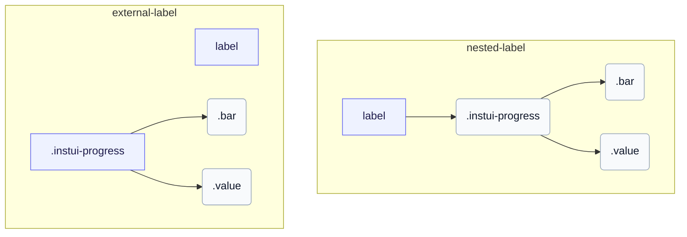

# CSS: progress

`.instui-progress` · <span class="instui-pill -color-success pantoken-doc-tag">stable</span> — Որոշակի առաջընթացի ցանց գունավոր մետրով, չափերով և ընտրովի արժեքի պիտակով:

`.value`-ը `.bar`-ի քույր է, երկուսն էլ արմատի երեխաներ են — արտացոլելով թե ինչպես progress-circle-ը տեղադրում է իր սեփական `.value` մասը: InstUI-ում չկա անորոշ վիճակ; `:indeterminate`-ը pantoken-միայն լավագույն հաստատ է (ծնիկ `&lt;progress&gt;` առանց `value` հատկանիշի), անիմացիայի `.bar`-ը որպես սահող հատված և թաքցնում `.value`-ը քանի որ ցուցադրելու համար իմաստալից թիվ չկա: `&lt;meter&gt;`-ը չունի անորոշ վիճակ, ուստի այն անփոփոխ է:

**Աղբյուր:** [progress.css](https://github.com/thedannywahl/pantoken/blob/main/formats/components/src/components/progress/progress.css)

## Մուտքականություն

Օգտագործեք ծնիկ `&lt;progress&gt;` զրոյական հիմնական առաջադրանքի ավարտման շրջանակի համար և `&lt;meter&gt;` երբ նվազագույնը ոչ զրոյական է: Տալ յուրաքանչյուր տարրին մատչելի անուն` այն տեղադրելով `&lt;label&gt;`-ում կամ կցելով առանձին `&lt;label&gt;`-ը համապատասխան `for` և `id` արժեքների միջոցով:

## Օգտագործում

```css
@import "@pantoken/components/components.css";
@import "@pantoken/components/progress.css";
```

## Օրինակներ

### Nested label
```html
<label>
  Uploading Document: <progress class="instui-progress -color-brand" value="70">70%</progress>
</label>
```
### External label
```html
<label for="storage-used">Storage used</label>
<meter id="storage-used" class="instui-progress -color-warning" min="20" value="40" max="60">50%</meter>
```

## Կառուցվածք

`// Variant: nested-label`

```text
label
  .instui-progress
    .bar
    .value
```

`// Variant: external-label`

```text
label
.instui-progress
  .bar
  .value
```



## Մոդիֆիկատորներ

| Մոդիֆիկատոր | Նկարագիր |
| --- | --- |
| `.-color-brand` | Ապրանքային նշանի մետրի գույն: |
| `.-color-danger` | Վտանգի մետրի գույն: |
| `.-color-info` | Տեղեկատվական մետրի գույն: |
| `.-color-inverse` | Մութ ֆոնի համար: |
| `.-color-primary-inverse` | Մութ ֆոնի վրա (առաջնային հակադարձ) մետրի գույն: |
| `.-color-success` | Հաջողության մետրի գույն: |
| `.-color-warning` | Զգուշացման մետրի գույն: |
| `.-meter-color-alert` | <span class="instui-pill -color-danger pantoken-doc-tag">Հնացած</span> — use `.-color-warning`. |
| `.-meter-color-brand` | <span class="instui-pill -color-danger pantoken-doc-tag">Հնացած</span> — use `.-color-brand`. |
| `.-meter-color-danger` | <span class="instui-pill -color-danger pantoken-doc-tag">Հնացած</span> — use `.-color-danger`. |
| `.-meter-color-info` | <span class="instui-pill -color-danger pantoken-doc-tag">Հնացած</span> — use `.-color-info`. |
| `.-meter-color-success` | <span class="instui-pill -color-danger pantoken-doc-tag">Հնացած</span> — use `.-color-success`. |
| `.-meter-color-warning` | <span class="instui-pill -color-danger pantoken-doc-tag">Հնացած</span> — use `.-color-warning`. |
| `.-render-value-inside` | Ներկայացնում է `.value`-ը ճանապարհի ներսում, հավասարեցված նրա սկզբինակին, փոխարենը կողքին; ստեղծել այն ընթեռնելիության համար մետրի գույնից վեր: |
| `.-should-animate` | <span class="instui-pill pantoken-doc-tag pantoken-doc-tag-interaction">Interaction</span> — Animate meter changes over half a second. |
| `.-size-large` | Մեծ. Երկար-ձեւ այլանունը `-size-lg`: |
| `.-size-lg` | Մեծ: |
| `.-size-md` | Միջին (լռելյալ): |
| `.-size-medium` | Միջին (լռելյալ): `-size-md`-ի երկար ձևի միջուկ: |
| `.-size-sm` | Փոքր: |
| `.-size-small` | Փոքր. Երկար-ձեւ այլանունը `-size-sm`: |
| `.-size-x-small` | Չափազանց փոքր. Երկար-ձեւ այլանունը `-size-xs`: |
| `.-size-xs` | Չափազանց փոքր: |

## Մասեր

| Մաս | Նկարագիր |
| --- | --- |
| `.bar` | Լցված մետրի ցանց: |
| `.value` | Արժեքի տեքստը ցանցի կողքին: |

## Պսևդո-էլեմենտներ

| Պսևդո-էլեմենտ | Նկարագիր |
| --- | --- |
| `:::indeterminate` | Հատուկ, InstUI-ի մաս չէ: Կիրառվում է միայն ծնիկ `&lt;progress&gt;`-ի համար, որը չունի `value` հատկանիշ; անիմացիայի `.bar`-ը որպես սահող հատված և թաքցնում `.value`-ը: |
| `::after` | Նկարում է ճանապարհի ներքևի կանոնը որպես իր սեփական շերտ մետրի վրա, որպեսզի ամբողջ եզրագիծը և ներքևի եզրագիծը անկախ մնան թեմաներում: |

## Փոփոխական վիճակներ

| Վիճակ | Նկարագիր |
| --- | --- |
| `:indeterminate` | — |

## Անհատական հատկություններ

| Առանձնահատկություն | Տիպ | Ընթացիկ | Նկարագիր |
| --- | --- | --- | --- |
| `--max` | `<number>` | — | Առաջընթացի առավելագույն արժեքը (լռելյալ `100`): |
| `--min` | `<number>` | — | Մետրի նվազագույն արժեքը (լռելյալ `0`): |
| `--value` | `<number>` | — | Ընթացիկ առաջընթացի արժեքը: |
| `--value-max` | `<number>` | — | @alias {@link --max} Առաջընթացի առավելագույն արժեքը (լռելյալ `100`): |
| `--value-now` | `<number>` | — | @alias `--value`-ի միջուկ: |

## Անիմացիաներ

| Անիմացիա | Նկարագիր |
| --- | --- |
| `pantoken-progress-indeterminate` | — |

## Ցուցիչներ սպառված

| Տոկեն | Տիպ | Արժեք |
| --- | --- | --- |
| `--instui-color-background-brand` | `<color>` | `light-dark(#1D354F, #EEF4FD)` |
| `--instui-color-background-error` | `<color>` | `#E62429` |
| `--instui-color-background-info` | `<color>` | `#2B7ABC` |
| `--instui-color-background-success` | `<color>` | `#03893D` |
| `--instui-color-background-warning` | `<color>` | `#CF4A00` |
| `--instui-component-progress-bar-border-color` | `<color>` | `light-dark(#1D354F, #EEF4FD)` |
| `--instui-component-progress-bar-border-color-inverse` | `<color>` | `light-dark(#ffffff, #6A7883)` |
| `--instui-component-progress-bar-border-radius` | `<length>` | `0.5rem` |
| `--instui-component-progress-bar-font-family` | `[ <font-family-name> \| <generic-font-family> ]#` | `Atkinson Hyperlegible Next, "Helvetica Neue", Helvetica, Arial, sans-serif` |
| `--instui-component-progress-bar-font-weight` | `<integer>` | `400` |
| `--instui-component-progress-bar-large-height` | `<length>` | `2rem` |
| `--instui-component-progress-bar-line-height` | `<percentage>` | `125%` |
| `--instui-component-progress-bar-medium-height` | `<length>` | `1.5rem` |
| `--instui-component-progress-bar-medium-value-font-size` | `<length>` | `1rem` |
| `--instui-component-progress-bar-meter-color-brand-inverse` | `<color>` | `light-dark(#ffffff, #10141A)` |
| `--instui-component-progress-bar-small-height` | `<length>` | `1rem` |
| `--instui-component-progress-bar-text-color` | `<color>` | `light-dark(#576773, #AAB0B5)` |
| `--instui-component-progress-bar-text-color-inverse` | `<color>` | `light-dark(#ffffff, #1C222B)` |
| `--instui-component-progress-bar-track-bottom-border-color` | `<color>` | `#00000000` |
| `--instui-component-progress-bar-track-bottom-border-color-inverse` | `<color>` | `#00000000` |
| `--instui-component-progress-bar-track-bottom-border-width` | `<length>` | `0.0625rem` |
| `--instui-component-progress-bar-track-color` | `<color>` | `#00000000` |
| `--instui-component-progress-bar-track-color-inverse` | `<color>` | `#00000000` |
| `--instui-component-progress-bar-value-padding` | `<length>` | `0.5rem` |
| `--instui-component-progress-bar-x-small-height` | `<length>` | `0.5rem` |

## Բրաուզերի աջակցություն

- Միջակայքել մետրի մասի կանոնները `@scope` ամբ-կանոնով; `@scope` աջակցություն չունեցող դիտարկիչները անտեսում են այդ միջակայքային կանոնները:

## Ավելին կապված

- [progress-circle](/hy/api/css/progress-circle.md) — Նույն որոշակի առաջընթացի շրջանաձև ձևը:

