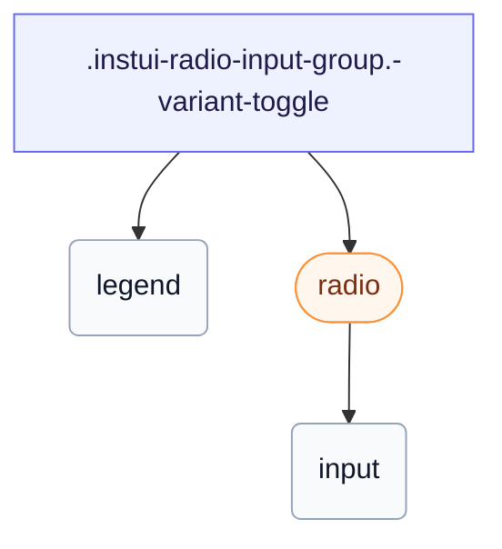

# CSS: radio-input-group

`.instui-radio-input-group` — Մեկ ընտրում ռադիո `&lt;fieldset&gt;`, պարզ կամ կապված հատվածավորված վերջ:

Սահմանում է իր սեփական `gap`-ը ռադիոների միջև; շղթայում `-gap-*` տարածության ծառայական փոփոխականը վերակայում է այդ ներդրված արժեքը:

**Աղբյուր:** [radio-input-group.css](https://github.com/thedannywahl/pantoken/blob/main/formats/components/src/components/radio-input-group/radio-input-group.css)

## Մուտքականություն

Ներկայացնում է ծնիկ `&lt;fieldset&gt;`-ը `&lt;legend&gt;`-ով, որ անվանում է խմբին; երեխայի ռադիոները կիսում են մեկ `name`, ուստի միայն մեկը կարող է ընտրվել միաժամանակ:

## Օգտագործում

```css
@import "@pantoken/components/components.css";
@import "@pantoken/components/radio-input-group.css";
```

## Օրինակներ

```html
<fieldset class="instui-radio-input-group">
  <legend>T-shirt size</legend>
  <label class="instui-radio"><input type="radio" name="size" checked> Small</label>
  <label class="instui-radio"><input type="radio" name="size"> Medium</label>
  <label class="instui-radio"><input type="radio" name="size"> Large</label>
</fieldset>
```
### Toggle variant
```html
<fieldset class="instui-radio-input-group -variant-toggle">
  <legend>T-shirt size</legend>
  <label class="instui-radio -variant-toggle"><input type="radio" name="size" checked> Small</label>
  <label class="instui-radio -variant-toggle"><input type="radio" name="size"> Medium</label>
  <label class="instui-radio -variant-toggle"><input type="radio" name="size"> Large</label>
</fieldset>
```

## Կառուցվածք

```text
.instui-radio-input-group.-variant-toggle
  legend
  radio (component)
    input
```



## Մոդիֆիկատորներ

| Մոդիֆիկատոր | Նկարագիր |
| --- | --- |
| `.-layout-columns` | Պատում են ռադիոները սյուներում: |
| `.-layout-inline` | Պատում են ռադիոները ներդարձակ: |
| `.-required` | Հերթագրել խումբը որպես պարտադիր: |
| `.-variant-toggle` | Պատում են երեխայի վերջերը հատվածավորված վերահսկողության գծում (միայն ընտրված հատվածը լցվում է): |

## Պսևդո-էլեմենտներ

| Պսևդո-էլեմենտ | Նկարագիր |
| --- | --- |
| `::after` | Տեղադրում է ձևավորական պարտադիր-դաշտի աստղանիշ հեռապատկերի տեքստից հետո, երբ խումբը պարտադիր է: |

## Ցուցիչներ սպառված

| Տոկեն | Տիպ | Արժեք |
| --- | --- | --- |
| `--instui-component-form-field-layout-asterisk-color` | `<color>` | `light-dark(#CF1F24, #FA917F)` |
| `--instui-component-form-field-layout-font-family` | `[ <font-family-name> \| <generic-font-family> ]#` | `Atkinson Hyperlegible Next, "Helvetica Neue", Helvetica, Arial, sans-serif` |
| `--instui-component-form-field-layout-font-size` | `<length>` | `1rem` |
| `--instui-component-form-field-layout-font-weight` | `<integer>` | `400` |
| `--instui-component-form-field-layout-gap-inputs` | `<length>` | `0.75rem` |
| `--instui-component-form-field-layout-gap-primitives` | `<length>` | `0.5rem` |
| `--instui-component-form-field-layout-line-height` | `<length>` | `1.125rem` |
| `--instui-component-form-field-layout-text-color` | `<color>` | `light-dark(#273540, #ffffff)` |
| `--instui-spacing-space-md` | `<length>` | `0.75rem` |

## Ենթակարողություններ

- [radio](/hy/api/css/radio.md)

## Ավելին կապված

- [radio](/hy/api/css/radio.md) — Այս խմբի հավաց անհատական կառավարում:
- [form-field-group](/hy/api/css/form-field-group.md) — Դաշտերի խմբավորման և դասավորման ընդհանուր թաղ:

