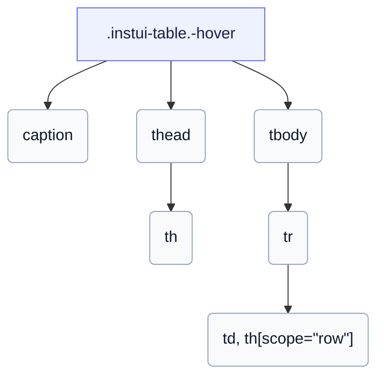

# CSS: table

`.instui-table` — Ձեւավորված տվյալների աղյուսակ `th`-ի և `td`-ի համար, գումարած ընտրական վերնագիր, հաղորդակցություն, ֆիքսված և կուտակված-քարտ դասավորություններով:

`-layout-stacked`-ի համար, մաքուր CSS-ը չի կարող յուրաքանչյուր սյունակի գլխավորի տեքստը քաղել դրա բջջի մեջ, այնպես որ տվեք յուրաքանչյուր բջջին `data-label` և կուտակված քարտը այն ցույց է տալիս `::before`-ի միջոցով: Տե՛ս `table.head`, `table.body`, `table.row`, `table.cell`, `table.col-header` և `table.row-header` անդամներ առանձին մասերի համար:

**Աղբյուր:** [body.css](https://github.com/thedannywahl/pantoken/blob/main/formats/components/src/components/table/members/body/body.css)

## Մուտքականություն

Պիտակավորեք աղյուսակը `&lt;caption&gt;`-ով, նշեք սյունակի գլխավորներ `<th scope="col">`-ով և շարքի գլխավորներ `<th scope="row">`-ով, և `-layout-stacked`-ում տվեք յուրաքանչյուր բջջին `data-label` քանի որ գլխավոր շարքը տեսողականորեն թաքցված է:

## Օգտագործում

```css
@import "@pantoken/components/components.css";
@import "@pantoken/components/table.css";
```

## Օրինակներ

```html
<table class="instui-table -hover">
  <caption>Top-rated films</caption>
  <thead>
    <tr>
      <th scope="col">Rank</th>
      <th scope="col">Title</th>
      <th scope="col">Year</th>
      <th scope="col">Rating</th>
    </tr>
  </thead>
  <tbody>
    <tr>
      <th scope="row">1</th>
      <td>The Shawshank Redemption</td>
      <td>1994</td>
      <td>9.3</td>
    </tr>
    <tr>
      <th scope="row">2</th>
      <td>The Godfather</td>
      <td>1972</td>
      <td>9.2</td>
    </tr>
    <tr>
      <th scope="row">3</th>
      <td>The Godfather: Part II</td>
      <td>1974</td>
      <td>9.0</td>
    </tr>
  </tbody>
</table>
```

## Կառուցվածք

```text
.instui-table.-hover
  caption
  thead
    th
  tbody
    tr
      td, th[scope="row"]
```



## Մոդիֆիկատորներ

| Մոդիֆիկատոր | Նկարագիր |
| --- | --- |
| `.-hover` | Ընդգծեք շարքերը հաղորդակցության ժամանակ: @affects table.row — Վերապահում է և գունավորում է շարքի հաղորդակցության եզրը: |
| `.-layout-fixed` | Ֆիքսված աղյուսակի դասավորություն (հավասար լայնության սյունակներ): |
| `.-layout-stacked` | Կուտակեք յուրաքանչյուր շարք որպես քարտ՝ մեկ բջջ `data-label`-ի միջոցով: @affects table.head @affects table.body @affects table.row @affects table.cell @affects table.col-header @affects table.row-header — Կուտակում է յուրաքանչյուր մասը որպես բլոկ և թաքցնում/պիտակավորում է գլխավորը համապատասխանաբար: |

## Մասեր

| Մաս | Նկարագիր |
| --- | --- |
| `.caption` | Ընտրական աղյուսակի վերնագիր: |

## Ցուցիչներ սպառված

| Տոկեն | Տիպ | Արժեք |
| --- | --- | --- |
| `--instui-component-table-background` | `<color>` | `light-dark(#ffffff, #10141A)` |
| `--instui-component-table-cell-padding-horizontal` | `<length>` | `0.75rem` |
| `--instui-component-table-cell-padding-vertical` | `<length>` | `0.5rem` |
| `--instui-component-table-col-header-color` | `<color>` | `light-dark(#273540, #F2F4F5)` |
| `--instui-component-table-color` | `<color>` | `light-dark(#273540, #ffffff)` |
| `--instui-component-table-font-family` | `[ <font-family-name> \| <generic-font-family> ]#` | `Atkinson Hyperlegible Next, "Helvetica Neue", Helvetica, Arial, sans-serif` |
| `--instui-component-table-font-size` | `<length>` | `1rem` |
| `--instui-component-table-head-font-weight` | `<integer>` | `600` |

## Ենթակարողություններ

- [table.body](/hy/api/css/table.body.md)
- [table.cell](/hy/api/css/table.cell.md)
- [table.col-header](/hy/api/css/table.col-header.md)
- [table.head](/hy/api/css/table.head.md)
- [table.row](/hy/api/css/table.row.md)
- [table.row-header](/hy/api/css/table.row-header.md)

