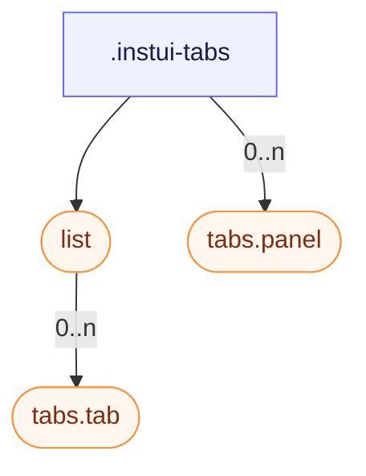

# CSS: tabs

`.instui-tabs` — Ներդրված վահանակի հավաքածու՝ ներդրման ցուցակ, ընտրելի ներդրումներ և նրանց վահանակներ:

Տե՛ս `tabs.tab` և `tabs.panel` անդամներ առանձին ներդրման կոճակների և նրանց բովանդակության վահանակների համար:

**Աղբյուր:** [panel.css](https://github.com/thedannywahl/pantoken/blob/main/formats/components/src/components/tabs/members/panel/panel.css)

## Մուտքականություն

Կապակցեք ներդրման ցուցակը role="tablist"-ով, յուրաքանչյուր ներդրում role="tab"-ով և aria-selected-ով, և յուրաքանչյուր վահանակ role="tabpanel"-ով:

## Օգտագործում

```css
@import "@pantoken/components/components.css";
@import "@pantoken/components/tabs.css";
```

## Օրինակներ

```html
<div class="instui-tabs">
  <div class="list" role="tablist" aria-label="Default tabs">
    <button class="tab -selected" role="tab" aria-selected="true">Overview</button>
    <button class="tab" role="tab" aria-selected="false">Details</button>
    <button class="tab -disabled" role="tab" aria-disabled="true" disabled>Disabled</button>
    <button class="tab" role="tab" aria-selected="false">History</button>
  </div>
  <div class="panel" role="tabpanel">The Overview tab's content shows here.</div>
</div>
```

## Կառուցվածք

```text
.instui-tabs
  list (component)
    tabs.tab (component, 0..n)
  tabs.panel (component, 0..n)
```



## Մոդիֆիկատորներ

| Մոդիֆիկատոր | Նկարագիր |
| --- | --- |
| `.-overflow-scroll` | Պահպանեք ներդրման ցուցակը մեկ տողում և թույլատրեք այն հորիզոնական փոխանցել փաթաթելու փոխարեն, թաքցնելով գլորման սանդղակ: |
| `.-variant-secondary` | Կլորացված "թղթապանակ" ներդրումներ ընտրված ներդրումով, որը տեսողականորեն կապակցվում է ստորև գտնվող վահանակին: @affects tabs.tab — Վերափոխում է ներդրման կոճակները կլորացված "թղթապանակ" տեսքի: |

## Մասեր

| Մաս | Նկարագիր |
| --- | --- |
| `.list` | Ներդրումների շարքը: |

## Ցուցիչներ սպառված

| Տոկեն | Տիպ | Արժեք |
| --- | --- | --- |
| `--instui-component-tabs-default-background` | `<color>` | `#00000000` |

## Ենթակարողություններ

- [list](/hy/api/css/list.md)
- [tabs.panel](/hy/api/css/tabs.panel.md)
- [tabs.tab](/hy/api/css/tabs.tab.md)

