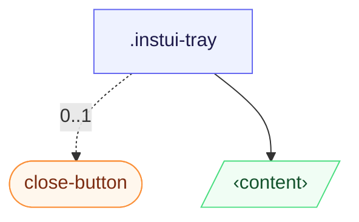

# CSS: tray

`.instui-tray` — Եզրային-ամրացված վահանակ, որը սահում է ցանկացած կողմից; բնական `[popover]` կամ `&lt;dialog&gt;`:

Սկիզբ/վերջ տեղակայումները լուծվում են `inset-inline`-ի հակառակ (տրամաբանական, ուղղության հետ կապված); սահել-մեջ փոխակերպումը ինքնաբերաբար հայելիացվում է `[dir="rtl"]` նախահայրի տակ, ուստի լրացուցիչ նշանակում անհրաժեշտ չէ աջից-ձախ դասավորությունների համար:

**Աղբյուր։** [tray.css](https://github.com/thedannywahl/pantoken/blob/main/formats/components/src/components/tray/tray.css)

## Accessibility

Դարակը երկխոսություն կամ popover մակերես է, ուստի անվանեք այն `aria-label` կամ `aria-labelledby`-ով, իսկ դրա փակ վերահսկողումը կրում է `aria-label` (օրինակում `.instui-close-button`-ը օգտագործում է `aria-label="Close"`):

## Usage

```css
@import "@pantoken/components/components.css";
@import "@pantoken/components/tray.css";
```

## Examples

```html
<div class="instui-tray -placement-end -size-sm">
  <span class="instui-heading -level-h3">Filters</span>
  <p class="-size-sm">A tray slides in from the start edge and fills the viewport height.</p>
</div>
<button class="instui-button -toggle">toggle tray</button>
```

## Structure

```text
.instui-tray
  close-button (component, 0..1)
  ‹content›
```



## Modifiers

| Modifier             | Description                                                                                   |
| -------------------- | --------------------------------------------------------------------------------------------- |
| `.-placement-bottom` | Ամրացրեք ներքևի եզրին:                                                                        |
| `.-placement-end`    | Ամրացրեք վերջի (inline-end) եզրին:                                                            |
| `.-placement-start`  | (լռելյալ) Ամրացրեք սկզբի (inline-start) եզրին:                                                |
| `.-placement-top`    | Ամրացրեք վերին եզրին:                                                                         |
| `.-size-large`       | Մեծ. Երկար-ձեւ այլանունը `-size-lg`:                                                          |
| `.-size-lg`          | Մեծ:                                                                                          |
| `.-size-md`          | (կանխադրված) Միջին:                                                                           |
| `.-size-medium`      | (կանխադրված) Միջին: Երկար ձևի `-size-md`-ի տարբերակ:                                          |
| `.-size-regular`     | <span class="instui-pill -color-danger pantoken-doc-tag">Deprecated</span> — use `.-size-md`. |
| `.-size-sm`          | Փոքր:                                                                                         |
| `.-size-small`       | Փոքր. Երկար-ձեւ այլանունը `-size-sm`:                                                         |
| `.-size-x-large`     | Չափազանց մեծ. Երկար-ձեւ այլանունը `-size-xl`:                                                 |
| `.-size-x-small`     | Չափազանց փոքր. Երկար-ձեւ այլանունը `-size-xs`:                                                |
| `.-size-xl`          | Չափազանց մեծ:                                                                                 |
| `.-size-xs`          | Չափազանց փոքր:                                                                                |

## Conditions

| Type     | Query                                   | Description |
| -------- | --------------------------------------- | ----------- |
| supports | `(transition-behavior: allow-discrete)` | —           |

## Tokens consumed

| Token                                      | Type                | Value                          |
| ------------------------------------------ | ------------------- | ------------------------------ |
| `--instui-component-tray-background-color` | `<color>`           | `light-dark(#ffffff, #1C222B)` |
| `--instui-component-tray-border-color`     | `<color>`           | `light-dark(#E8EAEC, #334450)` |
| `--instui-component-tray-border-width`     | `<length>`          | `0.0625rem`                    |
| `--instui-component-tray-padding`          | `<length>`          | `1.5rem`                       |
| `--instui-component-tray-width-lg`         | `<length>`          | `48em`                         |
| `--instui-component-tray-width-md`         | `<length>`          | `30em`                         |
| `--instui-component-tray-width-sm`         | `<length>`          | `20em`                         |
| `--instui-component-tray-width-xl`         | `<length>`          | `62em`                         |
| `--instui-component-tray-width-xs`         | `<length>`          | `16em`                         |
| `--instui-component-tray-z-index`          | `<integer>`         | `9999`                         |
| `--instui-elevation-topmost`               | `none \| <shadow>#` | —                              |
| `--tray-slide-x`                           | —                   | `-100%`                        |
| `--tray-slide-y`                           | —                   | `0%`                           |

## Browser support

- Բացվում է բնական `[popover]` API և `@starting-style`-ով; սահել-մեջը `@supports (transition-behavior: allow-discrete)` պահպանի ետևում է, ուստի դրանից առանց դիտարկիչներ դեռ բացում են դարակը, միայն առանց սահիկի:

## Subcomponents

- [close-button](/hy/api/css/close-button.md)

## Related

- [modal](/hy/api/css/modal.md) — Նույն մեկ-անջատել ստորոգութային օրինակ, կենտրոնացած՝ եզրային-ամրացված փոխարեն:
- [popover](/hy/api/css/popover.md) — Ընդհանուր վերին-շերտի մակերես, որի վրա այն կառուցված է:
