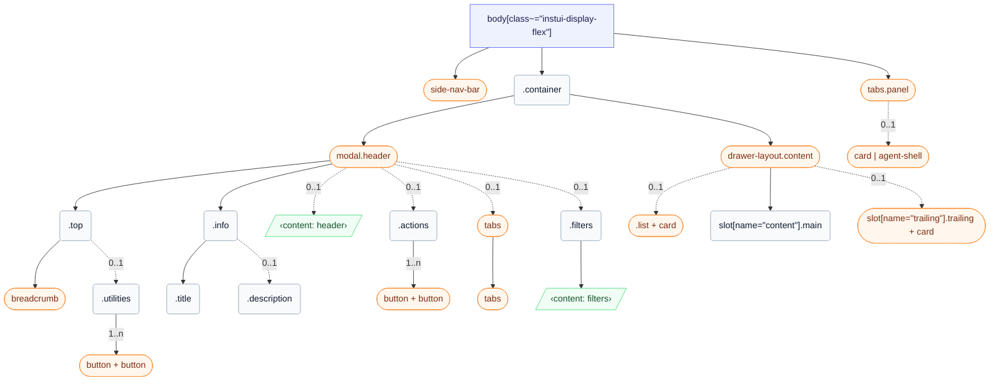

# CSS: wrapper

`body[class~="instui-display-flex"]` — Բանի-վճռ շարք՝ կողքի նավ, ցանցակ՝ վերնագրով և ընտրովի վահանակ:

✅ Օգտագործել Wrapper երբ:

- Ամբողջական Canvas ապրանքային էջ կառուցել, որը պահանջում է հետևողական դասավորման թաղ
- Էջը օգտագործում է GlobalNav որպես հիմնական նավիգացիայի միավոր
- Էջին անհրաժեշտ են կողային վահանակներ. ContentTabList, TrailingContentArea կամ UtilityPanel
- Ձեզ հարկավոր է հետևողական տարայի անցակ և բովանդակության առավելագույն լայնություն ամբողջ էջում
🚫 Մի օգտագործեք Wrapper երբ.

- Modal, Tray կամ Drawer կառուցել — նրանք ունեն իրենց սեփական դասավորման տարայներ
- Էջի ենթաբաժինը փաթեթավորել — Wrapper-ը պարունակում է ամբողջ էջը, ոչ թե մի շրջան

## Մուտքականություն

- Հիմնական բովանդակության տարածքը քարտեզագրել &lt;main&gt; վանդակային կետի հետ skip-nav հղումով, որպեսզի ստ键բորդի օգտատերերը կարողանան անցնել GlobalNav-ից
- Տալ ContentTabList-ին role="navigation" հստակ aria-label-ով, ինչպես "Էջի նավիգացիա" — առանձին GlobalNav-ի վանդակային կետից
- Տալ TrailingContentArea-ին role="complementary" նկարագրական aria-label-ով, որը արտացոլում է դրա բովանդակությունը, ինչպես "Ուսանողի մանրամասներ"
- Տալ յուրաքանչյուր UtilityPanel-ին հստակ aria-label. "AI 助手", "Ծանուցումներ" կամ "Ֆիլտրեր"
- Երբ UtilityPanel բացվում է, տեղափոխել ֆոկուսը վահանակի մեջ; երբ դա փակվում է, վերադարձնել ֆոկուսը այն ձգանին, որը բացել է այն

## Օգտագործում

```css
@import "@pantoken/plugin-layouts/layouts.css";
```

## Կառուցվածք

```text
body[class~="instui-display-flex"]
  side-nav-bar (component)
  .container
    modal.header (component)
      .top
        breadcrumb (component)
        .utilities (0..1)
          button + button (component, 1..n)
      .info
        .title
        .description (0..1)
      ‹content: header› (0..1)
      .actions (0..1)
        button + button (component, 1..n)
      tabs (component, 0..1)
        tabs (component)
      .filters (0..1)
        ‹content: filters›
    drawer-layout.content (component)
      list + card (component, 0..1)
      slot[name="content"].main
      slot[name="trailing"].trailing + card (component, 0..1)
  tabs.panel (component)
    card | agent-shell (component, 0..1)
```



## Նրբեր (Slots)

| Նրբասեղան (Slot) | Նկարագիր |
| --- | --- |
| `content` | Հիմնական էջի բովանդակություն։ |
| `filters` | Ընտրովի ֆիլտրերի բովանդակություն վերնագրի ներսում։ |
| `header` | Ընտրովի վերնագրի բացատ էջի նկարագրության տակ։ |
| `panel` | Կոմունալական վահանակի բովանդակություն։ |
| `trailing` | Հետևորդ լրասահամանի բովանդակություն։ |

## Մասեր

| Մաս | Նկարագիր |
| --- | --- |
| `.actions` | Ընտրովի վերնագրի կոճակներ վերին շարքի վերջում։ |
| `.container` | Հիմնական էջի սյունակ, որ պահում է վերնագիր և բովանդակություն։ |
| `.content` | Հիմնական բովանդակության շրջան տարայի սյունակի ներսում։ |
| `.description` | Ընտրովի էջի նկարագրություն վերնագրի տակ։ |
| `.filters` | Ընտրովի ֆիլտրերի շրջան վերնագրի ներսում։ |
| `.header` | Վերնագրի շրջան տարայի սյունակի ներսում։ |
| `.info` | Տարա էջի վերնագրի և ընտրովի նկարագրության համար։ |
| `.list` | Ընտրովի նավիգացիայի սյունակ բովանդակության ներսում։ |
| `.main` | Հիմնական բովանդակության սյունակ բովանդակության ներսում։ |
| `.panel` | Կոմունալական վահանակի շրջան, որ բացվում է էջի աջ կողմում։ |
| `.tabs` | Ընտրովի նավիգացիայի ներդիրներ բովանդակության շարքի սկզբում։ |
| `.title` | Էջի վերնագիր վերին շարքի տակ։ |
| `.top` | Ցանց շարք, որ պարունակում է հաղորդատող և կոմունալ ծառայություններ։ |
| `.trailing` | Ընտրովի լրասահամանի սյունակ բովանդակության ներսում։ |
| `.utilities` | Կոմունալական գործողություններ վերին շարքի վերջում։ |

## Փոփոխական վիճակներ

| Վիճակ | Նկարագիր |
| --- | --- |
| `:optional` | — |

## Ցուցիչներ սպառված

| Տոկեն | Տիպ | Արժեք |
| --- | --- | --- |
| `--instui-background-color-page` | — | — |

## Ենթակարողություններ

- [agent-shell](/hy/api/css/agent-shell.md)
- [breadcrumb](/hy/api/css/breadcrumb.md)
- [button](/hy/api/css/button.md)
- [card](/hy/api/css/card.md)
- [drawer-layout.content](/hy/api/css/drawer-layout.content.md)
- [list](/hy/api/css/list.md)
- [modal.header](/hy/api/css/modal.header.md)
- [side-nav-bar](/hy/api/css/side-nav-bar.md)
- [tabs](/hy/api/css/tabs.md)
- [tabs.panel](/hy/api/css/tabs.panel.md)

## Ավելին կապված

- [card](/hy/api/css/card.md)
- [agent-shell](/hy/api/css/agent-shell.md)
- [breadcrumb](/hy/api/css/breadcrumb.md)
- [tabs](/hy/api/css/tabs.md)
- [button](/hy/api/css/button.md)
- [heading](/hy/api/css/heading.md)

