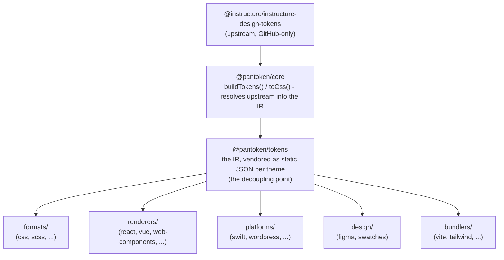

# Կառուցվածք

pantoken-ի մեկ աշխատանքի նպատակը է՝ մեկ անգամ լուծել Instructure-ի դիզայնի տոկենները և պատկերակները, այնուհետև այդ մոդելը վերակազմակերպել յուրաքանչյուր թիրախի համար։ Ստորևի շերտերը պահպանում են այդ վերակազմակերպումը ճշմարիտ և թողնում են հրատարակված փաթեթները ազատ ցանկացած միայն GitHub-ի upstream-ից։

## Շերտերը

- **`@pantoken/model`** պահում է տիպերի պայմանագրերը և ոչինչ ավելին։ Դա է ճշմարտության աղբյուրը `Token` ձևի և plugin պայմանագրի համար՝ զրոյական կախվածություններով, այնպես որ ցանկացած փաթեթ կարող է դրանից ազատորեն կախվել։
- **`@pantoken/core`** միակ փաթեթն է, որը դիպչում է upstream աղբյուրին։ Այն լուծում է տոկենները և պատկերակները canonical IR- ի մեջ և ձեւավորում CSS։
- **`@pantoken/tokens`** այդ IR-ը տրամադրում է որպես ստատիկ JSON build-ի պահին։ Դա առանձնացնող կետն է՝ ստորեկրվող փաթեթները կարդում են `@pantoken/tokens`, ոչ երբեք `@pantoken/core`, այնպես որ `npm i pantoken` երբեք չի հասնի միայն GitHub upstream-ի։
- **`@pantoken/utils`** կրում է ընդհանուր օգնականները — `var(--x)` լուծողը, հղման regex-երը, դեպքի և գույնի վերափոխումները, և drift ստուգումները, որոնք ապահովում են, որ生成ացված ելքը հավատարիմ է IR-ին։

## Ինչու են տոկենները.vendor-ացված

Upstream տոկենների փաթեթը գտնվում է GitHub-ում, ոչ npm-ում։ Եթե յուրաքանչյուր ստորեկվող փաթեթը կախված լիներ նրանից, `npm i pantoken` կձախողվեր նրանց համար, ովքեր չհասանելի են դրան։ Փոխարենը `@pantoken/tokens` լուծում է upstream-ը մեկ անգամ build-ի պահին և գրում արդյունքը ստատիկ JSON֊ում։ Հրապարակված փաթեթները ներառում են այդ JSON-ը, այնպես որ դրանք տեղադրվում են մաքուր npm-ից, սեղմվում semver-ով և աշխատում են օֆլայն։

## Բուքետներ

Յուրաքանչյուր ստորեկվող բուքետը IR-ի օգտագործման միջոց է՝

- **formats/** — վերափոխում է տոկենները ֆայլի (CSS, SCSS, Less, Stylus, DTCG)։
- **renderers/** — ֆրաենվոր և գործիքային ինտեգրացիաներ (React, Vue, Svelte, MUI, Pendo և այլն)։
- **bundlers/** — build-գործիքների plugin-ներ և presets (Vite, Next, Tailwind, Panda, PostCSS, webpack)։
- **platforms/** — բնիկ և site-generator թիրախներ (Swift, Kotlin, Rust, WordPress, Drupal)։
- **design/** — payload-ներ դիզայնի գործիքների համար (Figma, գունային swatches)։
- **plugins/** — ընտրովի տրանսֆորմներ, որոնք ընդլայնում են տոկենը կամ CSS ելքը։ Տես [Plugins](/guide/plugins)։

## Գեներացված ելք

Յուրաքանչյուր փաթեթ, որը գիտեն արտադրում է ֆայլ, գրում է այն per-package `generated/` գրացուցակում, որը վերարտադրում է build-ը, այնպես որ գեներացված ոչինչ չի հանձնվում commit։ Վоркսփեյսի տասք հաստատում է ամբողջը։ Տես [Generated output](/guide/generated-output).
