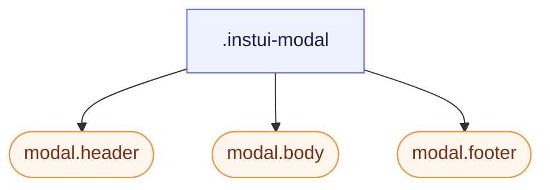

# CSS: modal

`.instui-modal` — A dialog surface (works on a native &lt;dialog&gt;); header/body/footer parts.

See the `modal.header`, `modal.body`, and `modal.footer` members for the individual parts.

**Source:** [body.css](https://github.com/thedannywahl/pantoken/blob/main/formats/components/src/components/modal/members/body/body.css)

<!-- js-requirement -->
> [!TIP]
> **Peningkatan JS** — This component's CSS renders and works on its own; pair it with `@pantoken/interactions` to add the interactive behavior. See the [modifier table below](#modifiers).


## Aksesibilitas

Open the native `&lt;dialog&gt;` with `showModal()` for modal semantics and Esc-to-close, and name it with `aria-labelledby` pointing at the `.header`.

## Penggunaan

```css
@import "@pantoken/components/components.css";
@import "@pantoken/components/modal.css";
```

## Demo

```demo
self:modal
```

## Contoh

```html
<dialog class="instui-modal -size-sm" id="modal-sm">
  <div class="header"><strong>Small</strong></div>
  <div class="body"><code>-size-sm</code> — a narrow modal.</div>
  <div class="footer">
    <button class="instui-button">Close</button>
  </div>
</dialog>
```

## Struktur

```text
.instui-modal
  modal.header (component)
  modal.body (component)
  modal.footer (component)
```



## Modifikator

| Modifikator | Deskripsi |
| --- | --- |
| `.-blur` | Blur the backdrop behind the modal. |
| `.-color-inverse` | On-dark chrome (pairs with a media body). @affects modal.header @affects modal.body @affects modal.footer — Recolours each part for the on-dark look. |
| `.-density-compact` | Tighter part padding. @affects modal.header @affects modal.body @affects modal.footer — Tightens each part's padding. |
| `.-overflow-fit` | Constrain to the viewport and scroll the body. @affects modal.body — Scrolls the body when the modal is capped to the viewport. |
| `.-size-auto` | Sized to content. |
| `.-size-fullscreen` | Edge-to-edge. |
| `.-size-large` | A wide modal. Long-form alias of `-size-lg`. |
| `.-size-lg` | A wide modal. |
| `.-size-sm` | A narrow modal. |
| `.-size-small` | A narrow modal. Long-form alias of `-size-sm`. |

## Pseudo-elemen

| Pseudo-elemen | Deskripsi |
| --- | --- |
| `::backdrop` | Dims the page behind the dialog as its mask, and frosts it under `-blur`. |

## Token yang digunakan

| Token | Tipe | Nilai |
| --- | --- | --- |
| `--instui-component-mask-background-color` | `<color>` | `light-dark(rgba(255,255,255,0.75), rgba(28,34,43,0.75))` |
| `--instui-component-modal-auto-min-width` | `<length>` | `16em` |
| `--instui-component-modal-background-color` | `<color>` | `light-dark(#ffffff, #171B21)` |
| `--instui-component-modal-border-color` | `<color>` | `light-dark(#E8EAEC, #334450)` |
| `--instui-component-modal-border-radius` | `<length>` | `1rem` |
| `--instui-component-modal-border-width` | `<length>` | `0.0625rem` |
| `--instui-component-modal-font-family` | `[ <font-family-name> \| <generic-font-family> ]#` | `Atkinson Hyperlegible Next, "Helvetica Neue", Helvetica, Arial, sans-serif` |
| `--instui-component-modal-inverse-background-color` | `<color>` | `light-dark(#273540, #1C222B)` |
| `--instui-component-modal-inverse-border-color` | `<color>` | `#334450` |
| `--instui-component-modal-inverse-text-color` | `<color>` | `#ffffff` |
| `--instui-component-modal-large-max-width` | `<length>` | `62em` |
| `--instui-component-modal-medium-max-width` | `<length>` | `48em` |
| `--instui-component-modal-small-max-width` | `<length>` | `30em` |
| `--instui-component-modal-text-color` | `<color>` | `light-dark(#273540, #F2F4F5)` |
| `--instui-elevation-topmost` | `none \| <shadow>#` | — |
| `--instui-spacing-space-xl` | `<length>` | `1.5rem` |

## Dukungan peramban

- Styles a native &lt;dialog&gt; and its `::backdrop`; the top-layer rendering and backdrop styling need a browser that supports the dialog element.

## Subkomponen

- [modal.body](/id/api/css/modal.body.md)
- [modal.footer](/id/api/css/modal.footer.md)
- [modal.header](/id/api/css/modal.header.md)

## Terkait

- [tray](/id/api/css/tray.md) — A tray is the same dismissible overlay pattern, anchored to a screen edge.

