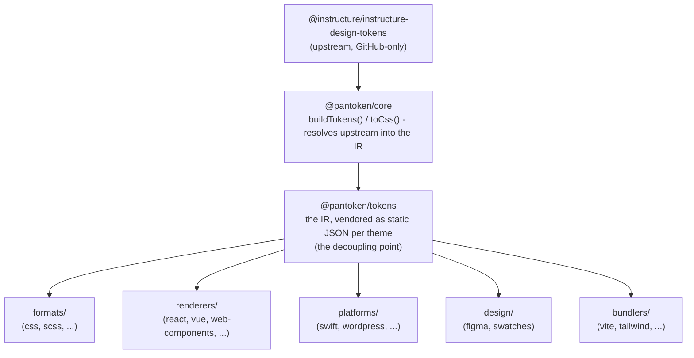

# Arsitektur

pantoken memiliki satu tugas: menyelesaikan (resolve) design token dan ikon Instructure sekali, lalu membentuk ulang model itu
untuk setiap target. Lapisan-lapisan di bawah menjaga pembentukan ulang tersebut tetap akurat dan menjaga paket-paket yang diterbitkan bebas
dari upstream yang hanya tersedia di GitHub.

## Lapisan-lapisan

- **`@pantoken/model`** memegang kontrak tipe, dan tidak lebih. Ini adalah sumber kebenaran untuk
  bentuk `Token` dan kontrak plugin, tanpa ketergantungan apa pun, sehingga paket mana pun dapat bergantung padanya
  dengan leluasa.
- **`@pantoken/core`** adalah satu-satunya paket yang menyentuh sumber upstream. Ia menyelesaikan token dan
  ikon menjadi IR kanonis dan merender CSS.
- **`@pantoken/tokens`** menyediakan IR tersebut sebagai JSON statis pada waktu build. Ini adalah titik pemisahan:
  paket-paket hilir membaca `@pantoken/tokens`, bukan `@pantoken/core`, sehingga `npm i pantoken` tidak pernah
  mengakses upstream yang hanya ada di GitHub.
- **`@pantoken/utils`** membawa helper bersama — resolver `var(--x)`, regex referensi,
  konversi huruf-kasus dan warna, serta pemeriksaan drift yang menjaga keluaran yang dihasilkan tetap setia pada IR.

## Mengapa token di-vendor

Paket token upstream berada di GitHub, bukan npm. Jika setiap paket hilir bergantung padanya,
`npm i pantoken` akan gagal bagi siapa pun tanpa akses itu. Sebagai gantinya `@pantoken/tokens` menyelesaikan
upstream sekali pada saat build dan menulis hasilnya ke JSON statis. Paket-paket yang diterbitkan membawa
JSON itu, sehingga mereka terpasang bersih dari npm, dipin ke semver, dan bekerja offline.

## Buckets

Setiap bucket hilir adalah cara mengonsumsi IR:

- **formats/** — mengubah token menjadi sebuah file (CSS, SCSS, Less, Stylus, DTCG).
- **renderers/** — integrasi framework dan alat (React, Vue, Svelte, MUI, Pendo, dan lainnya).
- **bundlers/** — plugin dan preset alat build (Vite, Next, Tailwind, Panda, PostCSS, webpack).
- **platforms/** — target native dan pembuat situs (Swift, Kotlin, Rust, WordPress, Drupal).
- **design/** — payload untuk alat desain (Figma, color swatches).
- **plugins/** — transformasi opsional yang memperluas output token atau CSS. Lihat [Plugins](/guide/plugins).

## Keluaran yang dihasilkan

Setiap paket yang menghasilkan file menulisnya ke direktori `generated/` per-paket yang direproduksi oleh build,
jadi tidak ada yang digenerate yang dikomit. Sebuah tugas workspace memvalidasi semuanya. Lihat
[Generated output](/guide/generated-output).
