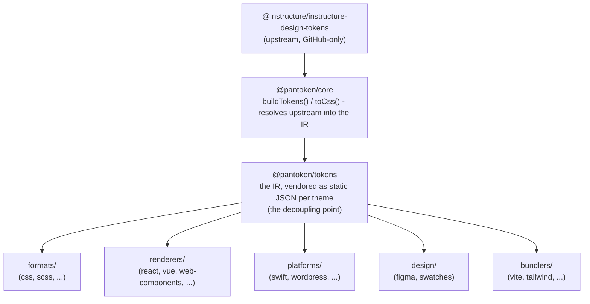

# Arkitektúr

pantoken hefur eitt verkefni: leysa hönnunar-tákn og táknmyndir Instructure einu sinni og umbreyta síðan þeim gögnum fyrir hvert markmið. Lögin hér fyrir neðan halda þeirri umbreytingu hreinni og tryggja að birtu pakkarnir séu lausir við nokkurt GitHub-einstaklingur upstream.

## Lögin

- **`@pantoken/model`** heldur á tegundasamningunum, og ekki neinu fleira. Hann er sannleiksgjafi fyrir `Token` forminu og viðbótarviðmóti plugins, án nokkurra háða, svo hvaða pakki sem er getur treyst á hann frjálst.
- **`@pantoken/core`** er eina pakkinn sem snertir upstream-gögnin. Hann leysir tákn og táknmyndir í hinn canonical IR og renderar CSS.
- **`@pantoken/tokens`** útvegar þann IR sem kyrrstætt JSON við byggingu. Þetta er aðskiljunarpunkturinn: niðurstreymispakkar lesa `@pantoken/tokens`, aldrei `@pantoken/core`, svo `npm i pantoken` nær aldrei í GitHub-einstaklinga upstream.
- **`@pantoken/utils`** ber með sér sameiginlega hjálparfærin — `var(--x)` leysirinn, tilvísunar-regexar, breytni fyrir case og liti, og drift-athuganirnar sem halda framleiðslu útgáfu trú að IR.

## Af hverju táknin eru innbyggð

Upstream-táknapakkinn býr á GitHub, ekki á npm. Ef allir niðurstreymispakkar treystu á hann, myndi `npm i pantoken` mistakast fyrir hvern sem ekki hefur aðgang. Í staðinn leysir `@pantoken/tokens` upstream einu sinni við byggingu og skrifar niðurstöðuna í kyrrstætt JSON. Birtu pakkarnir bera það JSON með sér, svo þeir setjast upp hreint af npm, festa við sem semver, og virka án nettengingar.

## Flokkar

Hver niðurstreymisflokkur er leið til að neyta IR:

- **formats/** — umbreyta táknunum í skrá (CSS, SCSS, Less, Stylus, DTCG).
- **renderers/** — ramma- og tól samþættingar (React, Vue, Svelte, MUI, Pendo, og fleiri).
- **bundlers/** — viðbætur og forstillingar fyrir byggitól (Vite, Next, Tailwind, Panda, PostCSS, webpack).
- **platforms/** — innfædd og síðu-rafli markmið (Swift, Kotlin, Rust, WordPress, Drupal).
- **design/** — gagnapakka fyrir hönnunarverkfæri (Figma, litapallar).
- **plugins/** — valfrjálsar umbreytingar sem stækka tákn- eða CSS-úttak. Sjá [Plugins](/guide/plugins).

## Framleitt úttak

Hver pakki sem framleiðir skrá skrifar hana í per-pakka `generated/` möppu sem bygging endursköpar, þannig að ekkert framleitt er skráð í geymslu. Workspacetask sannreynir allt. Sjá [Generated output](/guide/generated-output).
