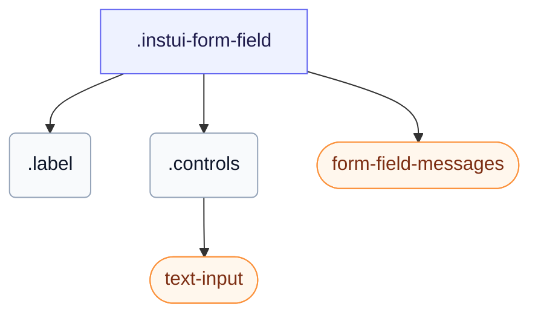

# CSS: form-field

`.instui-form-field` — A form-field wrapper: a label, its controls, and inline, required, or readonly layouts.

An error message stays hidden until the field's control is `:user-invalid` (after the user interacts) or you add the `-invalid` class. Use `-layout-inline` to put the label beside the controls and `-layout-stacked` to put it above. Also sets its own `gap` between the label, controls, and messages; chaining a `-gap-*` spacing utility modifier overrides that built-in value.

**Source:** [form-field.css](https://github.com/thedannywahl/pantoken/blob/main/formats/components/src/components/form-field/form-field.css)

## Accessibilità

The `&lt;label&gt;` element wraps the control, so the label text names it natively; the required asterisk is decorative and should be hidden from assistive tech (aria-hidden), and the error message surfaces once the control is `:user-invalid` or you add the `-invalid` class.

## Uso

```css
@import "@pantoken/components/components.css";
@import "@pantoken/components/form-field.css";
```

## Esempi

```html
<label class="instui-form-field">
  <span class="label">Email address</span>
  <span class="controls"><input class="instui-text-input" type="email" placeholder="you@example.com"></span>
  <div class="instui-form-field-messages">
    <span class="instui-form-field-message -type-hint">We'll never share it.</span>
    <span class="instui-form-field-message -type-error">Enter a valid email address.</span>
  </div>
</label>
```

## Struttura

```text
.instui-form-field
  .label
  .controls
    text-input (component)
  form-field-messages (component)
```



## Modificatori

| Modificatore | Descrizione |
| --- | --- |
| `.-inline` | Inline layout (shorthand for `-layout-inline`). |
| `.-invalid` | Invalid (error) state. |
| `.-label-align-end` | End-align the label text. |
| `.-label-align-start` | Start-align the label text. |
| `.-layout-inline` | Inline layout: label beside the controls. |
| `.-layout-stacked` | Stacked layout: label above the controls. |
| `.-readonly` | Read-only state. |
| `.-v-align-bottom` | Bottom-align the label with the controls. |
| `.-v-align-top` | Top-align the label with the controls. |

## Parti

| Parte | Descrizione |
| --- | --- |
| `.controls` | The control area beside or below the label. |
| `.label` | The field label. |

## Pseudo-elementi

| Pseudo-elemento | Descrizione |
| --- | --- |
| `::after` | Renders the decorative required-field asterisk after the label text when the field is required. |

## Stati

| Stato | Descrizione |
| --- | --- |
| `:required` | — |

## Token consumati

| Token | Tipo | Valore |
| --- | --- | --- |
| `--instui-component-form-field-layout-asterisk-color` | `<color>` | `light-dark(#CF1F24, #FA917F)` |
| `--instui-component-form-field-layout-font-family` | `[ <font-family-name> \| <generic-font-family> ]#` | `Atkinson Hyperlegible Next, "Helvetica Neue", Helvetica, Arial, sans-serif` |
| `--instui-component-form-field-layout-font-size` | `<length>` | `1rem` |
| `--instui-component-form-field-layout-font-weight` | `<integer>` | `400` |
| `--instui-component-form-field-layout-gap-inputs` | `<length>` | `0.75rem` |
| `--instui-component-form-field-layout-gap-primitives` | `<length>` | `0.5rem` |
| `--instui-component-form-field-layout-line-height` | `<length>` | `1.125rem` |
| `--instui-component-form-field-layout-readonly-text-color` | `<color>` | `light-dark(#576773, #AAB0B5)` |
| `--instui-component-form-field-layout-text-color` | `<color>` | `light-dark(#273540, #ffffff)` |

## Supporto browser

- Contains its element styles with the CSS `@scope` at-rule; needs a recent Chromium, Firefox, or Safari.

## Sottocomponenti

- [form-field-messages](/it/api/css/form-field-messages.md)
- [text-input](/it/api/css/text-input.md)

## Correlati

- [form-field-messages](/it/api/css/form-field-messages.md) — Renders the field's hint, error, and success messages.
- [form-field-group](/it/api/css/form-field-group.md) — Groups related fields under a shared legend.

