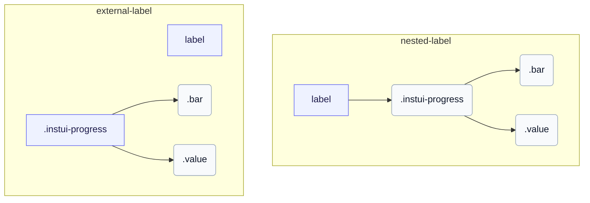

# CSS: progress

`.instui-progress` · <span class="instui-pill -color-success pantoken-doc-tag">stable</span> — A determinate progress bar with a coloured meter, sizes, and an optional value label.

`.value` is a sibling of `.bar`, both children of the root — mirroring how progress-circle nests its own `.value` part. InstUI has no indeterminate state; `:indeterminate` is a pantoken-only best guess (native `&lt;progress&gt;` without a `value` attribute), animating `.bar` as a sliding segment and hiding `.value` since there's no meaningful number to show. `&lt;meter&gt;` has no indeterminate state, so it's unaffected.

**Source:** [progress.css](https://github.com/thedannywahl/pantoken/blob/main/formats/components/src/components/progress/progress.css)

## Accessibilità

Use native `&lt;progress&gt;` for a zero-based task completion range and `&lt;meter&gt;` when the minimum is non-zero. Give either element an accessible name by nesting it in `&lt;label&gt;` or associating a separate `&lt;label&gt;` through matching `for` and `id` values.

## Uso

```css
@import "@pantoken/components/components.css";
@import "@pantoken/components/progress.css";
```

## Esempi

### Nested label
```html
<label>
  Uploading Document: <progress class="instui-progress -color-brand" value="70">70%</progress>
</label>
```
### External label
```html
<label for="storage-used">Storage used</label>
<meter id="storage-used" class="instui-progress -color-warning" min="20" value="40" max="60">50%</meter>
```

## Struttura

`// Variant: nested-label`

```text
label
  .instui-progress
    .bar
    .value
```

`// Variant: external-label`

```text
label
.instui-progress
  .bar
  .value
```



## Modificatori

| Modificatore | Descrizione |
| --- | --- |
| `.-color-brand` | Brand meter colour. |
| `.-color-danger` | Danger meter colour. |
| `.-color-info` | Informational meter colour. |
| `.-color-inverse` | For dark backgrounds. |
| `.-color-primary-inverse` | On-dark (primary inverse) meter colour. |
| `.-color-success` | Success meter colour. |
| `.-color-warning` | Warning meter colour. |
| `.-meter-color-alert` | <span class="instui-pill -color-danger pantoken-doc-tag">Deprecato</span> — use `.-color-warning`. |
| `.-meter-color-brand` | <span class="instui-pill -color-danger pantoken-doc-tag">Deprecato</span> — use `.-color-brand`. |
| `.-meter-color-danger` | <span class="instui-pill -color-danger pantoken-doc-tag">Deprecato</span> — use `.-color-danger`. |
| `.-meter-color-info` | <span class="instui-pill -color-danger pantoken-doc-tag">Deprecato</span> — use `.-color-info`. |
| `.-meter-color-success` | <span class="instui-pill -color-danger pantoken-doc-tag">Deprecato</span> — use `.-color-success`. |
| `.-meter-color-warning` | <span class="instui-pill -color-danger pantoken-doc-tag">Deprecato</span> — use `.-color-warning`. |
| `.-render-value-inside` | Renders `.value` inside the track, aligned to its start, instead of beside it; style it for legibility over the meter colour. |
| `.-should-animate` | <span class="instui-pill pantoken-doc-tag pantoken-doc-tag-interaction">Interaction</span> — Animate meter changes over half a second. |
| `.-size-large` | Large. Long-form alias of `-size-lg`. |
| `.-size-lg` | Large. |
| `.-size-md` | Medium (default). |
| `.-size-medium` | Medium (default). Long-form alias of `-size-md`. |
| `.-size-sm` | Small. |
| `.-size-small` | Small. Long-form alias of `-size-sm`. |
| `.-size-x-small` | Extra small. Long-form alias of `-size-xs`. |
| `.-size-xs` | Extra small. |

## Parti

| Parte | Descrizione |
| --- | --- |
| `.bar` | The filled meter bar. |
| `.value` | The value text beside the bar. |

## Pseudo-elementi

| Pseudo-elemento | Descrizione |
| --- | --- |
| `:::indeterminate` | Custom, not part of InstUI. Applies only to a native `&lt;progress&gt;` missing its `value` attribute; animates `.bar` as a sliding segment and hides `.value`. |
| `::after` | Draws the track's bottom rule as its own layer over the meter, so the full border and the bottom border stay independent across themes. |

## Stati

| Stato | Descrizione |
| --- | --- |
| `:indeterminate` | — |

## Proprietà personalizzate

| Proprietà | Tipo | Predefinito | Descrizione |
| --- | --- | --- | --- |
| `--max` | `<number>` | — | The maximum progress value (default `100`). |
| `--min` | `<number>` | — | The minimum meter value (default `0`). |
| `--value` | `<number>` | — | The current progress value. |
| `--value-max` | `<number>` | — | @alias {@link --max} The maximum progress value (default `100`). |
| `--value-now` | `<number>` | — | @alias Alias for `--value`. |

## Animazioni

| Animazione | Descrizione |
| --- | --- |
| `pantoken-progress-indeterminate` | — |

## Token consumati

| Token | Tipo | Valore |
| --- | --- | --- |
| `--instui-color-background-brand` | `<color>` | `light-dark(#1D354F, #EEF4FD)` |
| `--instui-color-background-error` | `<color>` | `#E62429` |
| `--instui-color-background-info` | `<color>` | `#2B7ABC` |
| `--instui-color-background-success` | `<color>` | `#03893D` |
| `--instui-color-background-warning` | `<color>` | `#CF4A00` |
| `--instui-component-progress-bar-border-color` | `<color>` | `light-dark(#1D354F, #EEF4FD)` |
| `--instui-component-progress-bar-border-color-inverse` | `<color>` | `light-dark(#ffffff, #6A7883)` |
| `--instui-component-progress-bar-border-radius` | `<length>` | `0.5rem` |
| `--instui-component-progress-bar-font-family` | `[ <font-family-name> \| <generic-font-family> ]#` | `Atkinson Hyperlegible Next, "Helvetica Neue", Helvetica, Arial, sans-serif` |
| `--instui-component-progress-bar-font-weight` | `<integer>` | `400` |
| `--instui-component-progress-bar-large-height` | `<length>` | `2rem` |
| `--instui-component-progress-bar-line-height` | `<percentage>` | `125%` |
| `--instui-component-progress-bar-medium-height` | `<length>` | `1.5rem` |
| `--instui-component-progress-bar-medium-value-font-size` | `<length>` | `1rem` |
| `--instui-component-progress-bar-meter-color-brand-inverse` | `<color>` | `light-dark(#ffffff, #10141A)` |
| `--instui-component-progress-bar-small-height` | `<length>` | `1rem` |
| `--instui-component-progress-bar-text-color` | `<color>` | `light-dark(#576773, #AAB0B5)` |
| `--instui-component-progress-bar-text-color-inverse` | `<color>` | `light-dark(#ffffff, #1C222B)` |
| `--instui-component-progress-bar-track-bottom-border-color` | `<color>` | `#00000000` |
| `--instui-component-progress-bar-track-bottom-border-color-inverse` | `<color>` | `#00000000` |
| `--instui-component-progress-bar-track-bottom-border-width` | `<length>` | `0.0625rem` |
| `--instui-component-progress-bar-track-color` | `<color>` | `#00000000` |
| `--instui-component-progress-bar-track-color-inverse` | `<color>` | `#00000000` |
| `--instui-component-progress-bar-value-padding` | `<length>` | `0.5rem` |
| `--instui-component-progress-bar-x-small-height` | `<length>` | `0.5rem` |

## Supporto browser

- Scopes the meter part rules with the `@scope` at-rule; browsers without `@scope` support ignore those scoped rules.

## Correlati

- [progress-circle](/it/api/css/progress-circle.md) — The circular form of the same determinate progress.

