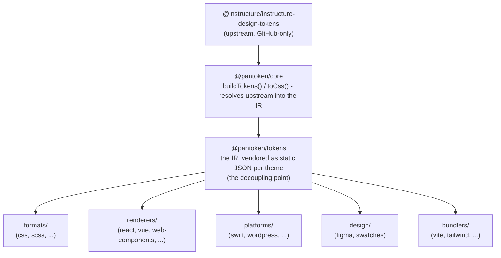

# Architettura

pantoken ha un compito: risolvere una sola volta i design token e le icone di Instructure, quindi rimodellare quel modello
per ogni destinazione. I livelli qui sotto mantengono quel rimodellamento onesto e mantengono i pacchetti pubblicati liberi
da qualsiasi upstream disponibile solo su GitHub.

## I livelli

- **`@pantoken/model`** contiene i contratti di tipo, e nient'altro. È la fonte di verità per la
  forma `Token` e il contratto dei plugin, senza dipendenze, così ogni pacchetto può dipendere da esso
  liberamente.
- **`@pantoken/core`** è l'unico pacchetto che tocca la sorgente upstream. Risolve token e
  icone nell'IR canonico e genera CSS.
- **`@pantoken/tokens`** fornisce quell'IR come JSON statico al momento della build. Questo è il punto di disaccoppiamento:
  i pacchetti downstream leggono `@pantoken/tokens`, mai `@pantoken/core`, quindi `npm i pantoken` non
  raggiunge mai l'upstream disponibile solo su GitHub.
- **`@pantoken/utils`** contiene gli helper condivisi — il risolutore `var(--x)`, le regex di riferimento,
  la conversione di case e colori, e i controlli di drift che mantengono l'output generato fedele all'IR.

## Perché i token sono forniti come venduti

Il pacchetto dei token upstream risiede su GitHub, non su npm. Se ogni pacchetto downstream ne dipendesse,
`npm i pantoken` fallirebbe per chiunque non avesse quell'accesso. Invece `@pantoken/tokens` risolve l'
upstream una volta al momento della build e scrive il risultato in JSON statico. I pacchetti pubblicati includono quel
JSON, quindi si installano correttamente da npm, fissano la semver e funzionano offline.

## Bucket

Ogni bucket downstream è un modo di consumare l'IR:

- **formats/** — trasformare i token in un file (CSS, SCSS, Less, Stylus, DTCG).
- **renderers/** — integrazioni con framework e strumenti (React, Vue, Svelte, MUI, Pendo e altri).
- **bundlers/** — plugin e preset per strumenti di build (Vite, Next, Tailwind, Panda, PostCSS, webpack).
- **platforms/** — obiettivi nativi e per generatori di siti (Swift, Kotlin, Rust, WordPress, Drupal).
- **design/** — payload per strumenti di design (Figma, tavolozze di colori).
- **plugins/** — trasformazioni opzionali che estendono i token o l'output CSS. Vedi [Plugins](/guide/plugins).

## Output generato

Ogni pacchetto che emette un file lo scrive in una directory `generated/` per pacchetto che una build
riproduce, quindi nulla di generato viene committato. Un task di workspace valida tutto. Vedi
[Generated output](/guide/generated-output).
