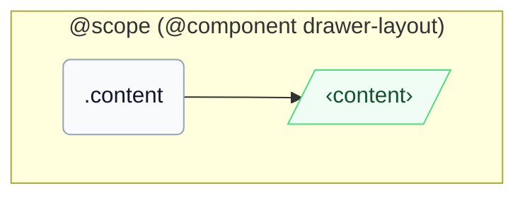

# CSS: drawer-layout.content

`.content` — The primary content pane that fills remaining space beside the tray.

Once the parent's inline-size drops below `46em` (`16em` tray width + `30em` breakpoint), a `@container` query on the parent's `pantoken-drawer-layout` container drops this member's `min-inline-size` to `0` automatically, matching the manual `[should-overlay-tray]` override.

## アクセシビリティ

Carry `role="region"` (InstUI's DrawerLayout convention) and name it with `aria-label`/`aria-labelledby` when context alone doesn't identify it.

## 使用法

```css
@import "@pantoken/components/components.css";
@import "@pantoken/components/drawer-layout.content.css";
```

## 例

```html
<div class="instui-drawer-layout">
  <div class="content" role="region">
    <p class="instui-text">Tray content</p>
  </div>
</div>
```

## 構造

```text
@scope (@component drawer-layout)
  .content
    ‹content›
```



## 条件

| 型 | クエリ | 説明 |
| --- | --- | --- |
| container | `pantoken-drawer-layout (max-width: 46em)` | — |

## 使用トークン

| トークン | 型 | 値 |
| --- | --- | --- |
| `--drawer-layout-content-min-inline-size` | `<length>` | — |
| `--pantoken-bp-md` | `<length>` | `30em` |

## 関連項目

- [drawer-layout.tray](/ja/api/css/drawer-layout.tray.md) — The adjacent panel in the same flex row.

