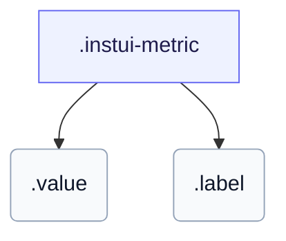

# CSS: metric

`.instui-metric` — A labelled statistic — a large value over a caption.

Sets its own `gap` between the value and label, and its own horizontal `padding`; chaining a `-gap-*`/`-p-*`/`-padding-*` spacing utility modifier overrides those built-in values.

**Source:** [metric.css](https://github.com/thedannywahl/pantoken/blob/main/formats/components/src/components/metric/metric.css)

## 使用法

```css
@import "@pantoken/components/components.css";
@import "@pantoken/components/metric.css";
```

## 例

```html
<div class="instui-metric">
  <span class="value">1,284</span>
  <span class="label">Active users</span>
</div>
```

## 構造

```text
.instui-metric
  .value
  .label
```



## 修飾子

| 修飾子 | 説明 |
| --- | --- |
| `.-text-align-center` | Centre the value and label. |
| `.-text-align-end` | End-align the value and label. |
| `.-text-align-start` | Start-align the value and label. |

## パーツ

| パート | 説明 |
| --- | --- |
| `.label` | The caption beneath the value. |
| `.value` | The large metric number. |

## 使用トークン

| トークン | 型 | 値 |
| --- | --- | --- |
| `--instui-component-metric-gap-texts` | `<length>` | `0.5rem` |
| `--instui-component-metric-label-color` | `<color>` | `light-dark(#273540, #ffffff)` |
| `--instui-component-metric-label-font-family` | `[ <font-family-name> \| <generic-font-family> ]#` | `Atkinson Hyperlegible Next, "Helvetica Neue", Helvetica, Arial, sans-serif` |
| `--instui-component-metric-label-font-size` | `<length>` | `0.75rem` |
| `--instui-component-metric-label-font-weight` | `<integer>` | `400` |
| `--instui-component-metric-label-line-height` | `<length>` | `0.75rem` |
| `--instui-component-metric-padding-horizontal` | `<length>` | `0.5rem` |
| `--instui-component-metric-value-color` | `<color>` | `light-dark(#273540, #ffffff)` |
| `--instui-component-metric-value-font-family` | `[ <font-family-name> \| <generic-font-family> ]#` | `Inclusive Sans, "Helvetica Neue", Helvetica, Arial, sans-serif` |
| `--instui-component-metric-value-font-size` | `<length>` | `1.75rem` |
| `--instui-component-metric-value-font-weight` | `<integer>` | `600` |
| `--instui-component-metric-value-line-height` | `<length>` | `1.75rem` |

