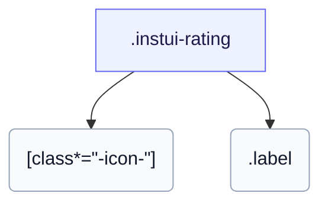

# CSS: rating

`.instui-rating` — A star rating with filled and empty glyphs and an optional numeric label.

Sets its own `gap` between star glyphs; chaining a `-gap-*` spacing utility modifier overrides that built-in value.

**Source:** [rating.css](https://github.com/thedannywahl/pantoken/blob/main/formats/components/src/components/rating/rating.css)

## アクセシビリティ

Give it role="img" and an aria-label stating the rating, since the stars are icon glyphs.

## 使用法

```css
@import "@pantoken/components/components.css";
@import "@pantoken/components/rating.css";
```

## 例

```html
<span class="instui-rating -size-sm" role="img" aria-label="2 out of 3 stars">
  <span class="instui-icon -icon-star-solid"></span> <span class="instui-icon -icon-star-solid"></span> <span class="instui-icon -icon-star"></span>
  <span class="label">2/3</span>
</span>
```

## 構造

```text
.instui-rating
  [class*="-icon-"]
  .label
```



## 修飾子

| 修飾子 | 説明 |
| --- | --- |
| `.-icon-*` | Render star glyphs with icon classes (for example, `-icon-star-solid`). |
| `.-size-large` | Large. Long-form alias of `-size-lg`. |
| `.-size-lg` | Large. |
| `.-size-sm` | Small. |
| `.-size-small` | Small. Long-form alias of `-size-sm`. |

## パーツ

| パート | 説明 |
| --- | --- |
| `.label` | The numeric label, e.g. "3/5". |

## 使用トークン

| トークン | 型 | 値 |
| --- | --- | --- |
| `--instui-color-text-base` | `<color>` | `light-dark(#273540, #F2F4F5)` |
| `--instui-component-rating-icon-icon-empty-color` | `<color>` | `light-dark(#1D354F, #EEF4FD)` |
| `--instui-component-rating-icon-icon-filled-color` | `<color>` | `light-dark(#1D354F, #EEF4FD)` |
| `--instui-component-rating-icon-icon-margin` | `<length>` | `0.125rem` |
| `--instui-component-rating-icon-large-icon-font-size` | `<length>` | `2.375rem` |
| `--instui-component-rating-icon-medium-icon-font-size` | `<length>` | `1.375rem` |
| `--instui-component-rating-icon-small-icon-font-size` | `<length>` | `1rem` |
| `--instui-font-family-base` | `[ <font-family-name> \| <generic-font-family> ]#` | `Atkinson Hyperlegible Next, "Helvetica Neue", Helvetica, Arial, sans-serif` |
| `--instui-font-size-text-base` | `<length>` | `1rem` |

