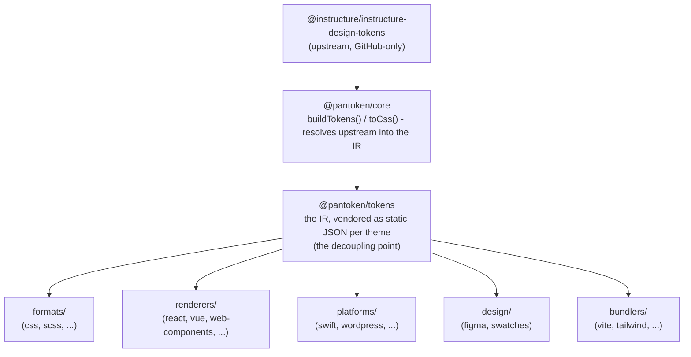

# アーキテクチャ

pantoken の仕事は一つ：Instructure のデザイントークンとアイコンを一度だけ解決し、そのモデルを各ターゲット向けに再形成すること。以下のレイヤーはその再形成を厳密に保ち、公開されるパッケージが GitHub 専用の上流に依存しないようにする。

## レイヤー

- **`@pantoken/model`** は型契約のみを保持し、それ以外は何も持たない。これは `Token` の形状とプラグイン契約の真の出典であり、依存関係がゼロなので任意のパッケージが自由に依存できる。
- **`@pantoken/core`** は上流ソースに唯一触れるパッケージである。トークンとアイコンを正規の IR に解決し、CSS をレンダリングする。
- **`@pantoken/tokens`** はその IR をビルド時に静的な JSON として提供する。ここがデカップリングのポイントである：下流パッケージは `@pantoken/tokens` を読み、決して `@pantoken/core` を読まないので、`npm i pantoken` は GitHub 専用の上流に手を伸ばすことがない。
- **`@pantoken/utils`** は共有ヘルパーを担う — `var(--x)` リゾルバ、参照用正規表現、ケースと色の変換、そして生成出力が IR に忠実であることを保つドリフトチェックなど。

## なぜトークンをベンダリングするのか

上流のトークンパッケージは npm ではなく GitHub に存在する。もしすべての下流パッケージがそれに依存していたら、`npm i pantoken` はそのアクセス権を持たない誰にとっても失敗するだろう。代わりに `@pantoken/tokens` はビルド時に上流を一度だけ解決し、その結果を静的な JSON に書き出す。公開パッケージはその JSON を含むため、npm からクリーンにインストールでき、セムババージョンに固定され、オフラインでも動作する。

## バケット

各下流バケットは IR を消費するための方法である：

- **formats/** — トークンをファイルに変換する（CSS、SCSS、Less、Stylus、DTCG）。
- **renderers/** — フレームワークやツールとの統合（React、Vue、Svelte、MUI、Pendo など）。
- **bundlers/** — ビルドツールのプラグインやプリセット（Vite、Next、Tailwind、Panda、PostCSS、webpack）。
- **platforms/** — ネイティブおよびサイトジェネレータ向けターゲット（Swift、Kotlin、Rust、WordPress、Drupal）。
- **design/** — デザイツール向けのペイロード（Figma、カラースウォッチ）。
- **plugins/** — トークンや CSS 出力を拡張するオプショナルな変換。詳細は [Plugins](/guide/plugins) を参照。

## 生成された出力

ファイルを出力するすべてのパッケージは、ビルドで再現されるパッケージごとの `generated/` ディレクトリに書き出すため、生成されたものは何もコミットされない。ワークスペースのタスクがそれらすべてを検証する。詳しくは [Generated output](/guide/generated-output) を参照。
