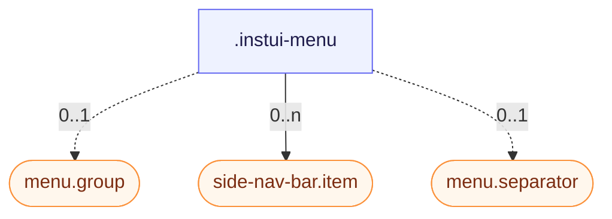

# CSS: menu

`.instui-menu` — A dropdown surface of items, groups, and separators.

Compose entries as `.item` (see the `menu.item` member), label a section with `.group` (see `menu.group`), and divide sections with `.separator` (see `menu.separator`).

**Source:** [group.css](https://github.com/thedannywahl/pantoken/blob/main/formats/components/src/components/menu/members/group/group.css)

## 사용법

```css
@import "@pantoken/components/components.css";
@import "@pantoken/components/menu.css";
```

## 예제들

-nocard
```html
<div class="instui-menu">
  <div class="group">Actions</div>
  <div class="item">Edit</div>
  <div class="item -active">Duplicate</div>
  <div class="separator"></div>
  <div class="item">Delete</div>
</div>
```

## 구조

```text
.instui-menu
  menu.group (component, 0..1)
  side-nav-bar.item (component, 0..n)
  menu.separator (component, 0..1)
```



## 사용된 토큰

| 토큰 | 타입 | 값 |
| --- | --- | --- |
| `--instui-border-radius-md` | `<length>` | `0.5rem` |
| `--instui-border-width-sm` | `<length>` | `0.0625rem` |
| `--instui-color-stroke-base` | `<color>` | `light-dark(#8D959F, #6A7883)` |
| `--instui-component-menu-item-background` | `<color>` | `light-dark(#ffffff, #171B21)` |
| `--instui-component-menu-max-width` | `<length>` | `16em` |
| `--instui-component-menu-min-width` | `<length>` | `8em` |
| `--instui-spacing-space-xs` | `<length>` | `0.25rem` |

## 하위 컴포넌트

- [menu.group](/ko/api/css/menu.group.md)
- [menu.item](/ko/api/css/menu.item.md)
- [menu.separator](/ko/api/css/menu.separator.md)
- [side-nav-bar.item](/ko/api/css/side-nav-bar.item.md)

## 관련 항목

- [tree-browser](/ko/api/css/tree-browser.md) — Both present nested, selectable entries.
- [simple-select](/ko/api/css/simple-select.md) — A select's dropdown reuses this menu surface.

