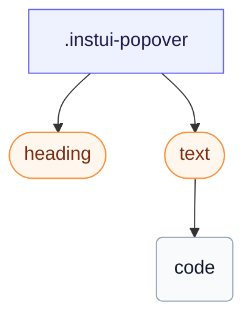

# CSS: popover

`.instui-popover` — An elevated surface for a native `[popover]`, positioned with CSS anchor positioning.

Anchor positioning is Chromium-only; the `@supports` guard means `-placement-*` is silently inert elsewhere and the UA centers the popover in the top layer instead of failing.

**Source:** [popover.css](https://github.com/thedannywahl/pantoken/blob/main/formats/components/src/components/popover/popover.css)

## 사용법

```css
@import "@pantoken/components/components.css";
@import "@pantoken/components/popover.css";
```

## 예제들

```html
<div class="instui-popover -placement-bottom" id="pop-1">
  <div class="instui-heading -level-h4">Share this page</div>
  <p class="instui-text -size-sm">A popover is a lightweight surface anchored to a trigger. This one uses the native <code>popover</code> attribute.</p>
</div>
```

## 구조

```text
.instui-popover
  heading (component)
  text (component)
    code
```



## 수정자

| 수정자 | 설명 |
| --- | --- |
| `.-placement-bottom` | Sit below the anchor. |
| `.-placement-end` | Sit at the end (inline-end) of the anchor. |
| `.-placement-start` | Sit at the start (inline-start) of the anchor. |
| `.-placement-top` | Sit above the anchor. |

## 조건

| 타입 | 쿼리 | 설명 |
| --- | --- | --- |
| supports | `(position-area: block-end)` | — |
| supports | `(transition-behavior: allow-discrete)` | — |

## 사용된 토큰

| 토큰 | 타입 | 값 |
| --- | --- | --- |
| `--instui-border-width-sm` | `<length>` | `0.0625rem` |
| `--instui-color-background-elevated-surface-base` | `<color>` | `light-dark(#ffffff, #171B21)` |
| `--instui-color-text-base` | `<color>` | `light-dark(#273540, #F2F4F5)` |
| `--instui-component-popover-border-color` | `<color>` | `light-dark(#8D959F, #6A7883)` |
| `--instui-component-popover-border-radius` | `<length>` | `0.75rem` |
| `--instui-elevation-above` | `none \| <shadow>#` | — |
| `--instui-spacing-space-sm` | `<length>` | `0.5rem` |

## 브라우저 지원

- Uses CSS anchor positioning (`position-anchor`/`position-area`) and the native `[popover]` API, both Chromium-only today; an `@supports` guard keeps the placement inert elsewhere, where the UA centres the popover in the top layer.

## 하위 컴포넌트

- [heading](/ko/api/css/heading.md)
- [text](/ko/api/css/text.md)

## 관련 항목

- [tooltip](/ko/api/css/tooltip.md) — A tooltip is a smaller, hover- or focus-triggered anchored surface.
- [context-view](/ko/api/css/context-view.md) — Context view is a related anchored surface with a pointer.

