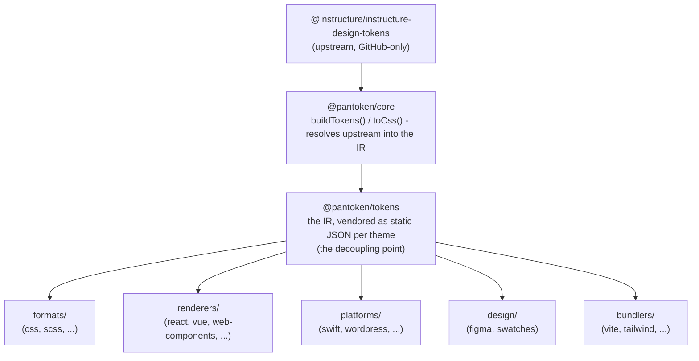

# 아키텍처

pantoken의 한 가지 임무는 Instructure의 디자인 토큰과 아이콘을 한 번 해석한 뒤, 그 모델을
모든 대상 플랫폼으로 재구성하는 것입니다. 아래 계층은 그 재구성을 투명하게 유지하고 게시된 패키지들이
GitHub 전용 업스트림에 의존하지 않도록 합니다.

## 레이어

- **`@pantoken/model`** 는 타입 계약만 보유하며 다른 것은 포함하지 않습니다. 이것은
  `Token` 형태와 플러그인 계약에 대한 진실의 출처이며 의존성이 전혀 없어서 어떤 패키지도
  자유롭게 의존할 수 있습니다.
- **`@pantoken/core`** 는 업스트림 소스와 상호작용하는 유일한 패키지입니다. 토큰과
  아이콘을 정규화된 IR로 해석하고 CSS를 렌더링합니다.
- **`@pantoken/tokens`** 는 빌드 시점에 그 IR을 정적 JSON으로 제공(vendor)합니다. 이것이 디커플링 지점입니다:
  다운스트림 패키지들은 `@pantoken/tokens` 를 읽고, 절대 `@pantoken/core` 를 읽지 않으므로 `npm i pantoken` 는
  GitHub 전용 업스트림을 참조하지 않습니다.
- **`@pantoken/utils`** 는 공유 헬퍼를 운반합니다 — `var(--x)` 리졸버, 참조용 정규식,
  케이스 및 색상 변환, 그리고 생성된 출력이 IR에 충실하도록 유지하는 드리프트 점검들입니다.

## 토큰이 벤더되는 이유

업스트림 토큰 패키지는 npm이 아닌 GitHub에 호스팅되어 있습니다. 만약 모든 다운스트림 패키지가 그것에
의존한다면, `npm i pantoken` 는 해당 접근 권한이 없는 사람들에게 실패할 것입니다. 대신 `@pantoken/tokens` 은
빌드 시점에 업스트림을 한 번 해석하고 결과를 정적 JSON으로 씁니다. 게시된 패키지들은 그 JSON을 포함하므로
npm에서 깨끗하게 설치되고, 세미버에 고정되며, 오프라인에서도 동작합니다.

## 버킷

각 다운스트림 버킷은 IR을 소비하는 방법입니다:

- **formats/** — 토큰을 파일로 변환(CSS, SCSS, Less, Stylus, DTCG).
- **renderers/** — 프레임워크 및 도구 통합(React, Vue, Svelte, MUI, Pendo 등).
- **bundlers/** — 빌드 도구 플러그인 및 프리셋(Vite, Next, Tailwind, Panda, PostCSS, webpack).
- **platforms/** — 네이티브 및 사이트 생성기 대상(Swift, Kotlin, Rust, WordPress, Drupal).
- **design/** — 디자인 도구용 페이로드(Figma, 색상 스와치).
- **plugins/** — 토큰 또는 CSS 출력을 확장하는 선택적 변환. [Plugins](/guide/plugins) 참조.

## 생성된 출력

파일을 생성하는 모든 패키지는 빌드가 재현하는 패키지별 `generated/` 디렉터리에 그것을 씁니다,
따라서 생성된 것은 커밋되지 않습니다. 워크스페이스 작업이 모두를 검증합니다. 자세한 내용은
[Generated output](/guide/generated-output) 참조.
