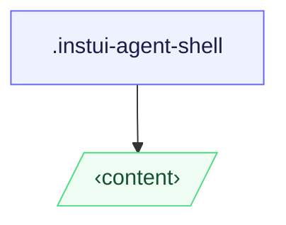

# CSS: agent-shell

`.instui-agent-shell` — A surface container for AI agents.

## Ngā Whakamahi

```css
@import "@pantoken/plugin-custom-components/custom-components.css";
```

## Ngā tauira

-nocard
```html
<div class="instui-agent-shell --p-md">
  <h2 class="instui-heading -variant-title-card-large">AI Agent</h2>
  <p>Content here.</p>
  <button class="instui-button">Action</button>
</div>
```

## Hanganga

```text
.instui-agent-shell
  ‹content›
```



## Ngā tohu i whakamahia

| Tohu | Momo | Uara |
| --- | --- | --- |
| `--instui-border-width-sm` | `<length>` | `0.0625rem` |
| `--instui-color-background-base` | `<color>` | `light-dark(#ffffff, #10141A)` |
| `--instui-color-stroke-ai-bottom-gradient` | `<color>` | `light-dark(#00828E, #04A4B7)` |
| `--instui-color-stroke-ai-top-gradient` | `<color>` | `light-dark(#9E58BD, #B680CC)` |
| `--instui-component-shared-tokens-border-radius-card-lg` | `<length>` | `1rem` |

## Tirohia anō

- https://www.figma.com/design/EmUrCpRWxboBTWEokGiBKP/Agent-Platform?node-id=1045-60738

