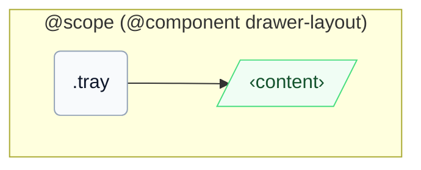

# CSS: drawer-layout.tray

`.tray` — The side panel beside main content, with optional overlay and tray-like surface modifiers.

Positioning uses `inset-inline-start`/`inset-inline` (never `left`/`right`), so `-placement-end` docks to the true trailing edge in both LTR and RTL.

## Wātea mō te katoa

If used as navigation, wrap links in a semantic `&lt;nav&gt;` and provide an accessible name.

## Ngā Whakamahi

```css
@import "@pantoken/components/components.css";
@import "@pantoken/components/drawer-layout.tray.css";
```

## Ngā tauira

```html
<div class="instui-drawer-layout" open>
  <aside class="tray" aria-label="Course navigation">
    <a class="instui-link" href="#">Modules</a>
  </aside>
  <main class="content" role="region">Main content</main>
</div>
```

## Hanganga

```text
@scope (@component drawer-layout)
  .tray
    ‹content›
```



## Ngā Kaitī

| Kaiwhakatikatika | Whakamārama |
| --- | --- |
| `.-placement-end` | Dock this tray to inline-end when overlay mode is active. |
| `.-without-border` | Remove the panel edge border. |
| `.-without-shadow` | Remove elevation when overlay mode is active. |

## Ngā Conditions

| Momo | Pātai | Whakamārama |
| --- | --- | --- |
| container | `pantoken-drawer-layout (max-width: 46em)` | — |

## Ngā tohu i whakamahia

| Tohu | Momo | Uara |
| --- | --- | --- |
| `--drawer-layout-tray-width` | — | — |
| `--instui-border-width-sm` | `<length>` | `0.0625rem` |
| `--instui-color-background-elevated-surface-base` | `<color>` | `light-dark(#ffffff, #171B21)` |
| `--instui-color-stroke-base` | `<color>` | `light-dark(#8D959F, #6A7883)` |
| `--instui-component-tray-width-xs` | `<length>` | `16em` |
| `--instui-component-tray-z-index` | `<integer>` | `9999` |
| `--instui-elevation-topmost` | `none \| <shadow>#` | — |

## Hono

- [drawer-layout.content](/mi/api/css/drawer-layout.content.md) — The primary pane that flexes alongside this member.

