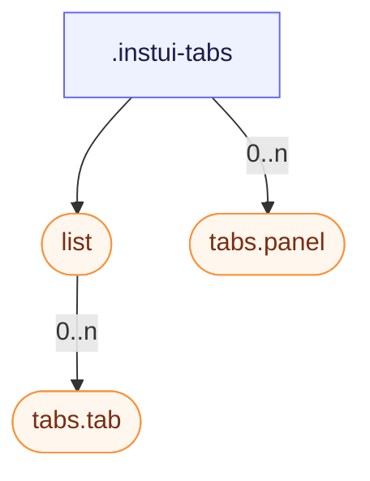

# CSS: tabs

`.instui-tabs` — A tabbed panel set: a tab list, selectable tabs, and their panels.

See the `tabs.tab` and `tabs.panel` members for the individual tab buttons and their content panels.

**Source:** [panel.css](https://github.com/thedannywahl/pantoken/blob/main/formats/components/src/components/tabs/members/panel/panel.css)

## Wātea mō te katoa

Wire the tab list with role="tablist", each tab with role="tab" and aria-selected, and each panel with role="tabpanel".

## Ngā Whakamahi

```css
@import "@pantoken/components/components.css";
@import "@pantoken/components/tabs.css";
```

## Ngā tauira

```html
<div class="instui-tabs">
  <div class="list" role="tablist" aria-label="Default tabs">
    <button class="tab -selected" role="tab" aria-selected="true">Overview</button>
    <button class="tab" role="tab" aria-selected="false">Details</button>
    <button class="tab -disabled" role="tab" aria-disabled="true" disabled>Disabled</button>
    <button class="tab" role="tab" aria-selected="false">History</button>
  </div>
  <div class="panel" role="tabpanel">The Overview tab's content shows here.</div>
</div>
```

## Hanganga

```text
.instui-tabs
  list (component)
    tabs.tab (component, 0..n)
  tabs.panel (component, 0..n)
```



## Ngā Kaitī

| Kaiwhakatikatika | Whakamārama |
| --- | --- |
| `.-overflow-scroll` | Keep the tab list on one line and let it scroll horizontally instead of wrapping, hiding the scrollbar. |
| `.-variant-secondary` | Rounded "folder" tabs with a selected tab that visually connects into the panel below. @affects tabs.tab — Restyles the tab buttons into the rounded "folder" look. |

## Wāhanga

| Wāhanga | Whakamārama |
| --- | --- |
| `.list` | The row of tabs. |

## Ngā tohu i whakamahia

| Tohu | Momo | Uara |
| --- | --- | --- |
| `--instui-component-tabs-default-background` | `<color>` | `#00000000` |

## Ngā wāhanga-iti

- [list](/mi/api/css/list.md)
- [tabs.panel](/mi/api/css/tabs.panel.md)
- [tabs.tab](/mi/api/css/tabs.tab.md)

