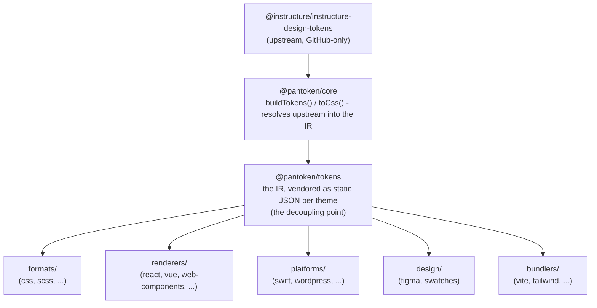

# Hanganga

He kotahi noa te mahi a pantoken: whakatau i ngā token hoahoa me ngā tohu o Instructure kotahi anake, kātahi ka hanga anō tērā tauira
mō ia whāinga. Ka noho ngā papa i raro nei hei whakarite kia pono taua hanga anō, ā, kia kore hoki e whakawhitia mai tētahi puna-mātāmua GitHub anake
ki ngā mōkihi kua whakaputaina.

## Ngā papa

- **`@pantoken/model`** e mau ana i ngā kirimana momo, ā, kāore he mea kē. Koia te puna pono mō te
  āhua `Token` me te kirimana o ngā pūtene, me kore āpitihanga, kia taea e tētahi mōkihi te whakawhirinaki ki a ia
  i runga i te whai wātea.
- **`@pantoken/core`** ko te mōkihi anake e pa ana ki te puna-mātāmua. Ka whakatau i ngā token me
  ngā tohu hei IR whakamana, ā, ka whakakite i te CSS.
- **`@pantoken/tokens`** e hoko ana i taua IR hei JSON pūmau i te wā hanga. Koinei te pito wehewehenga:
  ka pānui ngā mōkihi ā-muri i `@pantoken/tokens`, kaua ko `@pantoken/core`, nō reira `npm i pantoken` kāore e
  toro atu ki te puna-mātāmua e wātea ana anake i GitHub.
- **`@pantoken/utils`** e kawe ana i ngā awhina māori — te kaitohu `var(--x)`, ngā regex mō ngā tohutoro,
  ngā huringa ā-ahu me ngā tae, me ngā tātari rereke e whakarite ana kia pono ngā putanga i hangaia ki te IR.

## He aha i whakamana ai ngā token

Kei runga i GitHub te mōkihi token o te puna-mātāmua, kāore i runga i npm. Mēnā ka whakawhirinaki ngā mōkihi ā-muri katoa ki taua mea,
ka raru te whakaurunga mō te hunga kāore he uru. Nō reira, **`@pantoken/tokens`** ka whakatau i te puna-mātāmua kotahi i te wā hanga ka tuhi i te putanga ki te JSON pūmau. Ka kawe ngā mōkihi kua whakaputaina i taua
JSON, nō reira ka tāuta pai i runga i npm, ka piri ki te semver, ā, ka taea te mahi kia kore e hono ipurangi.

## Ngā kāwai

Ko ia kāwai ā-muri he ara ki te whakamahi i te IR:

- **formats/** — tahuri ngā token ki te konae (CSS, SCSS, Less, Stylus, DTCG).
- **renderers/** — whakaurunga anga me ngā taputapu (React, Vue, Svelte, MUI, Pendo, aha atu).
- **bundlers/** — mono me ngā preset mō ngā taputapu hanga (Vite, Next, Tailwind, Panda, PostCSS, webpack).
- **platforms/** — whāinga taketake me ngā kaihanga pae (Swift, Kotlin, Rust, WordPress, Drupal).
- **design/** — rawa mō ngā taputapu hoahoa (Figma, kāri tae).
- **plugins/** — tahuri ā-kōwhiringa e whakawhānui ana i te token rānei te putanga CSS. Tirohia [Plugins](/guide/plugins).

## Putanga i hangaia

Ka tuhi ia mōkihi e whakaputa ana i tētahi konae ki tētahi kōpaki `generated/` mō ia mōkihi — ka whakaahuatia e te hanga,
nō reira kāore he mea i hangaia e tukuna ki te repo. Ka whakatutukihia katoa e tētahi mahi worokspace. Tirohia
[Generated output](/guide/generated-output).
