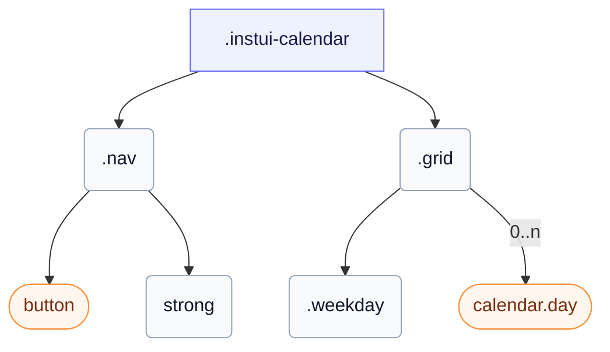

# CSS: calendar

`.instui-calendar` — A static month grid with navigation, weekday headers, and day cells.

See the `calendar.day` member for the individual day cells.

**Source:** [calendar.css](https://github.com/thedannywahl/pantoken/blob/main/formats/components/src/components/calendar/calendar.css)

## Aksesibiliti

Expose the grid with `role="table"` and a descriptive `aria-label`, and give each navigation button its own `aria-label`.

## Penggunaan

```css
@import "@pantoken/components/components.css";
@import "@pantoken/components/calendar.css";
```

## Contoh

```html
<div class="instui-calendar" role="table" aria-label="March 2026">
  <div class="nav">
    <button class="instui-button -color-tertiary -shape-square -without-border -icon-chevron-left" aria-label="Previous month"></button>
    <strong>March 2026</strong>
    <button class="instui-button -color-tertiary -shape-square -without-border -icon-chevron-right" aria-label="Next month"></button>
  </div>
  <div class="grid">
    <span class="weekday">Su</span>
    <span class="weekday">Mo</span>
    <span class="weekday">Tu</span>
    <span class="weekday">We</span>
    <span class="weekday">Th</span>
    <span class="weekday">Fr</span>
    <span class="weekday">Sa</span>
    <span class="day -outside-month">23</span>
    <span class="day -outside-month">24</span>
    <span class="day -outside-month">25</span>
    <span class="day -outside-month">26</span>
    <span class="day -outside-month">27</span>
    <span class="day -outside-month">28</span>
    <span class="day">1</span>
    <span class="day">2</span>
    <span class="day">3</span>
    <span class="day">4</span>
    <span class="day">5</span>
    <span class="day">6</span>
    <span class="day -today">7</span>
    <span class="day">8</span>
    <span class="day">9</span>
    <span class="day">10</span>
    <span class="day">11</span>
    <span class="day -selected">12</span>
    <span class="day">13</span>
    <span class="day">14</span>
    <span class="day">15</span>
  </div>
</div>
```

## Struktur

```text
.instui-calendar
  .nav
    button (component)
    strong
  .grid
    .weekday
    calendar.day (component, 0..n)
```



## Bahagian

| Bahagian | Penerangan |
| --- | --- |
| `.grid` | The seven-column day grid. |
| `.nav` | The month navigation row. |
| `.weekday` | A weekday column header. |

## Token digunakan

| Token | Jenis | Nilai |
| --- | --- | --- |
| `--instui-component-calendar-background` | `<color>` | `light-dark(#ffffff, #171B21)` |
| `--instui-component-calendar-color` | `<color>` | `light-dark(#273540, #ffffff)` |
| `--instui-component-calendar-day-height` | `<length>` | `2rem` |
| `--instui-component-calendar-day-min-width` | `<length>` | `2rem` |
| `--instui-component-calendar-font-family` | `[ <font-family-name> \| <generic-font-family> ]#` | `Atkinson Hyperlegible Next, "Helvetica Neue", Helvetica, Arial, sans-serif` |
| `--instui-component-calendar-font-size` | `<length>` | `1rem` |
| `--instui-component-calendar-font-weight` | `<integer>` | `600` |
| `--instui-component-calendar-line-height` | `<percentage>` | `150%` |
| `--instui-component-calendar-nav-margin` | `<length>` | `0.75rem` |
| `--instui-font-weight-interactive` | `<integer>` | `500` |
| `--instui-spacing-space2xs` | `<length>` | `0.125rem` |

## Subkomponen

- [button](/ms/api/css/button.md)
- [calendar.day](/ms/api/css/calendar.day.md)

