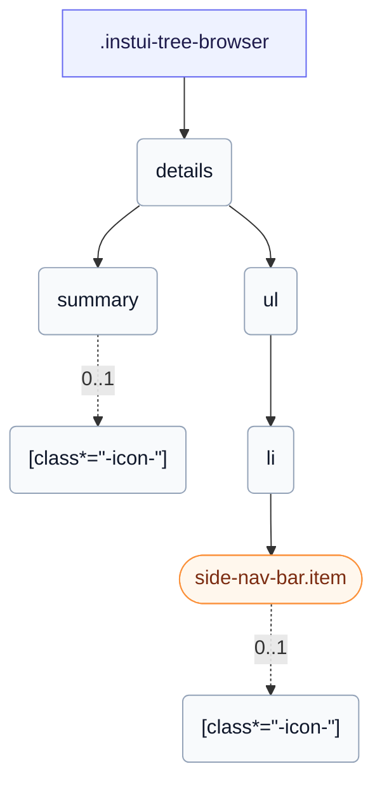

# CSS: tree-browser

`.instui-tree-browser` — A disclosure tree of nested collections and leaf items, with rotating chevrons.

Each collection is a native `&lt;details&gt;`; nesting them inside one another builds the tree, and the browser handles opening and closing every branch.

**Source:** [tree-browser.css](https://github.com/thedannywahl/pantoken/blob/main/formats/components/src/components/tree-browser/tree-browser.css)

## Aksesibiliti

Mark the root with role="tree" and each nested list with role="group".

## Penggunaan

```css
@import "@pantoken/components/components.css";
@import "@pantoken/components/tree-browser.css";
```

## Contoh

```html
<div class="instui-tree-browser" role="tree">
  <details open>
    <summary><span class="instui-icon -icon-folder"></span> Course files</summary>
    <ul role="group">
      <li>
        <a class="item" href="#"><span class="instui-icon -icon-file-text"></span> Syllabus.pdf</a>
      </li>
      <li>
        <details>
          <summary><span class="instui-icon -icon-folder"></span> Week 1</summary>
          <ul role="group">
            <li>
              <a class="item -selected" href="#"><span class="instui-icon -icon-file-text"></span> Reading.pdf</a>
            </li>
            <li>
              <a class="item" href="#"><span class="instui-icon -icon-file-text"></span> Slides.pptx</a>
            </li>
          </ul>
        </details>
      </li>
      <li>
        <a class="item" href="#"><span class="instui-icon -icon-file-text"></span> Rubric.docx</a>
      </li>
    </ul>
  </details>
</div>
```

## Struktur

```text
.instui-tree-browser
  details
    summary
      [class*="-icon-"] (0..1)
    ul
      li
        side-nav-bar.item (component)
          [class*="-icon-"] (0..1)
```



## Pemodifikasi

| Pemodifikasi | Penerangan |
| --- | --- |
| `.-icon-*` | Render folder/file glyph icons in summaries and leaf items. |
| `.-size-large` | Large. Long-form alias of `-size-lg`. |
| `.-size-lg` | Large. |
| `.-size-sm` | Small. |
| `.-size-small` | Small. Long-form alias of `-size-sm`. |

## Bahagian

| Bahagian | Penerangan |
| --- | --- |
| `.item` | A leaf entry in the tree. |

## Pseudo-elemen

| Pseudo-elemen | Penerangan |
| --- | --- |
| `::before` | Draws each collection's disclosure chevron, a masked glyph that rotates to point down when the branch is open. |

## Keadaan

| Keadaan | Penerangan |
| --- | --- |
| `:state(open)` | — |

## Token digunakan

| Token | Jenis | Nilai |
| --- | --- | --- |
| `--instui-component-tree-browser-border-radius` | `<length>` | `0.5rem` |
| `--instui-component-tree-browser-tree-button-base-spacing-large` | `<length>` | `1rem` |
| `--instui-component-tree-browser-tree-button-base-spacing-medium` | `<length>` | `0.75rem` |
| `--instui-component-tree-browser-tree-button-base-spacing-small` | `<length>` | `0.5rem` |
| `--instui-component-tree-browser-tree-button-border-radius` | `<length>` | `0.5rem` |
| `--instui-component-tree-browser-tree-button-hover-background-color` | `<color>` | `light-dark(#1D354F, #EEF4FD)` |
| `--instui-component-tree-browser-tree-button-hover-text-color` | `<color>` | `light-dark(#ffffff, #1C222B)` |
| `--instui-component-tree-browser-tree-button-icons-margin-right-medium` | `<length>` | `0.5rem` |
| `--instui-component-tree-browser-tree-button-name-font-size-large` | `<length>` | `1rem` |
| `--instui-component-tree-browser-tree-button-name-font-size-medium` | `<length>` | `0.875rem` |
| `--instui-component-tree-browser-tree-button-name-font-size-small` | `<length>` | `0.75rem` |
| `--instui-component-tree-browser-tree-button-name-text-color` | `<color>` | `light-dark(#2369A4, #7FB4F1)` |
| `--instui-component-tree-browser-tree-button-selected-background-color` | `<color>` | `light-dark(#4A5B68, #576773)` |
| `--instui-component-tree-browser-tree-button-selected-text-color` | `<color>` | `#ffffff` |
| `--instui-component-tree-browser-tree-button-text-line-height` | `<percentage>` | `125%` |
| `--instui-component-tree-browser-tree-collection-base-spacing-medium` | `<length>` | `0.75rem` |
| `--instui-component-tree-browser-tree-collection-font-family` | `[ <font-family-name> \| <generic-font-family> ]#` | `Atkinson Hyperlegible Next, "Helvetica Neue", Helvetica, Arial, sans-serif` |
| `--instui-icon-chevron-right` | `<image>` | `url('data:image/svg+xml;utf8,%3Csvg%20xmlns%3D%22http%3A%2F%2Fwww.w3.org%2F2000%2Fsvg%22%20width%3D%2224%22%20height%3D%2224%22%20viewBox%3D%220%200%2024%2024%22%20fill%3D%22none%22%20stroke%3D%22currentColor%22%20stroke-width%3D%222%22%20stroke-linecap%3D%22round%22%20stroke-linejoin%3D%22round%22%3E%3Cpath%20d%3D%22m9%2018%206-6-6-6%22%2F%3E%3C%2Fsvg%3E')` |

## Subkomponen

- [side-nav-bar.item](/ms/api/css/side-nav-bar.item.md)

## Berkaitan

- [menu](/ms/api/css/menu.md) — Both present nested, selectable entries.

