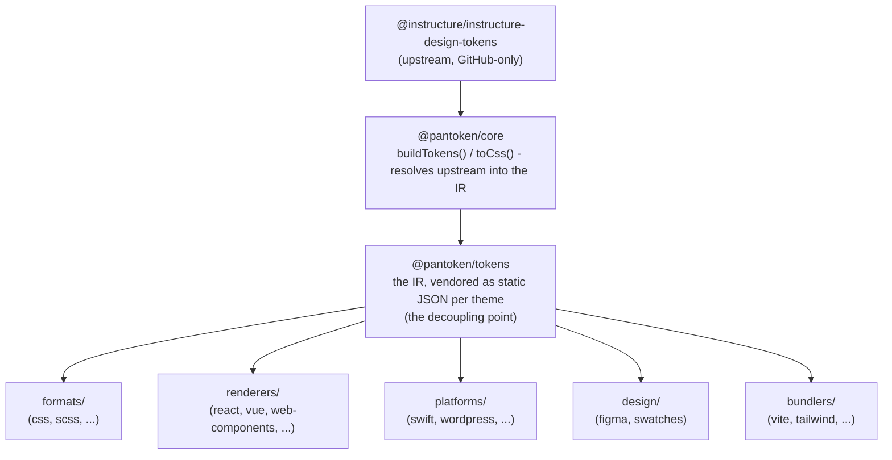

# Seni Bina

pantoken mempunyai satu tugas: menyelesaikan token reka bentuk dan ikon Instructure sekali sahaja, kemudian membentuk semula model itu untuk setiap sasaran. Lapisan di bawah memastikan pembentukan semula itu tepat dan memastikan pakej yang diterbitkan bebas daripada upstream yang hanya di GitHub.

## Lapisan

- **`@pantoken/model`** memegang kontrak jenis, dan tiada apa-apa lagi. Ia adalah sumber kebenaran untuk bentuk `Token` dan kontrak plugin, dengan sifar pergantungan, jadi mana-mana pakej boleh bergantung padanya dengan bebas.
- **`@pantoken/core`** adalah satu-satunya pakej yang menyentuh sumber upstream. Ia menyelesaikan token dan ikon kepada IR kanonik dan menghasilkan CSS.
- **`@pantoken/tokens`** menyertakan IR itu sebagai JSON statik pada masa bina. Ini adalah titik pemisahan: pakej hiliran membaca `@pantoken/tokens`, bukan `@pantoken/core`, jadi `npm i pantoken` tidak pernah mencapai upstream yang hanya di GitHub.
- **`@pantoken/utils`** membawa pembantu bersama — penyelesai `var(--x)`, regex rujukan, penukaran kes dan warna, dan pemeriksaan drift yang memastikan output yang dijana setia kepada IR.

## Mengapa token dibundel

Pakej token upstream berada di GitHub, bukan npm. Jika setiap pakej hiliran bergantung kepadanya, `npm i pantoken` akan gagal untuk sesiapa yang tidak mempunyai akses itu. Sebaliknya `@pantoken/tokens` menyelesaikan upstream sekali pada masa bina dan menulis hasilnya ke JSON statik. Pakej yang diterbitkan membawa JSON itu, jadi ia dipasang dengan kemas dari npm, dipaut pada semver, dan berfungsi tanpa sambungan.

## Kumpulan

Setiap kumpulan hiliran adalah satu cara menggunakan IR:

- **formats/** — menukar token kepada fail (CSS, SCSS, Less, Stylus, DTCG).
- **renderers/** — integrasi rangka kerja dan alat (React, Vue, Svelte, MUI, Pendo, dan lain-lain).
- **bundlers/** — plugin dan pratetap alat bina (Vite, Next, Tailwind, Panda, PostCSS, webpack).
- **platforms/** — sasaran asli dan penjana laman (Swift, Kotlin, Rust, WordPress, Drupal).
- **design/** — muatan untuk alat reka bentuk (Figma, palet warna).
- **plugins/** — transformasi pilihan yang meluaskan output token atau CSS. Lihat [Plugins](/guide/plugins).

## Output yang Dijana

Setiap pakej yang mengeluarkan fail menulisnya ke direktori `generated/` per-pakej yang dihasilkan semula oleh bina, jadi tiada apa yang dijana yang dikomitkan. Tugas ruang kerja mengesahkan semuanya. Lihat [Generated output](/guide/generated-output).
