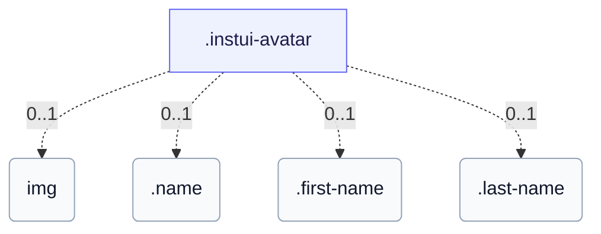

# CSS: avatar

`.instui-avatar` · <span class="instui-pill -color-success pantoken-doc-tag">stable</span> — A user avatar showing initials or an image, circular by default.

By default the palette colour tints the initials on a transparent surface; `-has-inverse-color` fills the surface with the colour and puts the initials on-colour. The `-color-ai` variant always fills with the violet→sea gradient. For a full display name, put it in the content (so it stays in the accessibility tree) and add `data-initials="XX"` for the compact visual — the real text is what a screen reader announces. Without `data-initials`, overflowing content just hard-clips (no ellipsis); wrap it in `.name` for a precise single-leading-letter clip instead, or split it into `.first-name`/`.last-name` for two clipped letters (either half can be omitted and the other stays centred).

**Source:** [avatar.css](https://github.com/thedannywahl/pantoken/blob/main/formats/components/src/components/avatar/avatar.css)

<!-- js-requirement -->
> [!TIP]
> **JS-forbedring** — This component's CSS renders and works on its own; pair it with `@pantoken/interactions` to add the interactive behavior. See the [modifier table below](#modifiers).


## Tilgjengelighet

Give an image avatar a meaningful `alt` (the person's name), not a generic "avatar"; for initials-only avatars, prefer real name content (bare text, data-initials, .name, or .first-name/.last-name) over pre-abbreviated letters, so assistive tech announces the real name.

## Bruk

```css
@import "@pantoken/components/components.css";
@import "@pantoken/components/avatar.css";
```

## Eksempler

```html
<span class="instui-avatar --me-sm">LH</span>
<span class="instui-avatar -color-ai --me-sm">AI</span>
<span class="instui-avatar --me-sm" data-initials="NV">Dr. Nguyen Van Thoc</span>
<span class="instui-avatar"><span class="name">Miguel Sanchez</span></span>
<span class="instui-avatar"><span class="first-name">Miguel</span> <span class="last-name">Sanchez</span></span>
```

## Struktur

The avatar shows one of: an &lt;img&gt;, bare/data-initials text, a .name wrap, or a .first-name/.last-name pair.

```text
.instui-avatar
  img (0..1)
  .name (0..1)
  .first-name (0..1)
  .last-name (0..1)
```



## Modifikatorer

| Modifikator | Beskrivelse |
| --- | --- |
| `.-color-accent1` | <span class="instui-pill -color-danger pantoken-doc-tag">Utdatert</span> — use `.-color-blue`. |
| `.-color-accent2` | <span class="instui-pill -color-danger pantoken-doc-tag">Utdatert</span> — use `.-color-green`. |
| `.-color-accent3` | <span class="instui-pill -color-danger pantoken-doc-tag">Utdatert</span> — use `.-color-red`. |
| `.-color-accent4` | <span class="instui-pill -color-danger pantoken-doc-tag">Utdatert</span> — use `.-color-orange`. |
| `.-color-accent5` | <span class="instui-pill -color-danger pantoken-doc-tag">Utdatert</span> — use `.-color-ash`. |
| `.-color-accent6` | <span class="instui-pill -color-danger pantoken-doc-tag">Utdatert</span> — use `.-color-grey`. |
| `.-color-ai` | AI-accent palette colour. |
| `.-color-ash` | Ash palette colour. |
| `.-color-blue` | Blue palette colour. |
| `.-color-green` | Green palette colour. |
| `.-color-grey` | Grey palette colour. |
| `.-color-orange` | Orange palette colour. |
| `.-color-red` | Red palette colour. |
| `.-has-inverse-color` | Use the inverse (on-dark) text colour. |
| `.-shape-rectangle` | Square (rectangular) shape instead of a circle. |
| `.-show-border` | <span class="instui-pill -color-info pantoken-doc-tag">Alias</span> — maps to `.-show-border-always`. |
| `.-show-border-always` | Force the border ring on, even over an image or an inverse fill. |
| `.-show-border-never` | Force the border ring off. |
| `.-size-2xl` | Two sizes larger. |
| `.-size-2xs` | Two sizes smaller. |
| `.-size-large` | Large. Long-form alias of `-size-lg`. |
| `.-size-lg` | Large. |
| `.-size-md` | Medium (the default). |
| `.-size-medium` | Medium (the default). Long-form alias of `-size-md`. |
| `.-size-sm` | Small. |
| `.-size-small` | Small. Long-form alias of `-size-sm`. |
| `.-size-x-large` | Extra large. Long-form alias of `-size-xl`. |
| `.-size-x-small` | Extra small. Long-form alias of `-size-xs`. |
| `.-size-xl` | Extra large. |
| `.-size-xs` | Extra small. |
| `.-size-xx-large` | Two sizes larger. Long-form alias of `-size-2xl`. |
| `.-size-xx-small` | Two sizes smaller. Long-form alias of `-size-2xs`. |

## Deler

| Del | Beskrivelse |
| --- | --- |
| `.first-name` | Optional (pairs with .last-name): wraps the given name, clipped to its leading letter. |
| `.last-name` | Optional (pairs with .first-name): wraps the family name, clipped to its leading letter. |
| `.name` | Optional: wrap the full name to clip it to a single leading letter without data-initials or JS. |

## Pseudo-elementer

| Pseudo-element | Beskrivelse |
| --- | --- |
| `::before` | — |

## Forbrukte tokens

| Token | Type | Verdi |
| --- | --- | --- |
| `--instui-component-avatar-ai-bottom-gradient-color` | `<color>` | `#00828E` |
| `--instui-component-avatar-ai-top-gradient-color` | `<color>` | `#9E58BD` |
| `--instui-component-avatar-ash-background-color` | `<color>` | `light-dark(#273540, #1C222B)` |
| `--instui-component-avatar-ash-text-color` | `<color>` | `light-dark(#273540, #C7CACD)` |
| `--instui-component-avatar-background-color` | `<color>` | `light-dark(#ffffff, #10141A)` |
| `--instui-component-avatar-blue-background-color` | `<color>` | `#2B7ABC` |
| `--instui-component-avatar-blue-text-color` | `<color>` | `light-dark(#2871AF, #7FB4F1)` |
| `--instui-component-avatar-border-color` | `<color>` | `light-dark(#8D959F, #6A7883)` |
| `--instui-component-avatar-border-width-md` | `<length>` | `0.125rem` |
| `--instui-component-avatar-border-width-sm` | `<length>` | `0.0625rem` |
| `--instui-component-avatar-font-family` | `[ <font-family-name> \| <generic-font-family> ]#` | `Atkinson Hyperlegible Next, "Helvetica Neue", Helvetica, Arial, sans-serif` |
| `--instui-component-avatar-font-size-lg` | `<length>` | `1.25rem` |
| `--instui-component-avatar-font-size-md` | `<length>` | `1rem` |
| `--instui-component-avatar-font-size-sm` | `<length>` | `0.875rem` |
| `--instui-component-avatar-font-size-xl` | `<length>` | `1.75rem` |
| `--instui-component-avatar-font-size-xs` | `<length>` | `0.75rem` |
| `--instui-component-avatar-font-size2xl` | `<length>` | `2.5rem` |
| `--instui-component-avatar-font-size2xs` | `<length>` | `0.75rem` |
| `--instui-component-avatar-font-weight` | `<integer>` | `600` |
| `--instui-component-avatar-green-background-color` | `<color>` | `#03893D` |
| `--instui-component-avatar-green-text-color` | `<color>` | `light-dark(#037D37, #61C378)` |
| `--instui-component-avatar-grey-background-color` | `<color>` | `light-dark(#4A5B68, #576773)` |
| `--instui-component-avatar-grey-text-color` | `<color>` | `light-dark(#4A5B68, #F2F4F5)` |
| `--instui-component-avatar-orange-background-color` | `<color>` | `#CF4A00` |
| `--instui-component-avatar-orange-text-color` | `<color>` | `light-dark(#BB4200, #FF905A)` |
| `--instui-component-avatar-rectangle-radius` | `<length>` | `0.25rem` |
| `--instui-component-avatar-red-background-color` | `<color>` | `#E62429` |
| `--instui-component-avatar-red-text-color` | `<color>` | `light-dark(#CF1F24, #FA917F)` |
| `--instui-component-avatar-size-lg` | `<length>` | `3.5rem` |
| `--instui-component-avatar-size-md` | `<length>` | `3rem` |
| `--instui-component-avatar-size-sm` | `<length>` | `2.5rem` |
| `--instui-component-avatar-size-xl` | `<length>` | `4rem` |
| `--instui-component-avatar-size-xs` | `<length>` | `2rem` |
| `--instui-component-avatar-size2xl` | `<length>` | `5rem` |
| `--instui-component-avatar-size2xs` | `<length>` | `1.5rem` |
| `--instui-component-avatar-text-on-color` | `<color>` | `#ffffff` |

## Relatert

- [byline](/nb/api/css/byline.md) — Can host an avatar as its leading hero figure.

