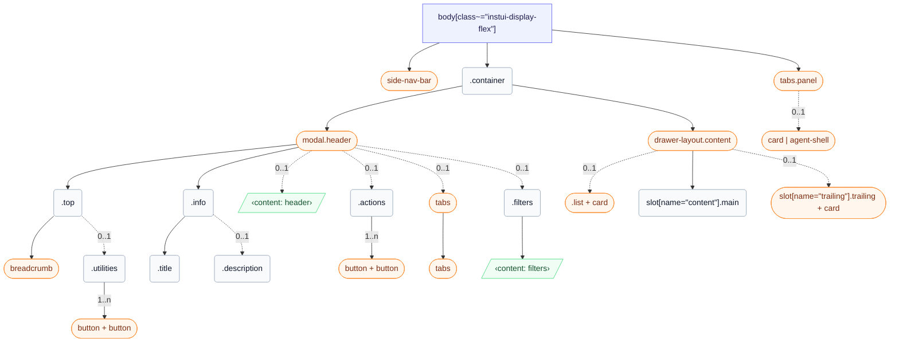

# CSS: wrapper

`body[class~="instui-display-flex"]` — App-shell row: side nav, container with header, and optional panel.

✅ Use Wrapper when:

- Building a full Canvas product page that needs a consistent layout shell
- The page uses GlobalNav as the primary navigation anchor
- The page needs side panels: ContentTabList, TrailingContentArea, or a UtilityPanel
- You need consistent container padding and content max-width across the full page
🚫 Don't use Wrapper when:

- Building a Modal, Tray, or Drawer — those have their own layout containers
- Wrapping a sub-section of a page — Wrapper contains the full page, not a region

## Tilgjengelighet

- Map the main content area to a &lt;main&gt; landmark with a skip-nav link so keyboard users can bypass GlobalNav
- Give ContentTabList role="navigation" with a distinct aria-label such as "Page navigation" — separate from GlobalNav's landmark
- Give TrailingContentArea role="complementary" with a descriptive aria-label that reflects its content, such as "Student details"
- Give each UtilityPanel a distinct aria-label: "AI assistant", "Notifications", or "Filters"
- When a UtilityPanel opens, move focus into the panel; when it closes, return focus to the trigger that opened it

## Bruk

```css
@import "@pantoken/plugin-layouts/layouts.css";
```

## Struktur

```text
body[class~="instui-display-flex"]
  side-nav-bar (component)
  .container
    modal.header (component)
      .top
        breadcrumb (component)
        .utilities (0..1)
          button + button (component, 1..n)
      .info
        .title
        .description (0..1)
      ‹content: header› (0..1)
      .actions (0..1)
        button + button (component, 1..n)
      tabs (component, 0..1)
        tabs (component)
      .filters (0..1)
        ‹content: filters›
    drawer-layout.content (component)
      list + card (component, 0..1)
      slot[name="content"].main
      slot[name="trailing"].trailing + card (component, 0..1)
  tabs.panel (component)
    card | agent-shell (component, 0..1)
```



## Slots

| Slot | Beskrivelse |
| --- | --- |
| `content` | Primary page content. |
| `filters` | Optional filters content inside the header. |
| `header` | Optional header slot below page description. |
| `panel` | Utility panel content. |
| `trailing` | Trailing complementary content. |

## Deler

| Del | Beskrivelse |
| --- | --- |
| `.actions` | Optional header buttons at the end of the top row. |
| `.container` | Main page column that holds header and content. |
| `.content` | Primary content region inside the container column. |
| `.description` | Optional page description below the title. |
| `.filters` | Optional filters region inside the header. |
| `.header` | Header region inside the container column. |
| `.info` | Container for page title and optional description. |
| `.list` | Optional navigation column inside content. |
| `.main` | Main content column inside content. |
| `.panel` | Utility panel region that opens on the right side of the page. |
| `.tabs` | Optional navigation tabs at the start of the content row. |
| `.title` | Page title below the top row. |
| `.top` | Grid row containing breadcrumbs and utilities. |
| `.trailing` | Optional complementary column inside content. |
| `.utilities` | Utility actions at the end of the top row. |

## Tilstander

| Tilstand | Beskrivelse |
| --- | --- |
| `:optional` | — |

## Forbrukte tokens

| Token | Type | Verdi |
| --- | --- | --- |
| `--instui-background-color-page` | — | — |

## Underkomponenter

- [agent-shell](/nb/api/css/agent-shell.md)
- [breadcrumb](/nb/api/css/breadcrumb.md)
- [button](/nb/api/css/button.md)
- [card](/nb/api/css/card.md)
- [drawer-layout.content](/nb/api/css/drawer-layout.content.md)
- [list](/nb/api/css/list.md)
- [modal.header](/nb/api/css/modal.header.md)
- [side-nav-bar](/nb/api/css/side-nav-bar.md)
- [tabs](/nb/api/css/tabs.md)
- [tabs.panel](/nb/api/css/tabs.panel.md)

## Relatert

- [card](/nb/api/css/card.md)
- [agent-shell](/nb/api/css/agent-shell.md)
- [breadcrumb](/nb/api/css/breadcrumb.md)
- [tabs](/nb/api/css/tabs.md)
- [button](/nb/api/css/button.md)
- [heading](/nb/api/css/heading.md)

