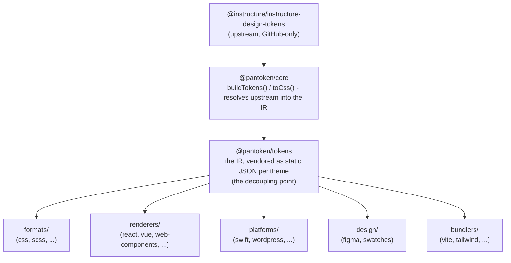

# Arkitektur

pantoken har ett oppdrag: løse Instructure sine design-tokens og ikoner én gang, og så omforme den modellen
for hver målplattform. Lagene nedenfor sørger for at den omformingen holdes ren og at de publiserte pakkene er fri
for enhver GitHub-spesifikk upstream.

## Lagene

- **`@pantoken/model`** inneholder typekontraktene, og ingenting annet. Det er sannhetskilden for
  `Token`-formen og plugin-kontrakten, med null avhengigheter, så hvilken som helst pakke kan avhenge av den
  fritt.
- **`@pantoken/core`** er den eneste pakken som berører upstream-kilden. Den løser tokens og
  ikoner inn i den kanoniske IR-en og renderer CSS.
- **`@pantoken/tokens`** leverer den IR-en som statisk JSON ved byggetid. Dette er avkoblingspunktet:
  downstream-pakkene leser `@pantoken/tokens`, aldri `@pantoken/core`, så `npm i pantoken` aldri
  trenger å nå ut til den GitHub-spesifikke upstreamen.
- **`@pantoken/utils`** bærer de delte hjelpefunksjonene — `var(--x)`-resolveren, referanse-regexene,
  case- og fargekonvertering, og drift-sjekkene som holder generert output tro mot IR-en.

## Hvorfor tokens vendes

Upstream-token-pakken ligger på GitHub, ikke npm. Hvis alle downstream-pakker avhengig av den,
ville `npm i pantoken` feilet for alle uten den tilgangen. I stedet løser `@pantoken/tokens` den
upstream én gang ved byggetid og skriver resultatet til statisk JSON. De publiserte pakkene bærer den
JSON-en, så de installeres rent fra npm, pinses til semver, og fungerer offline.

## Kategorier

Hver downstream-bucket er en måte å konsumere IR-en på:

- **formats/** — gjør om tokens til en fil (CSS, SCSS, Less, Stylus, DTCG).
- **renderers/** — rammeverk- og verktøyintegrasjoner (React, Vue, Svelte, MUI, Pendo, og flere).
- **bundlers/** — byggeverktøy-plugins og presets (Vite, Next, Tailwind, Panda, PostCSS, webpack).
- **platforms/** — native- og site-generator-mål (Swift, Kotlin, Rust, WordPress, Drupal).
- **design/** — nyttelaster for designverktøy (Figma, fargeprøver).
- **plugins/** — valgfrie transformasjoner som utvider token- eller CSS-output. Se [Plugins](/guide/plugins).

## Generert utdata

Hver pakke som emitterer en fil skriver den til en per-pakke `generated/`-mappe som et bygg
gjenoppretter, så ingenting generert blir committed. Et workspace-oppdrag validerer alt av det. Se
[Generated output](/guide/generated-output).
