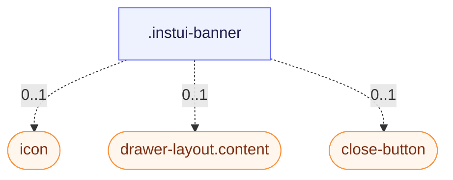

# CSS: banner

`.instui-banner` — A dismissible, iconed message surface for page-level or in-context announcements.

**Size** controls padding and gap: `relaxed` (default) is roomier; `compact` tightens both.
**Color** sets the fill: bare (no modifier) is unfilled — border and icon only; `-color-violet`
and `-color-sea` add a tinted background plus a matching icon swatch. `-variant-ai` replaces the
fill with a top-to-bottom gradient instead, for AI-attributed messaging.

## Accessibility

Add `role="status"` (or `role="alert"` for urgent messages) so assistive tech announces the
banner; mark a decorative icon `aria-hidden="true"` and give the close button an `aria-label`.

## Usage

@import "@pantoken/plugin-custom-components/custom-components.css";

```css
@import "@pantoken/plugin-custom-components/custom-components.css";
```

## Examples

-nocard

```html
<div class="instui-banner -color-violet" role="status">
  <span class="icon" aria-hidden="true"></span>
  <div class="content">This is a violet banner with an icon.</div>
  <button class="instui-close-button -size-xs" aria-label="Close"></button>
</div>
```

## Structure

```text
.instui-banner
  icon (component, 0..1)
  drawer-layout.content (component, 0..1)
  close-button (component, 0..1)
```



## Modifiers

| Modifier         | Description                                                |
| ---------------- | ---------------------------------------------------------- |
| `.-color-sea`    | Sea-tinted background and icon swatch.                     |
| `.-color-violet` | Violet-tinted background and icon swatch.                  |
| `.-size-compact` | Tighter padding and gap.                                   |
| `.-size-relaxed` | Roomier padding and gap (default).                         |
| `.-variant-ai`   | AI-attributed gradient background in place of a flat fill. |

## Parts

| Part       | Description                                                                                 |
| ---------- | ------------------------------------------------------------------------------------------- |
| `.content` | The message content, stacked in a column.                                                   |
| `.icon`    | The optional icon swatch; its background and corner radius come from the active size/color. |

## Tokens consumed

| Token                                                           | Type       | Value                          |
| --------------------------------------------------------------- | ---------- | ------------------------------ |
| `--instui-component-banner-ai-background-bottom-gradient-color` | `<color>`  | `light-dark(#CFF0F6, #00424A)` |
| `--instui-component-banner-ai-background-top-gradient-color`    | `<color>`  | `light-dark(#F3E5F7, #522965)` |
| `--instui-component-banner-border-color`                        | `<color>`  | `light-dark(#5F6E7A, #9EA6AD)` |
| `--instui-component-banner-border-radius`                       | `<length>` | `1rem`                         |
| `--instui-component-banner-border-style`                        | —          | `solid`                        |
| `--instui-component-banner-border-width`                        | `<length>` | `0.0625rem`                    |
| `--instui-component-banner-close-button-margin-right`           | `<length>` | `0.5rem`                       |
| `--instui-component-banner-close-button-margin-top`             | `<length>` | `0.5rem`                       |
| `--instui-component-banner-color`                               | `<color>`  | `light-dark(#273540, #ffffff)` |
| `--instui-component-banner-compact-content-gap-horizontal`      | `<length>` | `0.5rem`                       |
| `--instui-component-banner-compact-icon-border-radius`          | `<length>` | `0.5rem`                       |
| `--instui-component-banner-compact-padding-horizontal`          | `<length>` | `0.75rem`                      |
| `--instui-component-banner-compact-padding-vertical`            | `<length>` | `0.75rem`                      |
| `--instui-component-banner-content-gap-vertical`                | `<length>` | `0.75rem`                      |
| `--instui-component-banner-icon-color`                          | `<color>`  | `#ffffff`                      |
| `--instui-component-banner-relaxed-content-gap-horizontal`      | `<length>` | `1rem`                         |
| `--instui-component-banner-relaxed-icon-border-radius`          | `<length>` | `0.75rem`                      |
| `--instui-component-banner-relaxed-padding-horizontal`          | `<length>` | `1.5rem`                       |
| `--instui-component-banner-relaxed-padding-vertical`            | `<length>` | `1.5rem`                       |
| `--instui-component-banner-sea-background`                      | `<color>`  | `light-dark(#CFF0F6, #00424A)` |
| `--instui-component-banner-sea-icon-background`                 | `<color>`  | `#00828E`                      |
| `--instui-component-banner-violet-background`                   | `<color>`  | `light-dark(#F3E5F7, #522965)` |
| `--instui-component-banner-violet-icon-background`              | `<color>`  | `#9E58BD`                      |

## Subcomponents

- [close-button](/api/css/close-button.md)
- [drawer-layout.content](/api/css/drawer-layout.content.md)
- [icon](/api/css/icon.md)

## Related

- [alert](/api/css/alert.md) — A non-dismissible, status-coloured counterpart for inline messages.
- [close-button](/api/css/close-button.md) — The dismiss control a banner may include.
