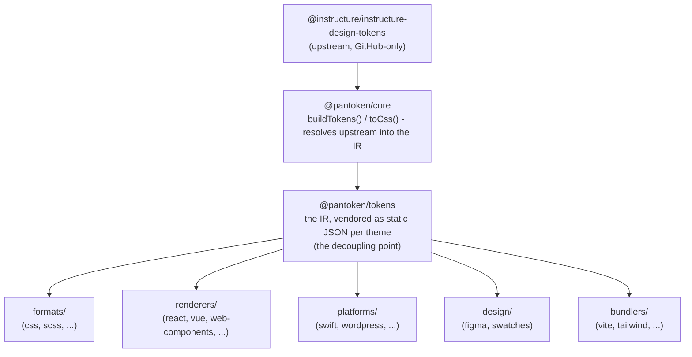

# Architectuur

pantoken heeft één taak: Instructure's designtokens en iconen één keer resolven en dat model vervolgens
voor elk doelplatform herschikken. De lagen hieronder houden die herschikking zuiver en zorgen dat de gepubliceerde pakketten vrij
blijven van elk GitHub-only upstream.

## De lagen

- **`@pantoken/model`** bevat de typecontracten, en niets meer. Het is de bron van waarheid voor de
  `Token`-vorm en het plugincontract, met nul afhankelijkheden, zodat elk pakket er vrij
  op kan vertrouwen.
- **`@pantoken/core`** is het enige pakket dat het upstream-bronbestand aanraakt. Het lost tokens en
  iconen op in de canonical IR en rendert CSS.
- **`@pantoken/tokens`** levert die IR als statische JSON bij build-tijd. Dit is het ontkoppelingspunt:
  downstream-pakketten lezen `@pantoken/tokens`, nooit `@pantoken/core`, zodat `npm i pantoken` nooit
  het GitHub-only upstream hoeft te bereiken.
- **`@pantoken/utils`** draagt de gedeelde hulpfuncties — de `var(--x)`-resolver, de referentie-regexes,
  case- en kleurconversies, en de driftcontroles die ervoor zorgen dat de gegenereerde output trouw blijft aan de IR.

## Waarom tokens worden opgenomen

Het upstream tokenpakket staat op GitHub, niet op npm. Als elk downstream-pakket ervan afhankelijk zou zijn,
zou `npm i pantoken` falen voor iedereen zonder die toegang. In plaats daarvan lost `@pantoken/tokens` het
upstream eenmaal op tijdens build-tijd en schrijft het resultaat naar statische JSON. De gepubliceerde pakketten dragen die
JSON mee, zodat ze schoon van npm geïnstalleerd kunnen worden, op semver vastpinnen en offline werken.

## Buckets

Elke downstream-bucket is een manier om de IR te consumeren:

- **formats/** — zet de tokens om in een bestand (CSS, SCSS, Less, Stylus, DTCG).
- **renderers/** — framework- en toolintegraties (React, Vue, Svelte, MUI, Pendo, en meer).
- **bundlers/** — build-tool-plugins en presets (Vite, Next, Tailwind, Panda, PostCSS, webpack).
- **platforms/** — native en site-generator-doelen (Swift, Kotlin, Rust, WordPress, Drupal).
- **design/** — payloads voor designtools (Figma, kleurstalen).
- **plugins/** — optionele transformaties die de token- of CSS-output uitbreiden. Zie [Plugins](/guide/plugins).

## Gegenereerde output

Elk pakket dat een bestand genereert schrijft het naar een per-pakket `generated/`-directory die een build
reproduceert, zodat niets van de gegenereerde bestanden wordt gecommit. Een workspace-taak valideert alles. Zie
[Gegenereerde output](/guide/generated-output).
