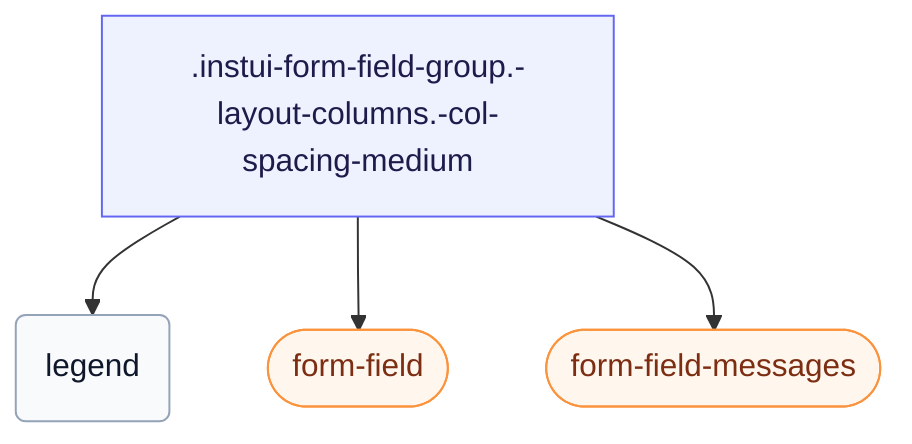

# CSS: form-field-group

`.instui-form-field-group` — A `&lt;fieldset&gt;` group with a legend, a column or inline layout, and configurable spacing.

Sets its own `gap` between fields, tunable with the `-col-spacing-*`/`-row-spacing-*` modifiers below — prefer those over chaining a generic `-gap-*` spacing utility modifier, which overrides the built-in value outright.

**Source:** [form-field-group.css](https://github.com/thedannywahl/pantoken/blob/main/formats/components/src/components/form-field-group/form-field-group.css)

## Tilgjenge

Renders a native `&lt;fieldset&gt;` with a `&lt;legend&gt;`, so the legend text names the whole group for assistive tech.

## Bruk

```css
@import "@pantoken/components/components.css";
@import "@pantoken/components/form-field-group.css";
```

## Døme

```html
<fieldset class="instui-form-field-group -layout-columns -col-spacing-medium">
  <legend>Shipping address</legend>
  <label class="instui-form-field">
    <span class="label">First name</span>
    <span class="controls"><input class="instui-text-input"></span>
  </label>
  <label class="instui-form-field">
    <span class="label">Last name</span>
    <span class="controls"><input class="instui-text-input"></span>
  </label>
  <label class="instui-form-field">
    <span class="label">City</span>
    <span class="controls"><input class="instui-text-input"></span>
  </label>
  <label class="instui-form-field">
    <span class="label">State</span>
    <span class="controls">
      <select class="instui-simple-select">
        <option>CA</option>
        <option>NY</option>
        <option>TX</option>
      </select>
    </span>
  </label>
  <div class="instui-form-field-messages">
    <span class="instui-form-field-message -type-hint">All fields are used for delivery only.</span>
  </div>
</fieldset>
```

## Struktur

```text
.instui-form-field-group.-layout-columns.-col-spacing-medium
  legend
  form-field (component)
  form-field-messages (component)
```



## Modifikatorar

| Modifikator | Skildring |
| --- | --- |
| `.-col-spacing-large` | Large column gap. |
| `.-col-spacing-medium` | Medium column gap. |
| `.-col-spacing-none` | No column gap. |
| `.-col-spacing-small` | Small column gap. |
| `.-layout-aligned` | Align child fields to a shared grid. |
| `.-layout-columns` | Lay child fields out in columns. |
| `.-layout-inline` | Lay child fields inline, in a row. |
| `.-required` | Mark the group as required. |
| `.-row-spacing-large` | Large row gap. |
| `.-row-spacing-medium` | Medium row gap. |
| `.-row-spacing-none` | No row gap. |
| `.-row-spacing-small` | Small row gap. |
| `.-v-align-bottom` | Bottom-align the fields. |
| `.-v-align-middle` | Middle-align the fields. |
| `.-v-align-top` | Top-align the fields. |

## Pseudo-element

| Pseudo-element | Skildring |
| --- | --- |
| `::after` | Renders the decorative required-field asterisk after the legend text when the group is required. |

## Vilkår

| Type | Førespurnad | Skildring |
| --- | --- | --- |
| supports | `(grid-template-columns: subgrid)` | — |

## Token brukt

| Token | Type | Verdi |
| --- | --- | --- |
| `--instui-component-form-field-layout-asterisk-color` | `<color>` | `light-dark(#CF1F24, #FA917F)` |
| `--instui-component-form-field-layout-font-family` | `[ <font-family-name> \| <generic-font-family> ]#` | `Atkinson Hyperlegible Next, "Helvetica Neue", Helvetica, Arial, sans-serif` |
| `--instui-component-form-field-layout-font-size` | `<length>` | `1rem` |
| `--instui-component-form-field-layout-font-weight` | `<integer>` | `400` |
| `--instui-component-form-field-layout-gap-inputs` | `<length>` | `0.75rem` |
| `--instui-component-form-field-layout-gap-primitives` | `<length>` | `0.5rem` |
| `--instui-component-form-field-layout-line-height` | `<length>` | `1.125rem` |
| `--instui-component-form-field-layout-text-color` | `<color>` | `light-dark(#273540, #ffffff)` |
| `--instui-spacing-space-lg` | `<length>` | `1rem` |
| `--instui-spacing-space-md` | `<length>` | `0.75rem` |
| `--instui-spacing-space-sm` | `<length>` | `0.5rem` |

## Nettlesarstøtte

- The `-layout-aligned` mode uses CSS subgrid behind an `@supports` guard; where subgrid is unsupported, the fields fall back to their own stacked layout.

## Underkomponentar

- [form-field](/nn/api/css/form-field.md)
- [form-field-messages](/nn/api/css/form-field-messages.md)

## Relatert

- [form-field](/nn/api/css/form-field.md) — The single field this group repeats.
- [radio-input-group](/nn/api/css/radio-input-group.md) — Groups radio inputs under a legend.

