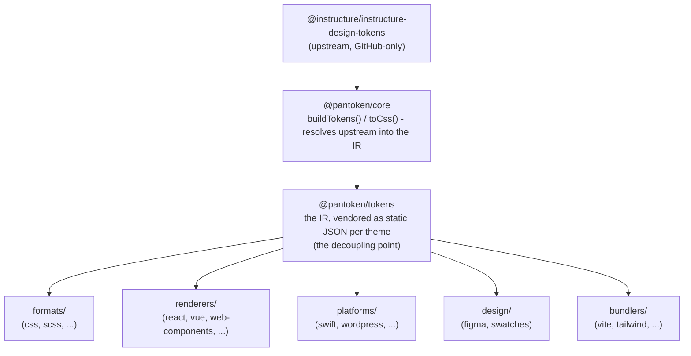

# Arkitektur

pantoken har éin jobb: løysa Instructure sine design-tokener og ikon éin gong, og så forma den modellen
om for kvar målplattform. Laga nedanfor held den omforminga ærleg og sørgjer for at dei publiserte pakkene er fri
for nokon GitHub-spesifikk upstream.

## Laga

- **`@pantoken/model`** inneheld typekontraktane, og ingenting anna. Det er sanninga for
  `Token`-forma og plugin-kontrakten, med null avhengnader, så kva som helst pakke kan avhenge av den
  fritt.
- **`@pantoken/core`** er den eine pakken som rører upstream-kjelda. Ho løser tokener og
  ikon til den kanoniske IR-en og renderer CSS.
- **`@pantoken/tokens`** leverer den IR-en som statisk JSON ved byggetid. Dette er avkoplingspunktet:
  nedstraums-pakkar les `@pantoken/tokens`, aldri `@pantoken/core`, så `npm i pantoken` når aldri etter den GitHub-spesifikke upstreamen.
- **`@pantoken/utils`** bær dei delte hjelpemidla — `var(--x)`-resolveren, referanse-regexane,
  versal-/fargekonvertering, og drift-sjekkane som held det genererte resultatet tru mot IR-en.

## Kvifor tokener blir vendora

Den upstream token-pakken ligg på GitHub, ikkje på npm. Om alle nedstraums-pakkar avhang av han,
ville `npm i pantoken` feila for alle utan den tilgangen. I staden løser `@pantoken/tokens`
upstream éin gong ved byggetid og skriv resultatet til statisk JSON. Dei publiserte pakkane tek med den
JSON-en, så dei blir installerte reint frå npm, pinnast til semver, og fungerer offline.

## Buckets

Kvar nedstraums-bucket er ein måte å konsumera IR-en på:

- **formats/** — gjere token til ei fil (CSS, SCSS, Less, Stylus, DTCG).
- **renderers/** — rammeverk- og verktøyintegrasjonar (React, Vue, Svelte, MUI, Pendo, og fleire).
- **bundlers/** — byggverktøy-plugins og preset (Vite, Next, Tailwind, Panda, PostCSS, webpack).
- **platforms/** — native- og side-generator-mål (Swift, Kotlin, Rust, WordPress, Drupal).
- **design/** — nyttelast for designverktøy (Figma, fargeprøver).
- **plugins/** — valfrie transformasjonar som utvidar token- eller CSS-utsleppet. Sjå [Plugins](/guide/plugins).

## Generert utslepp

Kvar pakke som emitterer ei fil skriv ho til ei per-pakke `generated/`-katalog som eit bygg
reproduserer, så ingenting generert blir committa. Ein workspace-oppgåve validerer alt. Sjå
[Generated output](/guide/generated-output).
