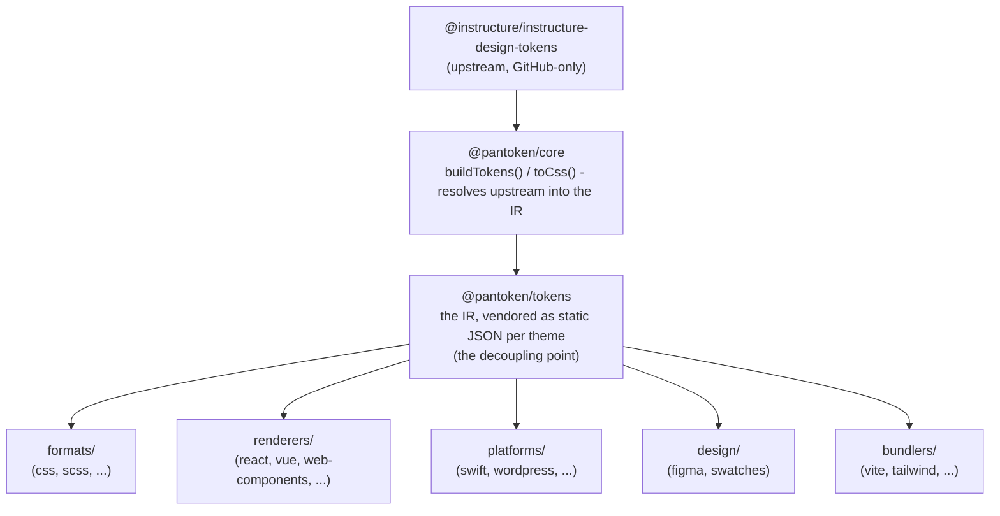

# Architektura

pantoken ma jedno zadanie: raz rozwiązać tokeny projektowe i ikony Instructure, a następnie przekształcić ten model
dla każdego celu. Warstwy poniżej utrzymują tę transformację w ryzach i sprawiają, że publikowane pakiety są wolne
od jakiegokolwiek upstreamu ograniczonego do GitHub.

## Warstwy

- **`@pantoken/model`** zawiera kontrakty typów i nic więcej. To źródło prawdy dla
  kształtu `Token` i kontraktu wtyczki, bez żadnych zależności, więc każdy pakiet może na nim
  swobodnie polegać.
- **`@pantoken/core`** to jedyny pakiet, który dotyka upstreamu. Rozwiązuje tokeny i
  ikony do kanonicznego IR i renderuje CSS.
- **`@pantoken/tokens`** dostarcza ten IR jako statyczne JSON w czasie budowania. To punkt odseparowania:
  pakiety downstream czytają `@pantoken/tokens`, nigdy `@pantoken/core`, więc `npm i pantoken` nigdy
  nie sięga po upstream dostępny tylko na GitHub.
- **`@pantoken/utils`** przenosi współdzielone pomocniki — resolver `var(--x)`, regexy referencji,
  konwersje wielkości liter i kolorów oraz kontrole dryfu, które utrzymują wygenerowany output wierny IR.

## Dlaczego tokeny są vendoryzowane

Upstreamowy pakiet z tokenami znajduje się na GitHub, nie na npm. Gdyby każdy pakiet downstream od niego zależał,
`npm i pantoken` zawiódłby dla każdego bez tego dostępu. Zamiast tego `@pantoken/tokens` rozwiązuje
upstream raz w czasie budowania i zapisuje wynik do statycznego JSON. Publikowane pakiety zawierają ten
JSON, więc instalują się czysto z npm, przypinają się do semver i działają offline.

## Buckets

Każdy bucket downstream to sposób konsumowania IR:

- **formats/** — zamienia tokeny na plik (CSS, SCSS, Less, Stylus, DTCG).
- **renderers/** — integracje z frameworkami i narzędziami (React, Vue, Svelte, MUI, Pendo i inne).
- **bundlers/** — wtyczki i presety narzędzi budujących (Vite, Next, Tailwind, Panda, PostCSS, webpack).
- **platforms/** — cele natywne i generatory stron (Swift, Kotlin, Rust, WordPress, Drupal).
- **design/** — payloady dla narzędzi projektowych (Figma, próbki kolorów).
- **plugins/** — opcjonalne transformacje, które rozszerzają output tokenów lub CSS. Zobacz [Plugins](/guide/plugins).

## Wygenerowany output

Każdy pakiet, który emituje plik, zapisuje go do katalogu `generated/` przypisanego do pakietu, który proces budowania
odtwarza, więc nic co wygenerowane nie jest commitowane. Zadanie workspace weryfikuje to wszystko. Zobacz
[Generated output](/guide/generated-output).
