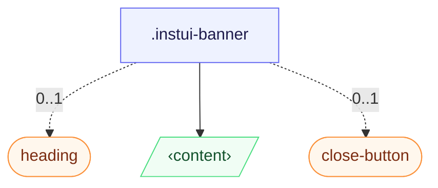

# CSS: banner

`.instui-banner` · `alpha` — A dismissible, iconed message surface for page-level or in-context announcements.

**Size** controls padding and gap: `relaxed` (default) is roomier; `compact` tightens both.
  **Color** sets the fill: bare (no modifier) is unfilled — border and icon only; `-color-violet`
  and `-color-sea` add a tinted background plus a matching icon swatch.

## Acessibilidade

Add `role="status"` (or `role="alert"` for urgent messages) so assistive tech announces the
  banner; mark a decorative icon `aria-hidden="true"` and give the close button an `aria-label`.

## Uso

@import "@pantoken/plugin-custom-components/custom-components.css";

```css
@import "@pantoken/plugin-custom-components/custom-components.css";
```

## Exemplos

-nocard
```html
<div class="instui-banner -icon-canvas-icon-reversed" role="status">
  <h2 class="instui-heading">New feature</h2>
  <span class="instui-text">This is a violet banner with a custom icon.</span>
  <div class="instui-view --display-flex --gap-md">
    <button class="instui-button">OK</button>
    <button class="instui-button">Cancel</button>
  </div>
  <button class="instui-close-button" aria-label="Close"></button>
</div>
```
### Sea colored and compact spacing -nocard
```html
<div class="instui-banner -color-sea -size-sm" role="status">
  This is a sea-colored banner with compact spacing.
</div>
```

## Estrutura

```text
.instui-banner
  heading (component, 0..1)
  ‹content›
  close-button (component, 0..1)
```



## Modificadores

| Modificador | Descrição |
| --- | --- |
| `.-color-sea` | Sea-tinted background and icon swatch. |
| `.-color-violet` | Violet-tinted background and icon swatch. |
| `.-icon-*` | Swap the default `info` glyph for an icon from the shared icon set (for example, `-icon-megaphone`). |
| `.-size-compact` | Tighter padding and gap. |
| `.-size-md` | <span class="instui-pill -color-info pantoken-doc-tag">Alias</span> — maps to `.-size-relaxed`. |
| `.-size-relaxed` | Roomier padding and gap (default). |
| `.-size-sm` | <span class="instui-pill -color-info pantoken-doc-tag">Alias</span> — maps to `.-size-compact`. |

## Pseudo-elementos

| Pseudo-elemento | Descrição |
| --- | --- |
| `::after` | — |
| `::before` | — |

## Estados

| Estado | Descrição |
| --- | --- |
| `[aria-disabled="true"]` | — |
| `:disabled` | — |

## Tokens consumidos

| Token | Tipo | Valor |
| --- | --- | --- |
| `--instui-color-background-interactive-action-primary-on-color-active` | `<color>` | `#B6CCEA` |
| `--instui-color-background-interactive-action-primary-on-color-base` | `<color>` | `#ffffff` |
| `--instui-color-background-interactive-action-primary-on-color-disabled` | `<color>` | `#8D959F` |
| `--instui-color-background-interactive-action-primary-on-color-hover` | `<color>` | `#D5E2F6` |
| `--instui-color-stroke-interactive-action-primary-on-color-active` | `<color>` | `#B6CCEA` |
| `--instui-color-stroke-interactive-action-primary-on-color-base` | `<color>` | `#ffffff` |
| `--instui-color-stroke-interactive-action-primary-on-color-disabled` | `<color>` | `#8D959F` |
| `--instui-color-stroke-interactive-action-primary-on-color-hover` | `<color>` | `#D5E2F6` |
| `--instui-color-text-interactive-action-primary-on-color-active` | `<color>` | `#213D5B` |
| `--instui-color-text-interactive-action-primary-on-color-base` | `<color>` | `#213D5B` |
| `--instui-color-text-interactive-action-primary-on-color-disabled` | `<color>` | `#4A5B68` |
| `--instui-color-text-interactive-action-primary-on-color-hover` | `<color>` | `#213D5B` |
| `--instui-component-banner-border-color` | `<color>` | `#5F6E7A1A` |
| `--instui-component-banner-border-radius` | `<length>` | `1rem` |
| `--instui-component-banner-border-style` | — | `solid` |
| `--instui-component-banner-border-width` | `<length>` | `0.0625rem` |
| `--instui-component-banner-close-button-margin-right` | `<length>` | `0.5rem` |
| `--instui-component-banner-close-button-margin-top` | `<length>` | `0.5rem` |
| `--instui-component-banner-color` | `<color>` | `light-dark(#273540, #ffffff)` |
| `--instui-component-banner-compact-content-gap-horizontal` | `<length>` | `0.5rem` |
| `--instui-component-banner-compact-icon-border-radius` | `<length>` | `0.5rem` |
| `--instui-component-banner-compact-padding-horizontal` | `<length>` | `0.75rem` |
| `--instui-component-banner-compact-padding-vertical` | `<length>` | `0.75rem` |
| `--instui-component-banner-content-gap-vertical` | `<length>` | `0.75rem` |
| `--instui-component-banner-icon-color` | `<color>` | `#ffffff` |
| `--instui-component-banner-relaxed-content-gap-horizontal` | `<length>` | `1rem` |
| `--instui-component-banner-relaxed-icon-border-radius` | `<length>` | `0.75rem` |
| `--instui-component-banner-relaxed-padding-horizontal` | `<length>` | `1.5rem` |
| `--instui-component-banner-relaxed-padding-vertical` | `<length>` | `1.5rem` |
| `--instui-component-banner-sea-background` | `<color>` | `light-dark(#CFF0F6, #00424A)` |
| `--instui-component-banner-sea-icon-background` | `<color>` | `#00828E` |
| `--instui-component-banner-violet-background` | `<color>` | `light-dark(#F3E5F7, #522965)` |
| `--instui-component-banner-violet-icon-background` | `<color>` | `#9E58BD` |
| `--instui-component-base-button-medium-height` | `<length>` | `2.5rem` |
| `--instui-component-base-button-small-font-size` | `<length>` | `0.875rem` |
| `--instui-component-base-button-small-height` | `<length>` | `2rem` |
| `--instui-component-base-button-small-padding-horizontal` | `<length>` | `0.75rem` |
| `--instui-component-heading-title-card-mini-font-size` | `<length>` | `1rem` |
| `--instui-component-heading-title-card-mini-font-weight` | `<integer>` | `700` |
| `--instui-component-heading-title-card-regular-font-size` | `<length>` | `1.25rem` |
| `--instui-component-heading-title-card-regular-font-weight` | `<integer>` | `700` |
| `--instui-component-text-content-font-size` | `<length>` | `1rem` |
| `--instui-component-text-content-font-weight` | `<integer>` | `400` |
| `--instui-component-text-content-line-height` | `<percentage>` | `150%` |
| `--instui-component-text-content-small-font-size` | `<length>` | `0.875rem` |
| `--instui-component-text-content-small-font-weight` | `<integer>` | `400` |
| `--instui-component-text-content-small-line-height` | `<percentage>` | `150%` |
| `--instui-font-size-text-base` | `<length>` | `1rem` |
| `--instui-icon-megaphone` | `<image>` | `url('data:image/svg+xml;utf8,%3Csvg%20xmlns%3D%22http%3A%2F%2Fwww.w3.org%2F2000%2Fsvg%22%20width%3D%2224%22%20height%3D%2224%22%20viewBox%3D%220%200%2024%2024%22%20fill%3D%22none%22%20stroke%3D%22currentColor%22%20stroke-width%3D%222%22%20stroke-linecap%3D%22round%22%20stroke-linejoin%3D%22round%22%3E%3Cpath%20d%3D%22M11%206a13%2013%200%200%200%208.4-2.8A1%201%200%200%201%2021%204v12a1%201%200%200%201-1.6.8A13%2013%200%200%200%2011%2014H5a2%202%200%200%201-2-2V8a2%202%200%200%201%202-2z%22%2F%3E%3Cpath%20d%3D%22M6%2014a12%2012%200%200%200%202.4%207.2%202%202%200%200%200%203.2-2.4A8%208%200%200%201%2010%2014%22%2F%3E%3Cpath%20d%3D%22M8%206v8%22%2F%3E%3C%2Fsvg%3E')` |
| `--instui-line-height-standalone-text-base` | `<length>` | `1rem` |
| `--pantoken-banner-close-button-reserve` | `<length>` | `0rem` |
| `--pantoken-banner-glyph` | `<url>` | `url('data:image/svg+xml;utf8,%3Csvg%20xmlns%3D%22http%3A%2F%2Fwww.w3.org%2F2000%2Fsvg%22%20width%3D%2224%22%20height%3D%2224%22%20viewBox%3D%220%200%2024%2024%22%20fill%3D%22none%22%20stroke%3D%22currentColor%22%20stroke-width%3D%222%22%20stroke-linecap%3D%22round%22%20stroke-linejoin%3D%22round%22%3E%3Cpath%20d%3D%22M11%206a13%2013%200%200%200%208.4-2.8A1%201%200%200%201%2021%204v12a1%201%200%200%201-1.6.8A13%2013%200%200%200%2011%2014H5a2%202%200%200%201-2-2V8a2%202%200%200%201%202-2z%22%2F%3E%3Cpath%20d%3D%22M6%2014a12%2012%200%200%200%202.4%207.2%202%202%200%200%200%203.2-2.4A8%208%200%200%201%2010%2014%22%2F%3E%3Cpath%20d%3D%22M8%206v8%22%2F%3E%3C%2Fsvg%3E')` |
| `--pantoken-banner-icon-background` | `<color>` | `#9E58BD` |
| `--pantoken-banner-icon-inset-block-start` | `<length>` | `1.5rem` |
| `--pantoken-banner-icon-inset-inline-start` | `<length>` | `1.5rem` |
| `--pantoken-banner-icon-size` | `<length>` | `2rem` |
| `--pantoken-glyph` | `<url>` | `url("data:image/svg+xml` |

## Subcomponentes

- [close-button](/pt-BR/api/css/close-button.md)
- [heading](/pt-BR/api/css/heading.md)

## Relacionado

- [alert](/pt-BR/api/css/alert.md) — A non-dismissible, status-coloured counterpart for inline messages.
- [close-button](/pt-BR/api/css/close-button.md) — The dismiss control a banner may include.

